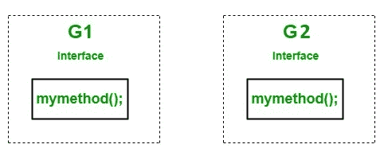

# C# |如何实现多个方法名相同的接口

> 原文:[https://www . geesforgeks . org/c-sharp-如何实现-多个接口-具有相同的方法名称/](https://www.geeksforgeeks.org/c-sharp-how-to-implement-multiple-interfaces-having-same-method-name/)

像一个类， ***[接口](https://www.geeksforgeeks.org/c-interface/)*** 可以有 ***[方法](https://www.geeksforgeeks.org/c-methods/)******[属性](https://www.geeksforgeeks.org/c-properties/)*** ，事件，以及 ***[索引器](https://www.geeksforgeeks.org/c-indexers/)*** 作为其成员。但是接口将只包含成员的声明。接口成员的实现将由 ***[类](https://www.geeksforgeeks.org/c-class-and-object/)*** 给出，它们隐式或显式地实现接口。
C#允许实现多个具有相同方法名的接口。为了理解如何用相同的方法名实现多个接口，我们举一个例子。在这个例子中，我们取了两个同名的名为`G1`和`G2`的接口。

[](https://media.geeksforgeeks.org/wp-content/uploads/Untitled-Diagram-18-1.jpg)

现在在一个名为 *Geeks* 的类中实现这些接口，并定义 *mymethod()* 方法，当用户试图调用这个方法时，它会给出一个错误，因为我们没有告诉编译器这个方法属于哪个接口。

**示例:**

```cs
// C# program to illustrate the concept
// of how to inherit multiple interfaces
// with the same method name
using System;

// Interface G1 and G2
// contains same method
interface G1 {

    // interface method
    void mymethod();
}

interface G2 {

    // interface method
    void mymethod();
}

// 'Geeks' implements both
// G1 and G2 interface
class Geeks : G1, G2 {

    // Defining method
    // this statement gives an error
    // because we doesn't specify
    // the interface name
    void mymethod()
    {
        Console.WriteLine("GeeksforGeeks");
    }
}

// Driver Class
public class GFG {

    // Main Method
    static public void Main()
    {

        // Creating object of Geeks
        // this statement gives an error
        // because we doesn't specify
        // the interface name
        Geeks obj = new Geeks();

        // calling method
        obj.mymethod();
    }
}
```

**编译时错误:**

> prog.cs(22，7):错误 CS0737: `Geeks '未实现接口成员` G1.mymethod()'，最佳实现候选` Geeks.mymethod()'未公开
> prog.cs(11，7):(与先前错误相关的符号位置)
> prog.cs(28，7):(与先前错误相关的符号位置)
> prog.cs(22，7):错误 CS0535: `Geeks '未实现接口成员` G2

为了消除这个错误，我们将使用类似`G1.mymethod()`的方法名称来指定接口的名称。它告诉编译器这个方法属于 *G1* 接口。同样的，`G2.mymethod()`告诉编译器这个方法属于 *G2* 接口。

**示例:**

```cs
// C# program to illustrate the concept 
// of how to inherit multiple interfaces 
// with the same method name
using System;

// Interface G1 and G2 
// contains same method
interface G1 {

    // method declaration
    void mymethod();
}

interface G2 {

    // method declaration
    void mymethod();
}

// Geeks implements both 
// G1 and G2 interface
class Geeks : G1, G2
{
    // Here mymethod belongs to 
    // G1 interface
    void G1.mymethod()
{
    Console.WriteLine("GeeksforGeeks");
}

    // Here mymethod belongs to 
    // G2 interface
    void G2.mymethod()
{
    Console.WriteLine("GeeksforGeeks");
}
}

// Driver Class
public class GFG {

    // Main Method
    static public void Main () {

        // Creating object of Geeks
        // of G1 interface
        G1 obj = new Geeks();

        // calling G1 interface method
        obj.mymethod();

        // Creating object of Geeks
        // of G2 interface
        G2 ob = new Geeks();

        // calling G2 interface method
        ob.mymethod();
    }
}
```

**输出:**

```cs
GeeksforGeeks
GeeksforGeeks

```

**注意:**也可以在实现接口的类中声明方法为 public。但是混乱仍然会存在，因为在大型程序中，用户无法区分实现哪个接口的哪种方法。

**示例:**

```cs
// C# program to illustrate the concept
// of how to inherit multiple interfaces
// with the same method name by defining 
// the method as public in the class 
// which implements the interfaces.
using System;

// Interface G1 and G2
// contains same method
interface G1 {

    // interface method
    void mymethod();
}

interface G2 {

    // interface method
    void mymethod();
}

// 'Geeks' implement both
// G1 and G2 interface
class Geeks : G1, G2 {

    // Defining method as public
    public void mymethod()
    {
        Console.WriteLine("GeeksforGeeks");
    }
}

// Driver Class
public class GFG {

    // Main Method
    static public void Main()
    {

        // Creating object of Geeks
        Geeks obj = new Geeks();

        // calling method
        obj.mymethod();
    }
}
```

**输出:**

```cs
GeeksforGeeks

```