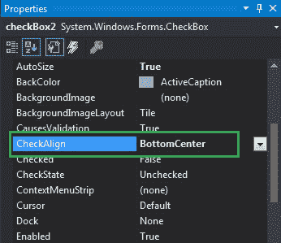
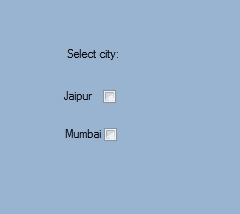

# C# |如何设置 CheckBox 中复选标记的对齐方式？

> 原文:[https://www . geesforgeks . org/c-sharp-如何设置复选标记对齐复选框/](https://www.geeksforgeeks.org/c-sharp-how-to-set-the-alignment-of-check-mark-in-checkbox/)

CheckBox 控件是 windows 窗体的一部分，用于接受用户的输入。或者换句话说，CheckBox 控件允许我们从给定的列表中选择单个或多个元素。在 CheckBox 中，您可以使用 CheckBox 的 **CheckAlign 属性**设置 CheckBox 上复选标记的水平和垂直对齐。该属性的默认值为*中左*。在 Windows 窗体中，可以通过两种不同的方式设置该属性:
**1。设计时:**使用以下步骤设置复选框的 CheckAlign 属性是最简单的方法:

*   **第一步:**创建如下图所示的 windows 窗体:
    **Visual Studio->File->New->Project->windows formpp**


*   **步骤 2:** 从工具箱中拖动 CheckBox 控件，并将其放到窗口窗体上。您可以根据需要将 CheckBox 放在 windows 窗体上的任何位置。


*   **步骤 3:** 拖放后，您将转到 CheckBox 控件的属性，通过使用 CheckAlign 属性来设置 CheckBox 中复选标记的对齐方式。



*   **输出:**


**2。运行时:**比上面的方法稍微复杂一点。在此方法中，您可以使用以下语法以编程方式设置 CheckAlign 属性:

```cs
public System.Drawing.ContentAlignment CheckAlign { get; set; }
```

这里，内容对齐用于表示内容对齐值。如果此属性的值不符合内容对齐值，它将引发*InvalidEnumArgumentException*。以下步骤用于设置复选框的检查对齐属性:

*   **步骤 1:** 使用 checkbox 类提供的 CheckBox()构造函数创建一个 CheckBox。

```cs
// Creating checkbox
CheckBox Mycheckbox = new CheckBox();
```

*   **步骤 2:** 创建 CheckBox 后，设置 CheckBox 类提供的 CheckBox 的 CheckAlign 属性。

```cs
// Set the CheckAlign property of the CheckBox
Mycheckbox.CheckAlign = ContentAlignment.MiddleCenter;
```

*   **第 3 步:**最后使用 add()方法将该复选框控件添加到表单中。

```cs
// Add this checkbox to form
this.Controls.Add(Mycheckbox);
```

*   **例:**

## c sharp . c sharp . c sharp . c sharp

```cs
using System;
using System.Collections.Generic;
using System.ComponentModel;
using System.Data;
using System.Drawing;
using System.Linq;
using System.Text;
using System.Threading.Tasks;
using System.Windows.Forms;

namespace WindowsFormsApp5 {

public partial class Form1 : Form {

    public Form1()
    {
        InitializeComponent();
    }

    private void Form1_Load(object sender, EventArgs e)
    {

        // Creating and setting the properties of label
        Label l = new Label();
        l.Text = "Select city:";
        l.Location = new Point(233, 111);

        // Adding label to form
        this.Controls.Add(l);

        // Creating and setting the properties of CheckBox
        CheckBox Mycheckbox = new CheckBox();
        Mycheckbox.Height = 50;
        Mycheckbox.Width = 100;
        Mycheckbox.Location = new Point(229, 136);
        Mycheckbox.Text = "Jaipur";
        Mycheckbox.CheckAlign = ContentAlignment.MiddleCenter;

        // Adding checkbox to form
        this.Controls.Add(Mycheckbox);

        // Creating and setting the properties of CheckBox
        CheckBox Mycheckbox1 = new CheckBox();
        Mycheckbox1.Height = 50;
        Mycheckbox1.Width = 100;
        Mycheckbox1.Location = new Point(230, 174);
        Mycheckbox1.Text = "Mumbai";
        Mycheckbox1.CheckAlign = ContentAlignment.MiddleCenter;

        // Adding checkbox to form
        this.Controls.Add(Mycheckbox1);
    }
}
}
```

*   **输出:**

