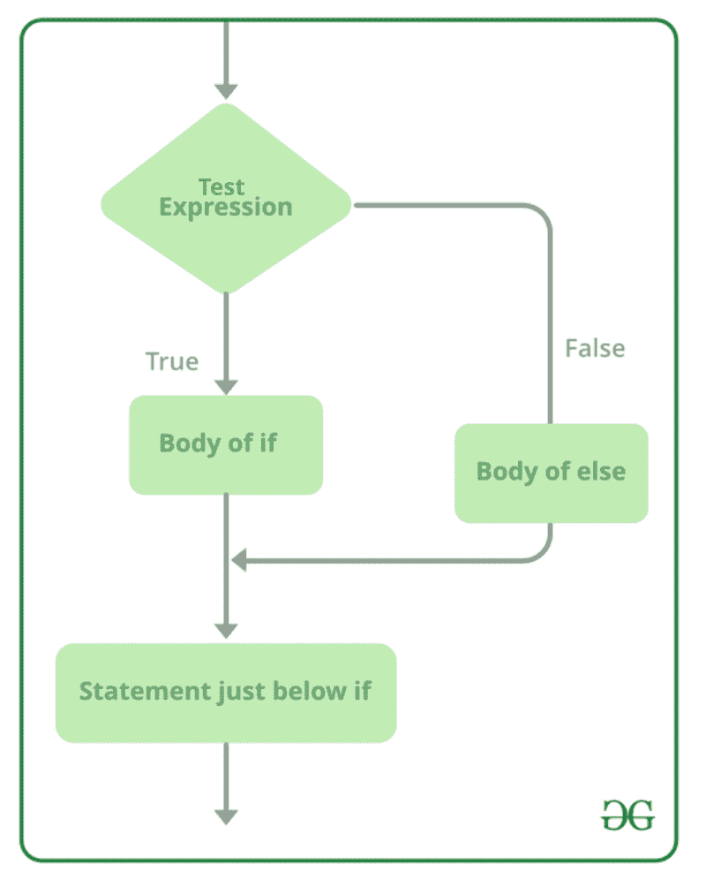

# c#–if else 语句

> 原文:[https://www.geeksforgeeks.org/c-sharp-if-else-statement/](https://www.geeksforgeeks.org/c-sharp-if-else-statement/)

在 C#中，我们知道，如果条件为真，则执行 if-语句，否则不会执行。但是，如果我们想要打印/执行某个条件为假的东西，该怎么办。又来了 **else 语句**。Else 语句与 if 语句一起使用，以便在给定条件为 false 时执行某个代码块。或者换句话说，在 if-else 语句中，如果给定条件评估为真，则 if 条件执行，或者如果给定条件评估为假，则 else 条件将执行。

*   Else-语句可以在花括号{}中包含单个或多个  语句。如果 else 语句只包含一个单条语句，那么卷曲的大括号是可选的。
*   else 语句的语句可以是任何种类/类型，就像它可以包含另一个 if-else 语句一样。

**语法:**

```
if(condition)
{  
    // code if condition is true  
}
else
{  
    // code if condition is false  
}  

```

**流程图:**



**例 1:**

## C#

```
// C# program to demonstrate
// if-else statement
using System;

class GFG{

static public void Main()
{

    // Declaring and initializing variables
    string x = "Geeks";
    string y = "GeeksforGeeks";

    // If-else statement
    if (x == y)
    {
        Console.WriteLine("Both strings are equal..!!");
    }

    // else statement
   else
    {
         Console.WriteLine("Both strings are not equal..!!");
    }
}
}
```

**输出:**

```
Both strings are not equal..!!

```

**例 2:**

## C#

```
// C# program to demonstrate if-else statement
using System;

class GFG{

static public void Main()
{

    // Declaring and initializing variables
    int x = 10;
    int y = 100;

    // If-else statement
    if (x >= y)
    {
        Console.WriteLine("x is greater than y");
    }

    // else statement
   else
    {
         Console.WriteLine("x is not greater than y");
    }
}
}
```

**输出:**

```
x is not greater than y

```

### if-else 语句的缩写

C#还提供了 if-else 语句的一个简单实现，也称为**三元运算符(？:)**因为它包含三个操作数。基本上是用一行代码代替多行代码。根据布尔表达式的值，i t 将返回两个值中的一个。

**语法:**

```
variable_name = (condition) ? TrueExpression :  FalseExpression;

```

这里，如果给定的条件为真，那么将执行 TrueExpression 语句。或者如果给定的条件为假，那么将执行 FalseExpression 语句。

**注意:** C#也支持嵌套三元运算符。

**例 1:**

## C#

```
// C# program to demonstrate short-hand 
// of if-else statement
using System;

class GFG{

static public void Main()
{

    // Declaring and initializing variables
    string x = "Geeks";
    string y = "GeeksforGeeks";

    // Short-hand if-else statement
    string result = (x == y) ? "Both strings are equal" : "Not equal";

    // Display result
    Console.WriteLine(result);
}
}
```

**输出:**

```
Not equal

```

**例 2:**

## C#

```
// C# program to demonstrate nested 
// Ternary Operator
using System; 

class GFG{ 

static void Main(string[] args) 
{ 

  int a = 23, b = 90;

  string result = a > b ? "a is greater than b" : 
                  a < b ? "a is less than b" :
                  a == b ? "a is equal to b" : "Invalid";

  Console.WriteLine(result);
} 
}
```

**输出:**

```
a is less than b

```