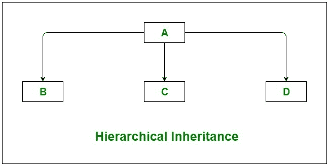

# C# |继承

> 原文:[https://www.geeksforgeeks.org/c-sharp-inheritance/](https://www.geeksforgeeks.org/c-sharp-inheritance/)

继承是面向对象编程的重要支柱。这是 C# 中允许一个类继承另一个类的特性(字段和方法)的机制。

**重要术语:**

*   **超类:**特征被继承的类称为超类(或基类或父类)。
*   **子类:**继承另一个类的类称为子类(或派生类、扩展类或子类)。除了超类字段和方法之外，子类还可以添加自己的字段和方法。
*   **可重用性:**继承支持“可重用性”的概念，即当我们想要创建一个新的类，并且已经有一个类包含了我们想要的一些代码时，我们可以从现有的类中派生出我们的新类。通过这样做，我们重用了现有类的字段和方法。

**如何使用继承**

用于继承的符号为 **:** 。
**语法:**

```cs
class derived-class : base-class  
{  
   // methods and fields  
   .
   .
}  

```

**示例:**在下面的继承示例中，类 GFG 是基类，类 GeeksforGeeks 是扩展 GFG 类的派生类，类 Sudo 是运行程序的驱动类。

```cs
// C# program to illustrate the
// concept of inheritance
using System;
namespace ConsoleApplication1 {

// Base class
class GFG {

   // data members
    public string name;
    public string subject;

    // public method of base class 
    public void readers(string name, string subject)
    {
        this.name = name;
        this.subject = subject;
        Console.WriteLine("Myself: " + name); 
        Console.WriteLine("My Favorite Subject is: " + subject);
    }
}

// inheriting the GFG class using : 
class GeeksforGeeks : GFG {

    // constructor of derived class
    public GeeksforGeeks()
    {
        Console.WriteLine("GeeksforGeeks");
    }
}

// Driver class
class Sudo {

    // Main Method
    static void Main(string[] args)
    {

        // creating object of derived class
        GeeksforGeeks g = new GeeksforGeeks();

        // calling the method of base class 
        // using the derived class object
        g.readers("Kirti", "C#");
    }
}
}
```

**输出:**

```cs
GeeksforGeeks
Myself: Kirti
My Favorite Subject is: C#

```

**c# 中的遗传类型**

下面是 C# 在不同组合中支持的不同类型的继承。

1.  **Single Inheritance:** In single inheritance, subclasses inherit the features of one superclass. In image below, the class A serves as a base class for the derived class B.

    [](https://media.geeksforgeeks.org/wp-content/uploads/Single.jpg)

2.  **Multilevel Inheritance:** In Multilevel Inheritance, a derived class will be inheriting a base class and as well as the derived class also act as the base class to other class. In below image, class A serves as a base class for the derived class B, which in turn serves as a base class for the derived class C.

    

3.  **Hierarchical Inheritance:** In Hierarchical Inheritance, one class serves as a superclass (base class) for more than one subclass. In below image, class A serves as a base class for the derived class B, C, and D.

    [](https://media.geeksforgeeks.org/wp-content/uploads/Hierarchical.jpg)

4.  **Multiple Inheritance(Through Interfaces):**In Multiple inheritance, one class can have more than one superclass and inherit features from all parent classes. Please note that **C# does not support multiple inheritance** with classes. In C#, we can achieve multiple inheritance only through Interfaces. In the image below, Class C is derived from interface A and B.

    [](https://media.geeksforgeeks.org/wp-content/uploads/Multiple-1.jpg)

5.  **Hybrid Inheritance(Through Interfaces):** It is a mix of two or more of the above types of inheritance. Since C# doesn’t support multiple inheritance with classes, the hybrid inheritance is also not possible with classes. In C#, we can achieve hybrid inheritance only through Interfaces.

    [](https://media.geeksforgeeks.org/wp-content/uploads/Hybrid.jpg)

**c# 中关于继承的重要事实**

*   **默认超类**:除了 Object 类没有超类之外，每个类都有且只有一个直接超类(单继承)。在没有任何其他显式超类的情况下，每个类都隐式地是对象类的子类。
*   **超类只能是一个:**超类可以有任意数量的子类。但是一个子类只能有一个**超类。这是因为 C# 不支持类的多重继承。虽然有接口，但是 C# 支持多重继承。**
*   **继承构造函数:**子类从其超类继承所有成员(字段、方法)。构造函数不是成员，所以它们不会被子类继承，但是超类的构造函数可以从子类中调用。
*   **私有成员继承:**子类不继承其父类的私有成员。但是，如果超类具有用于访问其私有字段的属性(get 和 set 方法)，那么子类可以继承。