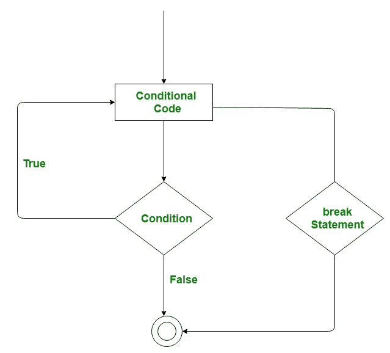

# C# |跳转语句(中断、继续、转到、返回和抛出)

> 原文:[https://www . geesforgeks . org/c-sharp-jump-statements-break-continue-goto-return-and-throw/](https://www.geeksforgeeks.org/c-sharp-jump-statements-break-continue-goto-return-and-throw/)

在 C#中，跳转语句用于在执行程序时，由于某些指定的代码，将控制从程序中的一个点转移到另一个点。跳转语句中有五个关键词:

*   **破裂***   **继续***   **转到***   **返回***   **throw

    #### break 语句

    break 语句用于终止它所在的循环或语句。之后，控件将传递给 break 语句之后的语句(如果可用)。如果 break 语句出现在嵌套循环中，那么它只终止那些包含 break 语句的循环。

    **流程图:**

    [](https://media.geeksforgeeks.org/wp-content/uploads/break-2.jpg)

    **示例:**

    ```cs
    // C# program to illustrate the
    // use of break statement
    using System;

    class Geeks {

        // Main Method
        static public void Main()
        {

            // GeeksforGeeks is printed only 2 times
            // because of break statement
            for (int i = 1; i < 4; i++) 
            {
                if (i == 3)
                    break;

                Console.WriteLine("GeeksforGeeks");
            }
        }
    }
    ```

    **Output:**

    ```cs
    GeeksforGeeks
    GeeksforGeeks

    ```

    #### 连续语句

    此语句用于在特定条件下跳过循环的执行部分。之后，它将控制转移到循环的开始。基本上，它跳过下面的语句，继续循环的下一次迭代。

    

    **示例:**

    ```cs
    // C# program to illustrate the
    // use of continue statement
    using System;

    class Geeks {

        // Main Method
        public static void Main()
        {

            // This will skip 4 to print
            for (int i = 1; i <= 10; i++) {

                // if the value of i becomes 4 then 
                // it will skip 4 and send the 
                // transfer to the for loop and 
                // continue with 5 
                if (i == 4)
                    continue;

                Console.WriteLine(i);
            }
        }
    }
    ```

    **Output:**

    ```cs
    1
    2
    3
    5
    6
    7
    8
    9
    10

    ```

    #### goto 语句

    此语句用于将控制转移到程序中标记的语句。标签是有效的标识符，放在传递控件的语句之前。

    

    **示例:**

    ```cs
    // C# program to illustrate the
    // use of goto statement
    using System;

    class Geeks {

        // Main Method
        static public void Main()
        {
            int number = 20;
            switch (number) {

            case 5:
                Console.WriteLine("case 5");
                break;
            case 10:
                Console.WriteLine("case 10");
                break;
            case 20:
                Console.WriteLine("case 20");

                // goto statement transfer 
                // the control to case 5
                goto case 5;

            default:
                Console.WriteLine("No match found");
                break;
            }
        }
    }
    ```

    **Output:**

    ```cs
    case 20
    case 5

    ```

    #### 返回语句

    此语句终止方法的执行，并将控件返回给调用方法。它返回一个可选值。如果方法类型为 void，则可以排除 return 语句。

    **示例:**

    ```cs
    // C# program to illustrate the
    // use of return statement
    using System;

    class Geeks {

        // creating simple addition function
        static int Addition(int a)
        {

            // add two value and
            // return the result of addition
            int add = a + a;

            // using return statement
            return add;
        }

        // Main Method
        static public void Main()
        {
            int number = 2;

            // calling addition function
            int result = Addition(number);
            Console.WriteLine("The addition is {0}", result);
        }
    }
    ```

    **Output:**

    ```cs
    The addition is 4

    ```

    #### 抛出语句

    这用于借助*新的*关键字手动创建任何有效异常类的对象。有效的异常必须从异常类派生。

    **示例:**

    ```cs
    // C# Program to illustrate the use 
    // of throw keyword
    using System;

    class Geeks {

         // takinmg null in the string
         static string sub = null;

        // method to display subject name    
        static void displaysubject(string sub1)
        {
            if (sub1  == null)
                throw new NullReferenceException("Exception Message");

        }

    // Main Method    
    static void Main(string[] args)
    {

        // using try catch block to 
        // handle the Exception
        try
        {

            // calling the static method
            displaysubject(sub);
        }

        catch(Exception exp)
        {
            Console.WriteLine(exp.Message );
        }                     
    }

    }
    ```

    **Output:**

    ```cs
    Exception Message

    ```**