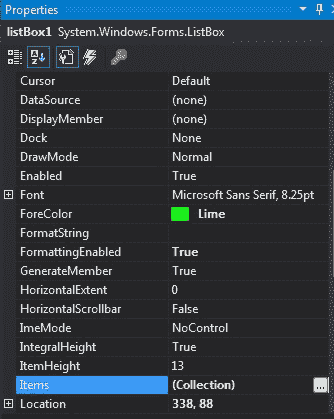

# C# | ListBox 类〔t1〕类

> 原文:[https://www.geeksforgeeks.org/c-sharp-listbox-class/](https://www.geeksforgeeks.org/c-sharp-listbox-class/)

在 Windows 窗体中，ListBox 控件用于显示列表中的多个元素，用户可以从中选择一个或多个元素，这些元素通常显示在多个列中。ListBox 类用于表示窗口列表框，还提供不同类型的属性、方法和事件。在*系统下定义。Windows.Forms* 命名空间。ListBox 类包含三种不同类型的集合类，即

*   **列表框。对象集合:**这个类保存列表框控件中包含的所有元素。
*   **列表框。SelectedObjectCollection:** 这个类保存所选项目的集合，它是 ListBox 控件中包含的项的子集。
*   **列表框。selectedindexcolution:**这个类保存了所选索引的集合，它是*列表框的索引子集。对象集合*并且这些索引指定被选择的元素。

在 C#中，您可以使用两种不同的方法在 windows 窗体中创建一个列表框:

**1。设计时:**创建列表框的最简单方法如下所示:

*   **第一步:**创建如下图所示的窗口表单:
    **Visual Studio->File->New->Project->windows formpp**
    
*   **Step 2:** Next, drag and drop the ListBox control from the toolbox to the form.

    

*   **Step 3:** After drag and drop you will go to the properties of the ListBox control to modify ListBox according to your requirement.
    

    **输出:**
    

**2。运行时:**比上面的方法稍微复杂一点。在此方法中，您可以借助 ListBox 类提供的语法，以编程方式创建 ListBox 控件。以下步骤显示了如何动态设置创建列表框:

*   **步骤 1:** 使用列表框类提供的*列表框()*构造函数创建一个列表框控件。

    ```
    // Creating a ListBox control
    ListBox mylist = new ListBox(); 

    ```

*   **步骤 2:** 创建 ListBox 控件后，设置 ListBox 类提供的 ListBox 控件的属性。

    ```
    ListBox mylist = new ListBox(); 
            mylist.Location = new Point(287, 109); 
            mylist.Size = new Size(120, 95); 
            mylist.ForeColor = Color.Purple; 
            mylist.Items.Add(123); 
            mylist.Items.Add(456); 
            mylist.Items.Add(789);

    ```

*   **Step 3:** And last add this ListBox control to the form using the following statement:

    ```
    // Adding ListBox control 
    // to the form 
    this.Controls.Add(mylist);

    ```

    **示例:**

    ```
    using System;
    using System.Collections.Generic;
    using System.ComponentModel;
    using System.Data;
    using System.Drawing;
    using System.Linq;
    using System.Text;
    using System.Threading.Tasks;
    using System.Windows.Forms;

    namespace WindowsFormsApp25 {

    public partial class Form1 : Form {

        public Form1()
        {
            InitializeComponent();
        }

        private void Form1_Load(object sender, EventArgs e)
        {

            // Creating and setting the
            // properties of ListBox
            ListBox mylist = new ListBox();
            mylist.Location = new Point(287, 109);
            mylist.Size = new Size(120, 95);
            mylist.ForeColor = Color.Purple;
            mylist.Items.Add(123);
            mylist.Items.Add(456);
            mylist.Items.Add(789);

            // Adding ListBox control
            // to the form
            this.Controls.Add(mylist);
        }
    }
    }
    ```

    **输出:**
    

#### 构造器

| 构造器 | 描述 |
| **列表框（）** | 该构造函数用于初始化列表框类的新实例。 |

#### 性能

| 财产 | 描述 |
| **自动化** | 此属性用于获取或设置一个值，该值指示控件是否根据其内容调整大小。 |
| **背景色** | 此属性用于获取或设置控件的背景色。 |
| 边框样式 | 此属性指示控件的边框样式。 |
| 字体 | 此属性用于获取或设置控件显示的文本的字体。 |
| **前颜色** | 此属性用于获取或设置控件的前景色。 |
| **高度** | 此属性用于获取或设置控件的高度。 |
| **位置** | 此属性用于获取或设置列表框控件左上角相对于其窗体左上角的坐标。 |
| **名称** | 此属性用于获取或设置控件的名称。 |
| **tab top** | 此属性用于获取或设置一个值，该值显示用户是否可以按 TAB 键将焦点提供给列表框。 |
| **尺寸** | 此属性用于获取或设置控件的高度和宽度。 |
| **文字** | 此属性用于获取或设置要在 RichTextBox 控件中显示的文本。 |
| **可见** | 此属性用于获取或设置一个值，该值指示是否显示控件及其所有子控件。 |
| **宽度** | 此属性用于获取或设置控件的宽度。 |
| **列宽** | 此属性用于获取或设置多列列表框中的列宽度。 |
| **水平范围** | 此属性用于获取或设置列表框的水平滚动条滚动的宽度。 |
| **项目高度** | 此属性用于获取或设置列表框中项目的高度。 |
| **项** | 该属性用于获取列表框的项目。 |
| **首选高度** | 此属性用于获取列表框中所有项目的组合高度。 |
| **选择指数** | 此属性用于获取或设置列表框中当前选定项的从零开始的索引。 |
| **选择集** | 此属性用于获取或设置列表框中当前选定的项目。 |
| **选择性成分** | 此属性用于获取一个集合，该集合包含列表框中所有当前选定项的从零开始的索引。 |
| **已排序** | 此属性用于获取或设置一个值，该值指示列表框中的项目是否按字母顺序排序。 |
| **TopIndex** | 此属性用于获取或设置列表框中第一个可见项的索引。 |