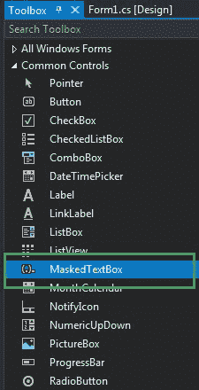
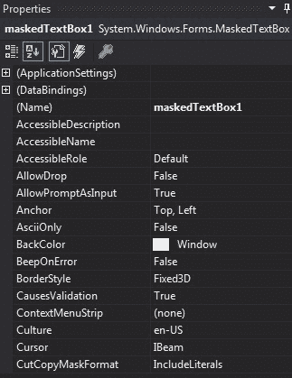
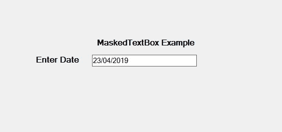
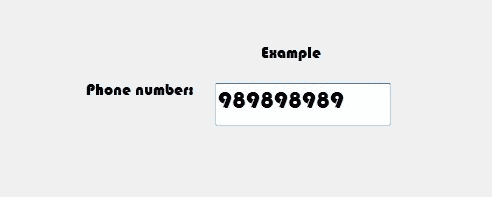

# c# | masketextbox 类

> 原文:[https://www.geeksforgeeks.org/c-sharp-maskedtextbox-class/](https://www.geeksforgeeks.org/c-sharp-maskedtextbox-class/)

在 C#中，MaskedTextBox 控件为表单上的用户输入(如日期、电话号码等)提供了一个验证过程。或者换句话说，它被用来提供区分正确和不正确用户输入的屏蔽。MaskedTextBox 类用于表示窗口屏蔽文本框，还提供不同类型的属性、方法和事件。在**系统下定义。Windows.Forms** 命名空间。
这个类增强了 TextBox 控件的版本，它支持声明性语法来接收或拒绝用户输入，当这个控件在运行时显示时，它将掩码表示为一系列提示字符和可选的文字字符。在 C#中，您可以使用两种不同的方法在 windows 窗体中创建一个 MaskedTextBox:

**1。设计时:**创建掩码文本框的最简单方法如下所示:

*   **Step 1:** Create a windows form as shown in the below image:
    **Visual Studio -> File -> New -> Project -> WindowsFormApp**

    

*   **Step 2:** Next, drag and drop the MaskedTextBox control from the toolbox to the form.

    

*   **Step 3:** After drag and drop you will go to the properties of the MaskedTextBox control to modify MaskedTextBox according to your requirement.

    

    **输出:**
    

**2。运行时:**比上面的方法稍微复杂一点。在这个方法中，您可以借助 masketextbox 类提供的语法，以编程方式创建 masketextbox 控件。以下步骤显示了如何动态设置创建掩码文本框:

*   **步骤 1:** 使用 masketextbox()构造函数创建一个 masketextbox 控件，该构造函数由 masketextbox 类提供。

    ```
    // Creating a MaskedTextBox control
    MaskedTextBox mbox = new MaskedTextBox(); 

    ```

*   **步骤 2:** 创建 masketextbox 控件后，设置 masketextbox 类提供的 masketextbox 控件的属性。

    ```
    // Setting the properties 
    // of MaskedTextBox
    mbox.Location = new Point(374, 137); 
    mbox.Mask = "000000000"; 
    mbox.Size = new Size(176, 20); 
    mbox.Name = "MyBox"; 
    mbox.Font = new Font("Bauhaus 93", 18); 

    ```

*   **Step 3:** And last add this MaskedTextBox control to the form using the following statement:

    ```
    // Adding MaskedTextBox 
    // control on the form 
    this.Controls.Add(mbox); 

    ```

    **示例:**

    ```
    using System;
    using System.Collections.Generic;
    using System.ComponentModel;
    using System.Data;
    using System.Drawing;
    using System.Linq;
    using System.Text;
    using System.Threading.Tasks;
    using System.Windows.Forms;

    namespace WindowsFormsApp36 {

    public partial class Form1 : Form {

        public Form1()
        {
            InitializeComponent();
        }

        private void Form1_Load(object sender, EventArgs e)
        {
            // Creating and setting the
            // properties of the Label
            Label l1 = new Label();
            l1.Location = new Point(413, 98);
            l1.Size = new Size(176, 20);
            l1.Text = " Example";
            l1.Font = new Font("Bauhaus 93", 12);

            // Adding label on the form
            this.Controls.Add(l1);

            // Creating and setting the
            // properties of the Label
            Label l2 = new Label();
            l2.Location = new Point(242, 135);
            l2.Size = new Size(126, 20);
            l2.Text = "Phone number:";
            l2.Font = new Font("Bauhaus 93", 12);

            // Adding label on the form
            this.Controls.Add(l2);

            // Creating and setting the
            // properties of the MaskedTextBox
            MaskedTextBox mbox = new MaskedTextBox();
            mbox.Location = new Point(374, 137);
            mbox.Mask = "000000000";
            mbox.Size = new Size(176, 20);
            mbox.Name = "MyBox";
            mbox.Font = new Font("Bauhaus 93", 18);

            // Adding MaskedTextBox
            // control on the form
            this.Controls.Add(mbox);
        }
    }
    }
    ```

    **输出:**

    

#### 构造器

| 构造器 | 描述 |
| **屏蔽文本框（）** | 这个构造函数用于初始化 MaskedTextBox 类的一个新实例。 |
| **掩码文本框(掩码文本提供程序)** | 此构造函数用于使用指定的自定义掩码语言提供程序初始化掩码文本框类的新实例。 |
| **屏蔽文本框（字符串）** | 此构造函数用于使用指定的输入掩码初始化掩码文本框类的新实例。 |

#### 性能

| 财产 | 描述 |
| **AsciiOnly** | 获取或设置一个值，该值指示掩码文本框控件是否接受 ASCII 字符集之外的字符。 |
| **自动化** | 此属性用于获取或设置一个值，该值指示控件是否根据其内容调整大小。 |
| **背景色** | 此属性用于获取或设置控件的背景色。 |
| 边框样式 | 此属性指示控件的边框样式。 |
| 字体 | 此属性用于获取或设置控件显示的文本的字体。 |
| **前颜色** | 此属性用于获取或设置控件的前景色。 |
| **高度** | 此属性用于获取或设置控件的高度。 |
| **位置** | 此属性用于获取或设置 MaskedTextBox 控件左上角相对于其窗体左上角的坐标。 |
| **名称** | 此属性用于获取或设置控件的名称。 |
| **tab top** | 此属性用于获取或设置一个值，该值显示用户是否可以按 TAB 键将焦点提供给 NumericUpDown。 |
| **尺寸** | 此属性用于获取或设置控件的高度和宽度。 |
| **文字** | 此属性用于获取或设置要在 RichTextBox 控件中显示的文本。 |
| **可见** | 此属性用于获取或设置一个值，该值指示是否显示控件及其所有子控件。 |
| **宽度** | 此属性用于获取或设置控件的宽度。 |
| **多行** | 此属性用于获取或设置一个值，该值指示这是否是一个多行 MaskedTextBox 控件。 |
| **文字配体** | 此属性用于获取或设置屏蔽文本框控件中文本的对齐方式。 |
| **文本掩码格式** | 此属性用于获取或设置一个值，该值确定格式化字符串中是否包含文字和提示字符。 |
| **精选文字** | 此属性用于获取或设置 MaskedTextBox 控件中的当前选择。 |
| 加快 | 此属性用于获取或设置用于表示 MaskedTextBox 中缺少用户输入的字符。 |
| **只读** | 此属性用于获取或设置一个值，该值指示文本框中的文本是否为只读。 |
| **最大长度** | 此属性用于获取或设置用户可以键入或粘贴到文本框控件中的最大字符数。掩码文本框不支持此属性。 |
| **线** | 此属性用于获取或设置多行配置中的文本行。掩码文本框不支持此属性。 |