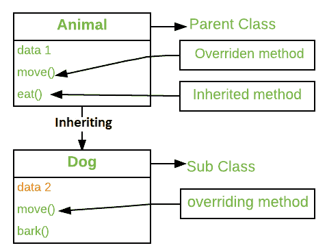

# C# |方法覆盖

> 原文:[https://www.geeksforgeeks.org/c-sharp-method-overriding/](https://www.geeksforgeeks.org/c-sharp-method-overriding/)

C#中的方法覆盖类似于 C++中的 [**虚函数**](https://www.geeksforgeeks.org/virtual-function-cpp/) 。方法重写是一种允许从派生类中的另一个类(基类)调用函数的技术。在派生类中创建与基类中的方法具有相同签名的方法称为方法重写。

简单地说，Overriding 是一个允许子类或子类提供某个方法的特定实现的特性，该方法已经由它的一个超类或父类提供。当子类中的方法与其超类中的方法具有相同的名称、相同的参数或签名以及相同的返回类型(或子类型)时，那么子类中的方法被称为覆盖超类中的方法。方法重写是 C#实现*运行时多态(动态多态)*的方法之一。

被重写声明重写的方法称为被重写的基方法。重写方法是从基类继承的成员的新实现。被重写的基方法必须是虚拟的、抽象的或重写的。



**示例:**

```cs
class base_class
{
    public void gfg();
}

class derived_class : base_class
{
    public void gfg();
}

class Main_Method
{
 static void Main()
 {
    derived_class d = new derived_class();
    d.gfg();
 }
}
```

这里基类在派生类中被继承，并且在两个类中具有相同签名的方法 *gfg()* 被重写。

**在 C#中，我们可以使用 3 种类型的关键字进行方法覆盖:**

*   **虚拟关键字:**此修饰符或关键字在基类方法中使用。它用于修改*基类*中的一个方法，因为*在派生类中覆盖了*那个特定的方法。
*   **覆盖:**此修饰符或关键字与派生类方法一起使用。用于将*虚*或*抽象*方法修改为*派生类*，并在基类中呈现。

```cs
class base_class
{
    public virtual void gfg();
}

class derived_class : base_class
{
    public override void gfg();
}
class Main_Method
{
 static void Main()
 {
    derived d_class = new derived_class();
    d.gfg();

      base_class b = new derived_class();
        b.gfg();
 }
}
```

这里首先， *d* 引用类*派生类*的对象，它调用类*派生类*的 *gfg()* ，然后， *b* 引用基类，它持有派生类的对象，它调用派生类的 *gfg()* 。这里 *gfg()* 方法从基类获取权限来重写派生类中的方法。

**示例 1:** 不使用虚拟和覆盖修改器的方法覆盖

## C#

```cs
// C# program to demonstrate the method overriding
// without using 'virtual' and 'override' modifiers
using System;

// base class name 'baseClass'
class baseClass

{
    public void show()
    {
        Console.WriteLine("Base class");
    }
}

// derived class name 'derived'
// 'baseClass' inherit here
class derived : baseClass
{

    // overriding
    new public void show()
    {
        Console.WriteLine("Derived class");
    }
}

class GFG {

    // Main Method
    public static void Main()
    {

        // 'obj' is the object of
        // class 'baseClass'
        baseClass obj = new baseClass();

        // invokes the method 'show()'
        // of class 'baseClass'
        obj.show();

        obj = new derived();

        // it also invokes the method
        // 'show()' of class 'baseClass'
        obj.show();

    }
}
```

**Output:** 

```cs
Base class
Base class
```

**说明:**在本程序中，对象 *obj* 两次调用 class baseClass，调用 class *baseClass* 的方法 *show()* 。为了避免这个问题，我们使用虚拟和覆盖关键字。

**示例 2:** 使用*虚拟*和*替代*修改器的方法替代。

## C#

```cs
// C# program to illustrate the use of
//'virtual' and 'override' modifiers
using System;

class baseClass {

    // show() is 'virtual' here
    public virtual void show()
    {
        Console.WriteLine("Base class");
    }
}

// class 'baseClass' inherit
// class 'derived'
class derived : baseClass
{

    //'show()' is 'override' here
    public override void show()
    {
        Console.WriteLine("Derived class");
    }
}

class GFG {

    // Main Method
    public static void Main()
    {

        baseClass obj;

        // 'obj' is the object
        // of class 'baseClass'
        obj = new baseClass();

        // it invokes 'show()'
        // of class 'baseClass'
        obj.show();

        // the same object 'obj' is now
        // the object of class 'derived'
        obj = new derived();

        // it invokes 'show()' of class 'derived'
        // 'show()' of class 'derived' is overridden
        // for 'override' modifier
        obj.show();

    }
}
```

**Output:** 

```cs
Base class
Derived class
```