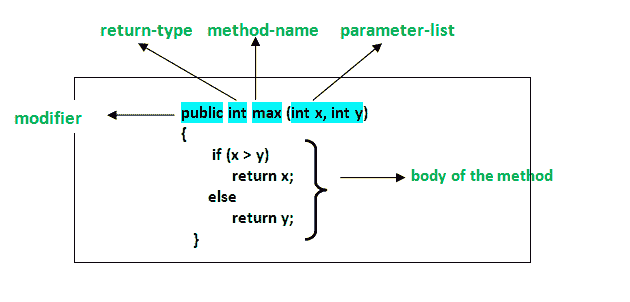

# C# |方法

> 原文:[https://www.geeksforgeeks.org/c-sharp-methods/](https://www.geeksforgeeks.org/c-sharp-methods/)

方法通常是程序中的代码或语句块，它使用户能够**重用**相同的代码，最终节省了过多的内存使用，充当了**时间节省器**，更重要的是，它提供了更好的**可读性**代码。因此，基本上，一个方法是执行特定任务并将结果返回给调用者的语句的集合。一个方法也可以在不返回任何东西的情况下执行一些特定的任务。

**示例:**

```
// Method Name --> GetCircleArea()
// Return Type ---> double
static double GetCircleArea(double radius)
{
    const float pi = 3.14F;
    double area = pi * radius * radius;
    return area;
}
```

**方法声明**

方法声明是指构造方法的方式，包括方法的命名。

**语法:**

```
<Access_Modifier> <return_type> <method_name>([<param_list>])
```



在 C#中，方法声明由以下组件组成:

*   **修饰符:**它定义了方法的访问类型，即在您的应用程序中可以从哪里访问它。在 C#中，有公共、受保护、私有访问修饰符。

*   **方法名称:**描述用户调用或引用的自定义方法的名称。例如 **GetName()**
*   **返回类型:**定义方法返回的数据类型。这取决于用户，因为它也可能返回空值，即不返回任何内容
*   **方法体:**指方法在执行过程中要执行的任务的代码行。它被括在大括号中。
*   **参数列表:**输入参数的逗号分隔列表在括号内定义，前面有数据类型。如果没有参数，那么空括号()就得用掉。

**方法签名:**方法签名主要由两个参数(参数个数、参数类型、参数顺序)定义，一个是**方法名**，第二个是其**参数表**。
**方法命名:**任何编程语言中的方法或函数的名称，无论是 C++还是 Java 或 C#都非常重要，主要用于调用该方法来执行。比如 findSum、computeMax、setX、getX 等。用户应该遵循某些预定义的命名方法规则:

*   方法名必须是某种名词或动词。
*   它的命名应该以这样一种方式进行，即它必须描述该方法的目的。
*   方法名的第一个字母可以是小写字母，也可以是大写字母，但是建议使用大写字母。

这些规则不是强制性的，而是值得推荐的。通常，一个方法在定义它的类中有一个唯一的名称，但是有时一个方法可能与同一类中的其他方法名称同名，因为 C#中允许方法重载。
**方法体:**如上所述，方法体由用户想要执行的代码语句组成。方法声明后，是否定义其实现取决于用户。不编写任何实现，使得方法不执行任何任务。然而，当用户想要使用方法执行某些任务时，它必须在方法的主体中编写要执行的语句。下面的语法描述了方法体的基本结构:
**语法:**

```
<return_type> <method_name>(<parameter_list>)
{

     // Implementation of the method code goes here.....

}
```

**方法调用**

**方法调用或方法调用**在用户想要执行方法时完成。需要调用方法才能使用其功能。在下列情况下，方法会返回到调用它的代码:

*   它完成了方法中的所有语句
*   它到达一个返回语句
*   抛出异常

**示例:**在下面的代码中，调用了一个名为 **Sum()** 的方法。

## c sharp . c sharp . c sharp . c sharp

```
// C# program to illustrate
// method calling
using System;
namespace ConsoleApplication1 {

class Geeks {

    // Here Sum() method asks for two
    // parameters from the user and
    // calculates the sum of these
    // and finally returns the result.
    static int Sum(int x, int y)
    {

            // there are two local variables
            // 'a' and 'b' where 'a' is assigned
            // the value of parameter 'x' and
            // 'b' is assigned the value of
            // parameter 'y'
            int a = x;
            int b = y;

            // The local variable calculates
            // the sum of 'a' and 'b'
            // and returns the result
            // which is of 'int' type.
            int result = a + b;

            return result;
        }

    // Main Method
    static void Main(string[] args)
    {
        int a = 12;
        int b = 23;

        // Method Sum() is invoked and
        // the returned value is stored
        // in the local variable say 'c'
        int c = Sum(a, b);

        // Display Result
        Console.WriteLine("The Value of the sum is " + c);
    }
}
}
```

**输出:**

```
The Value of the sum is 35
```

**方法参数**

在某些情况下，用户可能想要执行一个方法，但是有时该方法需要一些值输入来执行和完成它的任务。这些输入值在计算机语言术语中被称为**参数**。现在，这些参数可以是 int、long、float、double 或 char。然而，这取决于用户的要求。C#中的方法可以根据返回类型和输入参数分为**不同的类别**。

*   **无参数示例程序&无返回类型**

## c sharp . c sharp . c sharp . c sharp

```
// C# program to illustrate method Without
// Parameters & Without Return Type
using System;
namespace ConsoleApplication2 {
class Geeks {

    // Here the method 'PrintSentence()'
    // neither takes any parameter nor
    // returns any value. It simply performs
    // the required operations and prints
    // the result within it.
    static void PrintSentence()
    {

        Console.WriteLine("No parameters and return type void");
    }

    // Main Method
    static void Main(string[] args)
    {

        // Method Invoking or Method calling
        PrintSentence();
    }
}
}
```

*   **输出:**

```
No parameters and return type void
```

*   **不带参数的示例程序&带返回值类型**

## c sharp . c sharp . c sharp . c sharp

```
// C# program to illustrate the method Without
// Parameters & With Return Value Type
using System;
namespace ConsoleApplication3 {

class Geeks {

    // This method takes no parameter,
    // however returns the result obtained
    static int sum()
    {
        int a = 78, b = 70, add;  
        add = a + b;
        return add; 
    }

    // Main Method
    static void Main(string[] args)
    {

        // Here the calling variable
        // is 'getresult'
        int getresult = sum();

        // Printing the value of
        // 'getresult' variable
        Console.WriteLine(getresult);
    }
}
}
```

*   **输出:**

```
148
```

*   **带参数的示例程序&不带返回值类型**

## c sharp . c sharp . c sharp . c sharp

```
// C# program to illustrate Method With
// Parameters & Without Return Value Type
using System;
namespace ConsoleApplication3 {
class Geeks {

    // This method take the side of
    // the square as a parameter and
    // after obtaining the result,
    // it simply print it without
    // returning anything..
    static void perimeter(int p)
    {

        // Displaying the perimeter
        // of the square
        Console.WriteLine("Perimeter of the Square is " + 4 * p);
    }

    // Main  Method
    static void Main(string[] args)
    {

        // side of square
        int p = 5;

        // Method invoking
        perimeter(p);
    }
}
}
```

*   **输出:**

```
Perimeter of the Square is 20
```

*   **带参数的示例程序&带返回值类型**

## c sharp . c sharp . c sharp . c sharp

```
// C# program to illustrate Method With
// Parameters & With Return Value Type
using System;
namespace ConsoleApplication4 {
class Geeks {

    // This method asks a number from
    // the user and using that it
    // calculates the factorial
    // of it and returns the result
    static int factorial(int n)
    {
        int f = 1;

        // Method to calculate the
        // factorial of a number
        for (int i = 1; i<= n; i++)
        {
            f = f * i;
        }

        return f;
    }

    // Main Method
    static void Main(string[] args)
    {
        int p = 4;

        // displaying result by calling the function
        Console.WriteLine("Factorial is : " + factorial(p));
    }
}
}
```

*   **输出:**

```
Factorial is : 24
```

**使用方法的优势:**
使用方法有很多优势。其中一些列举如下:

*   它使程序结构良好。
*   方法增强了代码的可读性。
*   它为用户重用现有代码提供了一种有效的方法。
*   它优化了执行时间和内存空间。