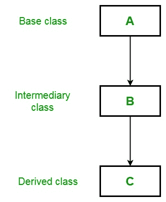
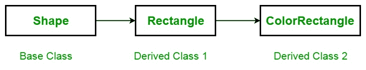

# C# |多级继承

> 原文:[https://www . geesforgeks . org/c-sharp-多级-继承/](https://www.geeksforgeeks.org/c-sharp-multilevel-inheritance/)

在多级[继承](https://www.geeksforgeeks.org/c-inheritance/)中，一个派生类将继承一个基类，并且该派生类也作为其他类的基类。例如，如下图所示的三个名为 A、B 和 C 的类，其中 C 类是从 B 类派生的，B 类是从 A 类派生的，在这种情况下，每个派生类都会继承其基类的所有特征。所以 C 类继承了 A 类和 b 类的所有特性。



**示例:**这里，使用派生类 Rectangle 作为基类来创建名为 ColorRectangle 的派生类。由于继承，颜色矩形继承了矩形和形状的所有特征，并添加了一个名为 rcolor 的额外字段，其中包含矩形的颜色。



这个例子也涵盖了派生类中构造函数的概念。我们知道，子类从它的超类继承所有成员(字段、方法)，但是构造函数不是成员，所以它们不能被子类继承，但是超类的构造函数可以从子类调用。如下例所示，base 引用最接近的基类中的构造函数。颜色矩形中的基调用矩形中的构造函数，矩形类中的基调用形状中的构造函数。

```
// C# program to illustrate the
// concept of multilevel inheritance
using System;

class Shape {

    double a_width;
    double a_length;

    // Default constructor
    public Shape()
    {
        Width = Length = 0.0;
    }

    // Constructor for Shape
    public Shape(double w, double l)
    {
        Width = w;
        Length = l;
    }

    // Construct an object with 
    // equal length and width
    public Shape(double y)
    {
        Width = Length = y;
    }

    // Properties for Length and Width
    public double Width
    {
        get {
               return a_width; 
            }

        set { 
              a_width = value < 0 ? -value : value; 
            }
    }

    public double Length
    {
        get { 
               return a_length; 
            }

        set { 
              a_length = value < 0 ? -value : value;
            }
    }
    public void DisplayDim()
    {
        Console.WriteLine("Width and Length are " 
                     + Width + " and " + Length);
    }
}

// A derived class of Shape 
// for the rectangle.
class Rectangle : Shape {

    string Style;

    // A default constructor. 
    // This invokes the default
    // constructor of Shape.
    public Rectangle()
    {
        Style = "null";
    }

    // Constructor
    public Rectangle(string s, double w, double l)
        : base(w, l)
    {
        Style = s;
    }

    // Construct an square.
    public Rectangle(double y)
        : base(y)
    {
        Style = "square";
    }

    // Return area of rectangle.
    public double Area()
    {
        return Width * Length;
    }

    // Display a rectangle's style.
    public void DisplayStyle()
    {
        Console.WriteLine("Rectangle is  " + Style);
    }
}

// Inheriting Rectangle class
class ColorRectangle : Rectangle {

    string rcolor;

    // Constructor
    public ColorRectangle(string c, string s,
                          double w, double l)
        : base(s, w, l)
    {
        rcolor = c;
    }

    // Display the color.
    public void DisplayColor()
    {
        Console.WriteLine("Color is " + rcolor);
    }
}

// Driver Class
class GFG {

    // Main Method
    static void Main()
    {
        ColorRectangle r1 = new ColorRectangle("pink", 
                   "Fibonacci rectangle", 2.0, 3.236);

        ColorRectangle r2 = new ColorRectangle("black",
                                   "Square", 4.0, 4.0);

        Console.WriteLine("Details of r1: ");
        r1.DisplayStyle();
        r1.DisplayDim();
        r1.DisplayColor();

        Console.WriteLine("Area is " + r1.Area());
        Console.WriteLine();

        Console.WriteLine("Details of r2: ");
        r2.DisplayStyle();
        r2.DisplayDim();
        r2.DisplayColor();

        Console.WriteLine("Area is " + r2.Area());
    }
}
```

**Output:**

```
Details of r1: 
Rectangle is  Fibonacci rectangle
Width and Length are 2 and 3.236
Color is pink
Area is 6.472

Details of r2: 
Rectangle is  Square
Width and Length are 4 and 4
Color is black
Area is 16

```