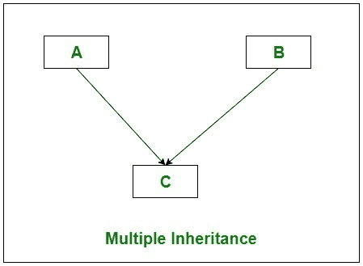

# C# |使用接口多重继承

> 原文:[https://www . geeksforgeeks . org/c-sharp-多重继承-使用-接口/](https://www.geeksforgeeks.org/c-sharp-multiple-inheritance-using-interfaces/)

在多重继承中，一个类可以有多个超类，并从其所有父类继承特性。如下图所示，C 类继承了 A 类和 b 类的特性。



但是 C#不支持多类继承。为了克服这个问题，我们使用接口来实现多类继承。借助[界面](https://www.geeksforgeeks.org/c-sharp-interface/)，C 类(如上图所示)可以得到 A 类和 b 类的特征。

**例 1:** 首先我们尝试将 *Geeks1* 和 *Geeks2* 类的特性继承成 GeeksforGeeks 类，那么编译器会给出一个错误，因为 C#直接不支持多类继承。

```
// C# program to illustrate
// multiple class inheritance
using System;
using System.Collections;

// Parent class 1
class Geeks1 {

    // Providing the implementation
    // of languages() method
    public void languages()
    {

        // Creating ArrayList
        ArrayList My_list = new ArrayList();

        // Adding elements in the
        // My_list ArrayList
        My_list.Add("C");
        My_list.Add("C++");
        My_list.Add("C#");
        My_list.Add("Java");

        Console.WriteLine("Languages provided by GeeksforGeeks:");
        foreach(var elements in My_list)
        {
            Console.WriteLine(elements);
        }
    }
}

// Parent class 2
class Geeks2 {

    // Providing the implementation
    // of courses() method
    public void courses()
    {

        // Creating ArrayList
        ArrayList My_list = new ArrayList();

        // Adding elements in the
        // My_list ArrayList
        My_list.Add("System Design");
        My_list.Add("Fork Python");
        My_list.Add("Geeks Classes DSA");
        My_list.Add("Fork Java");

        Console.WriteLine("\nCourses provided by GeeksforGeeks:");
        foreach(var elements in My_list)
        {
            Console.WriteLine(elements);
        }
    }
}

// Child class
class GeeksforGeeks : Geeks1, Geeks2 {
}

public class GFG {

    // Main method
    static public void Main()
    {

        // Creating object of GeeksforGeeks class
        GeeksforGeeks obj = new GeeksforGeeks();
        obj.languages();
        obj.courses();
    }
}
```

**运行时错误:**

> prog.cs(61，30):错误 CS1721: `GeeksforGeeks ':类不能有多个基类(` Geeks1 '和` geeks 2 ')
> Prog . cs(35，7):(与先前错误相关的符号的位置)

但是我们可以使用接口将极客 1 和极客 2 类的特性间接继承到极客 forgeks 类中。如下图所示。


**例 2:** 两个 *GFG1* 和 *GFG2* 接口都是由 Geeks1 和 Geeks2 类实现的。现在极客 1 和极客 2 类定义了语言()和课程()方法。当 GeeksforGeeks 类继承 GFG1 和 GFG2 接口时，您不需要重新定义*语言()*和*课程()*方法，只需简单地创建 *Geeks1* 和 *Geeks2* 类的对象，并使用 GeeksforGeeks 类中的这些对象访问*语言()*和*课程()*方法。

```
// C# program to illustrate how to
// implement multiple class inheritance
// using interfaces
using System;
using System.Collections;

// Interface 1
interface GFG1 {
    void languages();
}

// Parent class 1
class Geeks1 : GFG1 {

    // Providing the implementation
    // of languages() method
    public void languages()
    {

        // Creating ArrayList
        ArrayList My_list = new ArrayList();

        // Adding elements in the
        // My_list ArrayList
        My_list.Add("C");
        My_list.Add("C++");
        My_list.Add("C#");
        My_list.Add("Java");

        Console.WriteLine("Languages provided by GeeksforGeeks:");
        foreach(var elements in My_list)
        {
            Console.WriteLine(elements);
        }
    }
}

// Interface 2
interface GFG2 {
    void courses();
}

// Parent class 2
class Geeks2 : GFG2 {

    // Providing the implementation
    // of courses() method
    public void courses()
    {

        // Creating ArrayList
        ArrayList My_list = new ArrayList();

        // Adding elements in the
        // My_list ArrayList
        My_list.Add("System Design");
        My_list.Add("Fork Python");
        My_list.Add("Geeks Classes DSA");
        My_list.Add("Fork Java");

        Console.WriteLine("\nCourses provided by GeeksforGeeks:");
        foreach(var elements in My_list)
        {
            Console.WriteLine(elements);
        }
    }
}

// Child class
class GeeksforGeeks : GFG1, GFG2 {

    // Creating objects of Geeks1 and Geeks2 class
    Geeks1 obj1 = new Geeks1();
    Geeks2 obj2 = new Geeks2();

    public void languages()
    {
        obj1.languages();
    }

    public void courses()
    {
        obj2.courses();
    }
}

// Driver Class
public class GFG {

    // Main method
    static public void Main()
    {

        // Creating object of GeeksforGeeks class
        GeeksforGeeks obj = new GeeksforGeeks();
        obj.languages();
        obj.courses();
    }
}
```

**输出:**

```
Languages provided by GeeksforGeeks:
C
C++
C#
Java

Courses provided by GeeksforGeeks:
System Design
Fork Python
Geeks Classes DSA
Fork Java

```