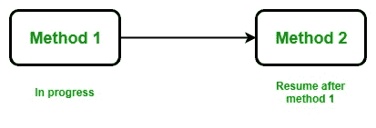

# C# 多线程

> 原文:[https://www.geeksforgeeks.org/c-sharp-multithreading/](https://www.geeksforgeeks.org/c-sharp-multithreading/)

多任务是在一定时间间隔内同时执行多个任务或进程。Windows 操作系统是多任务处理的一个例子，因为它能够同时运行多个进程，比如运行谷歌浏览器、记事本、VLC 播放器等。同时。操作系统使用一个称为*进程*的术语来同时执行所有这些应用程序。进程是负责执行应用程序的操作系统的一部分。在你的系统上执行的每个程序都是一个进程，为了在应用程序中运行代码，一个进程使用了一个被称为*线程*的术语。
线程是一个轻量级进程，或者换句话说，线程是一个执行程序下代码的单元。所以每个程序都有逻辑，一个线程负责执行这个逻辑。默认情况下，每个程序都携带一个线程来执行程序的逻辑，该线程被称为*主线程*，因此默认情况下，每个程序或应用程序都是单线程模型。这种单线程模型有一个缺点。单线程以同步方式运行程序中的所有进程，这意味着一个接一个。所以，第二个进程等待直到第一个进程完成它的执行，它消耗更多的处理时间。

例如，我们有一个名为 *Geek* 的类，这个类包含两种不同的方法，即*方法 1* 、*方法 2* 。现在主线程负责执行所有这些方法，所以主线程逐个执行所有这些方法。



**示例:**

```cs
// C# program to illustrate the 
// concept of single threaded model
using System;
using System.Threading;

public class Geek {

    // static method one
    public static void method1()
    {

        // It prints numbers from 0 to 10
        for (int I = 0; I <= 10; I++) {

            Console.WriteLine("Method1 is : {0}", I);

            // When the value of I is equal to 
            // 5 then this method sleeps for 
            // 6 seconds and after 6 seconds 
            // it resumes its working
            if (I == 5) {
                Thread.Sleep(6000);
            }
        }
    }

    // static method two
    public static void method2()
    {

        // It prints numbers from 0 to 10
        for (int J = 0; J <= 10; J++) {

            Console.WriteLine("Method2 is : {0}", J);
        }
    }
}

// Driver Class
public class GFG {

    // Main Method
    static public void Main()
    {

        // Calling static methods
        Geek.method1();
        Geek.method2();
    }
}
```

**输出:**

```cs
Method1 is : 0
Method1 is : 1
Method1 is : 2
Method1 is : 3
Method1 is : 4
Method1 is : 5
Method1 is : 6
Method1 is : 7
Method1 is : 8
Method1 is : 9
Method1 is : 10
Method2 is : 0
Method2 is : 1
Method2 is : 2
Method2 is : 3
Method2 is : 4
Method2 is : 5
Method2 is : 6
Method2 is : 7
Method2 is : 8
Method2 is : 9
Method2 is : 10

```

**说明:**这里，首先*方法 1* 执行。在*方法 1* 、*中，对于*循环，当 I 的值等于 5 时，从 0 开始，然后该方法进入睡眠 6 秒钟，6 秒钟后，它恢复其过程并打印剩余值。直到*方法 2* 处于等待状态。*方法 2* 在*方法 1* 完成分配的任务时开始工作。因此为了克服单线程模型的缺点`multithreading` 被引入。

**多线程**是单个进程内包含多个线程的进程。这里每个线程执行不同的活动。例如，我们有一个类，这个调用包含两个不同的方法，现在使用多线程，每个方法由一个单独的线程执行。所以多线程的主要优势是它同时工作，这意味着多个任务同时执行。并且还最大化了 CPU 的利用率因为多线程工作在分时概念上意味着每个线程都占用自己的执行时间并且不影响另一个线程的执行，这个时间间隔是由操作系统给定的。


**示例:**

```cs
// C# program to illustrate the
// concept of multithreading
using System;
using System.Threading;

public class GFG {

    // static method one
    public static void method1()
    {

        // It prints numbers from 0 to 10
        for (int I = 0; I <= 10; I++) {
            Console.WriteLine("Method1 is : {0}", I);

            // When the value of I is equal to 5 then
            // this method sleeps for 6 seconds
            if (I == 5) {
                Thread.Sleep(6000);
            }
        }
    }

    // static method two
    public static void method2()
    {
        // It prints numbers from 0 to 10
        for (int J = 0; J <= 10; J++) {
            Console.WriteLine("Method2 is : {0}", J);
        }
    }

    // Main Method
    static public void Main()
    {

        // Creating and initializing threads
        Thread thr1 = new Thread(method1);
        Thread thr2 = new Thread(method2);
        thr1.Start();
        thr2.Start();
    }
}
```

**输出:**

```cs
Method1 is : 0
Method1 is : 1
Method1 is : 2
Method1 is : 3
Method2 is : 0
Method2 is : 1
Method2 is : 2
Method2 is : 3
Method2 is : 4
Method2 is : 5
Method2 is : 6
Method2 is : 7
Method2 is : 8
Method2 is : 9
Method2 is : 10
Method1 is : 4
Method1 is : 5
Method1 is : 6
Method1 is : 7
Method1 is : 8
Method1 is : 9
Method1 is : 10

```

**说明:**这里，我们使用 Thread 类创建并初始化两个线程，即 *thr1* 和 *thr2* 。现在使用`thr1.Start();`和`thr2.Start();`我们开始执行这两个线程。现在两个线程同时运行， *thr2* 的处理不像单线程模型那样依赖于 *thr1* 的处理。

**注意:**输出可能会因上下文切换而有所不同。

**多线程的优势:**

*   它同时执行多个进程。
*   最大限度地利用 CPU 资源。
*   多个进程之间的时间共享。