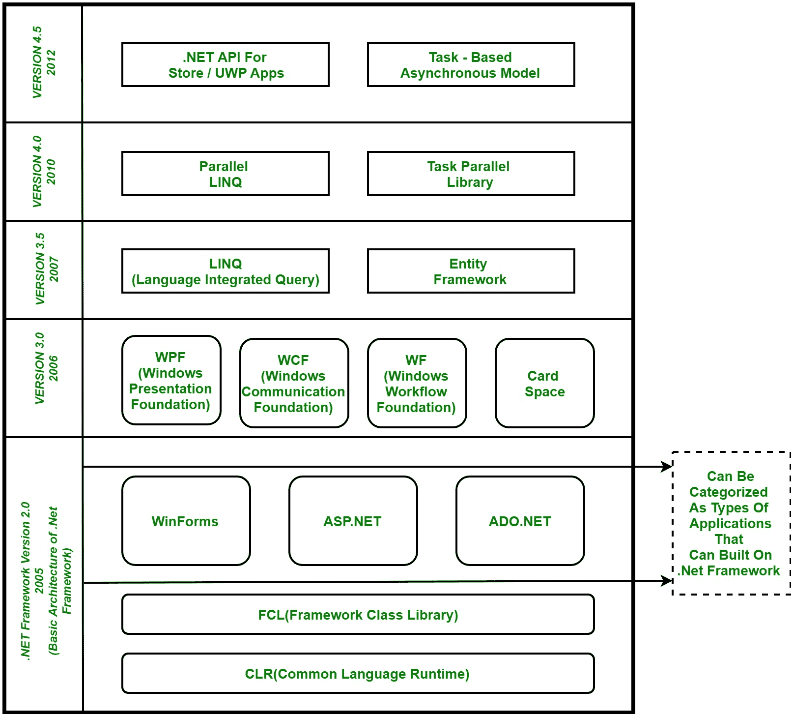

# C# |。NET 框架(基本架构和组件堆栈)

> 原文:[https://www . geesforgeks . org/c-sharp-net-framework-basic-architecture-component-stack/](https://www.geeksforgeeks.org/c-sharp-net-framework-basic-architecture-component-stack/)

。NET 是由微软设计和开发的软件框架。的第一个版本。Net 框架是 2002 年出现的 1.0。简单来说，就是一个虚拟机，用来编译和执行用 [C#](https://www.geeksforgeeks.org/introduction-to-c/) 、VB.Net 等不同语言编写的程序。
用于开发基于表单的应用程序、基于网络的应用程序和网络服务。上有多种编程语言。网络平台，VB.Net 和 [C#](https://www.geeksforgeeks.org/introduction-to-c/) 是最常见的。它被用来为视窗、电话、网络等构建应用程序。它提供了很多功能，也支持行业标准。

### **的基本架构和组件堆栈。NET 框架**

自下而上的前三个组件被认为是的基本架构。Net 框架，在 2005 年及之后，微软在。Net 框架如下:

**1。CLR(公共语言运行时):**它是一个运行时环境，可以执行以任何方式编写的代码。NET 编程语言。。Net 框架为许多语言提供了支持，如 [C#](https://www.geeksforgeeks.org/introduction-to-c/) 、F #[c++](https://www.geeksforgeeks.org/c-plus-plus/)、Cobra、Jscript.Net、VB.Net、Oxygene 等

**2。FCL(框架类库):**在这个被称为 FCL 的框架中存在大量类库。

**3。应用程序类型:**主要是内置的应用程序。Net 框架分为以下三类:

*   **WinForms :** 基于表单的应用程序在此类别下考虑。简单来说，我们可以说读取和写入文件系统的基于客户端的应用程序就属于这一类。
*   **ASP。NET :** 基于网络的应用程序就属于这一类。ASP.Net 是一个 web 框架，它提供了令人敬畏的 HTML、CSS 和 JavaScript 的集成，这使得开发 web 应用程序、网站和 web 服务非常有用。**加入了网络服务。Net Framework 2.0，并被视为 ASP.NET 网络应用程序的一部分。**
*   **ADO。NET :** 它包括开发用于与数据库通信的应用程序，如微软的 SQL Server、甲骨文等。来了。它主要由可用于连接、检索、插入和删除数据的类组成。

**4。WPF(Windows Presentation Foundation):**Windows Presentation Foundation(WPF)是微软给出的一个图形子系统，它使用 DirectX，用于基于 Windows 的应用程序中呈现 UI(用户界面)。WPF 最初是作为。NET Framework 3.0 于 2006 年发布，之前被称为**“阿瓦隆”**。

**5。WCF(Windows Communication Foundation):**它是一个用于构建连接和面向服务的应用程序的框架，用于将数据作为异步从一个服务端点传输到另一个服务点。它以前被称为**靛蓝**。

**6。WF(Windows Workflow Foundation):**它是微软给出的一项技术，为在其中构建工作流提供了一个平台。Net 应用程序。

**7。卡空间:**是微软。NET Framework 软件客户端，旨在让用户以安全、简单和可信的方式向在线服务提供其数字身份。

**8。LINQ(语言集成查询):**介绍于。Net 框架 3.5 版。基本上是一种用 VB 或者 [C#](https://www.geeksforgeeks.org/introduction-to-c/) 编程语言对数据源进行查询的查询语言。

**9。实体框架:**它是基于开源 ORM(对象关系映射)的框架。Net Framework 版。它使。Net 开发人员使用。Net 对象。在实体框架之前。Net 开发人员已经执行了很多与数据库相关的事情。像打开到数据库的连接一样，开发人员必须创建一个数据集来获取数据或将数据提交到数据库，将数据从数据集转换为。NET 对象，反之亦然。这给开发人员带来了困难，也是容易出错的过程，然后**“实体框架”**开始为应用程序自动化所有这些数据库相关的活动。因此，实体框架允许开发人员在更高的抽象层次上工作。

**注:**增加了 **REST(表征状态转移)**和 **AJAX** 。Net Framework 3.5 作为 ASP.NET 的扩展和服务，用于增强。NET 框架。

**10。并行 LINQ(语言集成查询):**它进来了。Net Framework 版，也称为 PLINQ。它为 **LINQ** 提供了一个并发查询执行引擎。它并行执行 **LINQ** ，这样它就可以尽量使用它正在执行的处理能力系统。

**11 时。TPL(任务并行库):**它是一组公共类型和 API。通过简化向添加并发性和并行性的过程，它允许开发人员提高工作效率。Net 应用程序。

**12 时。。商店/UWP 应用的. NET API:**2012 年，微软增加了一些使用 [C#](https://www.geeksforgeeks.org/introduction-to-c/) 或 VB 为 Windows 创建 **UWP(通用 Windows 平台)**应用的 API。

**13。基于任务的异步模型:**它是用来描述中异步操作和任务的模型。Net 框架。