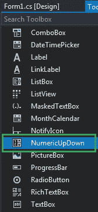
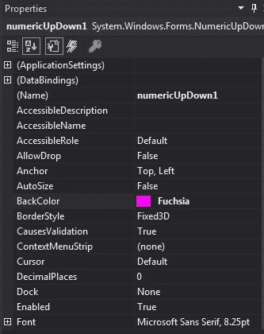
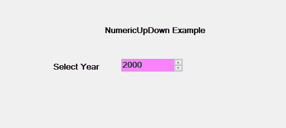
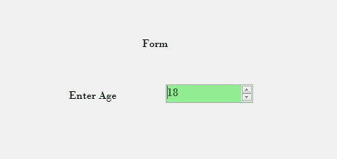

# c# | numeric pdown 类

> 原文:[https://www.geeksforgeeks.org/c-sharp-numericupdown-class/](https://www.geeksforgeeks.org/c-sharp-numericupdown-class/)

在 Windows 窗体中，NumericUpDown 控件用于提供显示数值的 Windows 旋转框或上下控件。或者换句话说，NumericUpDown 控件提供了一个使用上下箭头移动并保存一些预定义数值的界面。NumericUpDown 类用于表示窗口数字上下框，还提供不同类型的属性、方法和事件。在**系统下定义。Windows.Forms** 命名空间。在 C#中，您可以使用两种不同的方法在 windows 窗体中创建 NumericUpDown:

**1。设计时:**创建 NumericUpDown 的最简单方法如下步骤所示:

*   **第一步:**创建如下图所示的窗口表单:
    **Visual Studio->File->New->Project->windows formpp**
    
*   **Step 2:** Next, drag and drop the NumericUpDown control from the toolbox to the form.

    

*   **Step 3:** After drag and drop you will go to the properties of the NumericUpDown control to modify NumericUpDown according to your requirement.

    

    **输出:**

    

**2。运行时:**比上面的方法稍微复杂一点。在此方法中，您可以借助 NumericUpDown 类提供的语法，以编程方式创建 NumericUpDown 控件。以下步骤显示了如何动态设置创建数值:

*   **步骤 1:** 使用 numericpdown()构造函数创建 numericpdown 控件，该构造函数由 numericpdown 类提供。

    ```cs
    // Creating a NumericUpDown control
    NumericUpDown nbox = new NumericUpDown(); 

    ```

*   **步骤 2:** 创建 NumericUpDown 控件后，设置 NumericUpDown 类提供的 NumericUpDown 控件的属性。

    ```cs
    // Setting the properties of NumericUpDown control
    nbox.Location = new Point(386, 130); 
    nbox.Size = new Size(126, 26); 
    nbox.Font = new Font("Bodoni MT", 12); 
    nbox.Value = 18; 
    nbox.Minimum = 18; 
    nbox.Maximum = 30; 
    nbox.BackColor = Color.LightGreen; 
    nbox.ForeColor = Color.DarkGreen; 
    nbox.Increment = 1; 
    nbox.Name = "MySpinBox"; 

    ```

*   **Step 3:** And last add this NumericUpDown control to the form using the following statement:

    ```cs
    // Adding this control 
    // to the form 
    this.Controls.Add(nbox); 

    ```

    **示例:**

    ```cs
    using System;
    using System.Collections.Generic;
    using System.ComponentModel;
    using System.Data;
    using System.Drawing;
    using System.Linq;
    using System.Text;
    using System.Threading.Tasks;
    using System.Windows.Forms;

    namespace WindowsFormsApp42 {

    public partial class Form1 : Form {

        public Form1()
        {
            InitializeComponent();
        }

        private void Form1_Load(object sender, EventArgs e)
        {
            // Creating and setting the
            // properties of the labels
            Label l1 = new Label();
            l1.Location = new Point(348, 61);
            l1.Size = new Size(215, 20);
            l1.Text = "Form";
            l1.Font = new Font("Bodoni MT", 12);
            this.Controls.Add(l1);

            Label l2 = new Label();
            l2.Location = new Point(242, 136);
            l2.Size = new Size(103, 20);
            l2.Text = "Enter Age";
            l2.Font = new Font("Bodoni MT", 12);
            this.Controls.Add(l2);

            // Creating and setting the
            // properties of NumericUpDown
            NumericUpDown nbox = new NumericUpDown();
            nbox.Location = new Point(386, 130);
            nbox.Size = new Size(126, 26);
            nbox.Font = new Font("Bodoni MT", 12);
            nbox.Value = 18;
            nbox.Minimum = 18;
            nbox.Maximum = 30;
            nbox.BackColor = Color.LightGreen;
            nbox.ForeColor = Color.DarkGreen;
            nbox.Increment = 1;
            nbox.Name = "MySpinBox";

            // Adding this control
            // to the form
            this.Controls.Add(nbox);
        }
    }
    }
    ```

    **输出:**

    

#### 构造器

| 构造器 | 描述 |
| **NumericUpDown()** | 此构造函数用于初始化 NumericUpDown 类的新实例。 |

#### 性能

| 财产 | 描述 |
| **自动化** | 此属性用于获取或设置一个值，该值指示控件是否根据其内容调整大小。 |
| **背景色** | 此属性用于获取或设置控件的背景色。 |
| 边框样式 | 此属性指示控件的边框样式。 |
| 字体 | 此属性用于获取或设置控件显示的文本的字体。 |
| **前颜色** | 此属性用于获取或设置控件的前景色。 |
| **高度** | 此属性用于获取或设置控件的高度。 |
| **位置** | 此属性用于获取或设置 NumericUpDown 控件左上角相对于其窗体左上角的坐标。 |
| **名称** | 此属性用于获取或设置控件的名称。 |
| **tab top** | 此属性用于获取或设置一个值，该值显示用户是否可以按 TAB 键将焦点提供给 NumericUpDown。 |
| **尺寸** | 此属性用于获取或设置控件的高度和宽度。 |
| **文字** | 此属性用于获取或设置要在 NumericUpDown 控件中显示的文本。 |
| **文字配体** | 此属性用于获取或设置旋转框(也称为上下控件)中文本的对齐方式。 |
| **可见** | 此属性用于获取或设置一个值，该值指示是否显示控件及其所有子控件。 |
| **宽度** | 此属性用于获取或设置控件的宽度。 |
| **向上向下对齐** | 此属性用于获取或设置微调框(也称为上下控件)上的上下按钮的对齐方式。 |
| **千分之一** | 此属性用于获取或设置一个值，该值指示是否在适当的时候在数字显示框(也称为上下控件)中显示千位分隔符。 |
| **十六进制** | 此属性用于获取或设置一个值，该值指示数字显示框(也称为上下控件)是否应以十六进制格式显示其包含的值。 |
| **增量** | 此属性用于获取或设置值，以在单击向上或向下按钮时增加或减少微调框(也称为上下控件)。 |