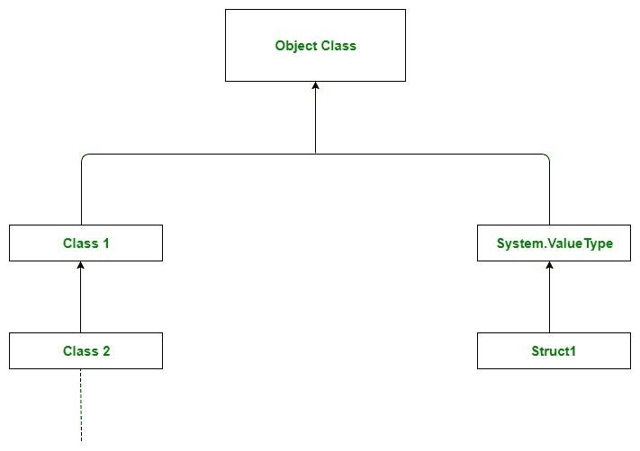

# C# |对象类

> 原文:[https://www.geeksforgeeks.org/c-sharp-object-class/](https://www.geeksforgeeks.org/c-sharp-object-class/)

对象类是 *[中所有类的基类。网络框架](https://www.geeksforgeeks.org/c-net-framework-basic-architecture-component-stack/)* 。它存在于**系统**命名空间中。在 C#中，**。NET 基类库(BCL)** 有一个特定于语言的别名，它是 Object 类，完全限定名为 **System。对象**。C#中的每个类都是直接或间接从对象类派生的。如果一个类不扩展任何其他类，那么它是对象类的直接子类，如果扩展其他类，那么它是间接派生的。因此，对象类方法对所有 C#类都可用。因此，在任何 C#程序中，对象类都是继承层次的根。对象类的主要目的是为派生类提供低级服务。

C#中有两种类型，即 **[引用类型和](https://www.geeksforgeeks.org/c-data-types-2/)** 值类型。通过使用系统。值类型类，值类型隐式继承对象类。系统。值类型类用更适合值类型的实现重写对象类中的虚拟方法。在其他编程语言中，内置类型如 int、double、float 等。没有任何面向对象的属性。要模拟内置类型的面向对象行为，必须将它们显式包装到对象中。但是在 C#中，由于从 System 继承的值类型的存在，我们不需要这样的包装。值类型进一步继承自 System.Object。因此在 C#中，值类型的工作方式也类似于引用类型。引用类型通过使用其他引用类型直接或间接继承对象类。

[](https://media.geeksforgeeks.org/wp-content/uploads/Object_Class-1.jpg)

**上图说明:**这里可以看到类型层次结构顶部的 Object 类。*1 级*和*2 级*为参照类型。类 1 直接继承对象类，而类 2 通过使用类 1 间接继承。结构 1 是通过*系统隐式继承对象类的值类型。ValueType* 类型。

**示例:**

```
// C# Program to demonstrate
// the Object class
using System;
using System.Text;

class Geeks {

    // Main Method
    static void Main(string[] args)
    {

        // taking object type
        Object obj1 = new Object();

        // taking integer
        int i = 10;

        // taking Type type and assigning
        // the value as type of above
        // defined types using GetType
        // method
        Type t1 = obj1.GetType();
        Type t2 = i.GetType();

        // Displaying result

        Console.WriteLine("For Object obj1 = new Object();");

        // BaseType is used to display
        // the base class of current type
        // it will return nothing as Object
        // class is on top of hierarchy
        Console.WriteLine(t1.BaseType);

        // It will return the name class
        Console.WriteLine(t1.Name);

        // It will return the
        // fully qualified name
        Console.WriteLine(t1.FullName);

        // It will return the Namespace
        // By default Namespace is System
        Console.WriteLine(t1.Namespace);

        Console.WriteLine();

        Console.WriteLine("For String str");

        // BaseType is used to display
        // the base class of current type
        // it will return System.Object
        // as Object class is on top
        // of hierarchy
        Console.WriteLine(t2.BaseType);

        // It will return the name class
        Console.WriteLine(t2.Name);

        // It will return the
        // fully qualified name
        Console.WriteLine(t2.FullName);

        // It will return the Namespace
        // By default Namespace is System
        Console.WriteLine(t2.Namespace);
    }
}
```

**输出:**

```
For Object obj1 = new Object();

Object
System.Object
System

For String str
System.ValueType
Int32
System.Int32
System

```

#### 构造器

| 构造器 | 描述 |
| --- | --- |
| **对象()** | 初始化对象类的新实例。此构造函数由派生类中的构造函数调用，但也可用于直接创建对象类的实例。 |

#### 方法

C#对象类中总共有 8 种方法，如下所示:

| 方法 | 描述 |
| --- | --- |
| **等于(对象)** | 确定指定的对象是否等于当前对象。 |
| **等于(对象，对象)** | 确定指定的对象实例是否被视为相等。 |
| **最终确定()** | 允许对象在被垃圾回收之前尝试释放资源并执行其他清理操作。 |
| **GetHashCode（）** | 用作默认哈希函数。 |
| gettype() | 获取当前实例的类型。 |
| **MemberWiseCrone()** | 创建当前对象的浅拷贝。 |
| **参考等式(对象，对象)** | 确定指定的对象实例是否为同一实例。 |
| **ToString()** | 返回表示当前对象的字符串。 |

**要点:**

*   C#类不需要声明对象类的继承，因为继承是隐式的。
*   对象类中定义的每个方法在系统中的所有对象中都是可用的，就像*中的所有类一样。NET 框架*是从 Object 类派生出来的。
*   派生类可以并且确实重写对象类的 Equals、Finalize、GetHashCode 和 ToString 方法。
*   在内部装箱和取消装箱类型的过程会导致性能成本。使用类型特定的类来处理经常使用的类型可以提高性能成本。