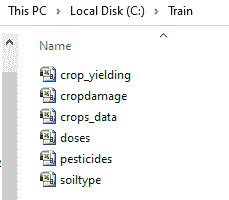

# 用于在目录中列出文件的 C# 程序

> 原文:[https://www . geeksforgeeks . org/c-sharp-program-for-list-in-a-a-directory 中的文件/](https://www.geeksforgeeks.org/c-sharp-program-for-listing-the-files-in-a-directory/)

给定文件，现在我们的任务是使用 C# 列出目录中的所有这些文件。为此，我们使用以下函数和类:

**目录信息:**它是一个提供不同类型的方法来移动、创建和枚举目录及其子目录的类。你不能继承它。

**语法**:

```cs
DirectoryInfo object = new DirectoryInfo(path);
```

其中路径是文件目标，例如–@“C:\ my folder \ file _ name”。

**获取文件:**此方法用于获取当前目录中存在的文件列表。该方法以未排序的方式返回文件名。如果您想要排序的文件名，请使用排序方法。

**语法**:

```cs
DirectoryInfo_object.GetFiles()
```

这个方法返回一个文件信息类型的数组。并在指定路径未找到或无效时抛出*DirectoryNotFoundException*。此方法可以通过以下方式重载:

*   **获取文件(字符串):**该方法用于获取文件的名称，包括它们在给定目录中的路径。
*   **获取文件(字符串、字符串、枚举选项):**该方法用于获取与给定目录中给定搜索模式和枚举选项匹配的文件名及其路径。
*   **获取文件(字符串，String，SearchOption):** 该方法用于获取文件的名称以及与给定目录中给定搜索模式匹配的路径。还使用一个值来检查是否搜索子目录。

**接近**

**1。**使用目录信息类创建和读取目录

```cs
DirectoryInfo place  = new DirectoryInfo(@"C:\Train");
```

**2。**使用 GetFiles()方法创建一个数组来获取所有文件列表

```cs
            FileInfo[] Files = place.GetFiles();
```

**3。**通过 foreach 循环显示带有 Name 属性的文件名

```cs
foreach(FileInfo i in Files)
{           
    Console.WriteLine("File Name - {0}",
                       i.Name);
}
```

**示例:**

在这个例子中，我们取了名为 Train 的 c 盘一个文件夹(目录)——它包括所有的 csv 文件。现在我们将显示这个目录中的文件列表。



## C#

```cs
// C# program to listing the files in a directory
using System;
using System.IO;

class GFG{

static void Main(string[] args)
{

    // Get the directory
    DirectoryInfo place = new DirectoryInfo(@"C:\Train");

    // Using GetFiles() method to get list of all
    // the files present in the Train directory
    FileInfo[] Files = place.GetFiles();
    Console.WriteLine("Files are:");
    Console.WriteLine();

    // Display the file names
    foreach(FileInfo i in Files)
    {
        Console.WriteLine("File Name - {0}", i.Name);
    }
}
}
```

**输出:**

```cs
Files are:
File Name - crop_yielding.csv
File Name - cropdamage.csv
File Name - crops_data.csv
File Name - doses.csv
File Name - pesticides.csv
File Name - soiltype.csv
```