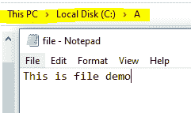

# 从流中读取数据并将数据转换为字符的 C#程序

> 原文:[https://www . geesforgeks . org/c-sharp-program-for-reading-data-from-stream-cast-data-to-chars/](https://www.geeksforgeeks.org/c-sharp-program-for-reading-data-from-stream-and-cast-data-to-chars/)

给定数据，现在我们的任务是从流中读取数据，并将数据转换为 C#中的字符。为此，我们使用以下类和方法:

*   [**【FileStream】**](https://www.geeksforgeeks.org/basics-of-filestream-in-c-sharp/)**:是一个用来读写文件的类。因此，要使用 FileStream 操作文件，需要创建一个 FileStream 类的对象。**

**语法**:

```cs
Stream object = new FileStream(path, FileMode.Open)
```

其中*路径*是你文件的位置–@“c:\ A \ data . txt”，FileMode 是文件的读写等模式。

*   **ReadByte():** 该方法用于从文件中逐字节读取数据。当当前流不支持读取时，此方法将引发 NotSupportException。如果当前流已关闭，则此方法将引发 ObjectDisposedException。

**语法:**

```cs
FileStream_object.ReadByte()
```

**例**:

让我们考虑一个名为“file.txt”的文件存在于 c 盘的 A 文件夹中，如下图所示:



现在我们从流中读取数据，并将数据转换为字符。为此，请遵循以下方法。

**接近**

> *   Use FileStream to read the file named "file.txt" with the specified path.
> *   Use the ReadByte () method to read the data in the file byte by byte until the end of the file is reached.
> 
> ```cs
> while ((obj = s.ReadByte()) != -1)
> {
> 
>     // Convert the data into chars and display
>     Console.Write("{0} ", (char)obj);
> }
> ```
> 
> *   Use Casting to char to display file data as characters.
> 
> ```cs
> (char)obj
> ```

## C#

```cs
// C# program to read the data from stream
// and cast data to chars 
using System;
using System.IO;

public sealed class GFG{

public static void Main()
{

    // Read the file from the specified path
    using (Stream s = new FileStream(@"c:\A\file.txt", FileMode.Open))
    {
        int obj;

        // Read the data in file byte by byte
        // Using ReadByte() method
        while ((obj = s.ReadByte()) != -1)
        {

            // Convert the data into chars and display
            Console.Write("{0} ", (char)obj);
        }
        Console.ReadLine();
    }
}
}
```

**输出**:

```cs
T H I S  I S  F I L E  D E M O
```