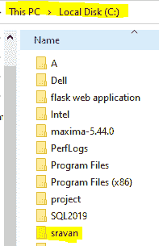

# C#程序创建目录

> 原文:[https://www . geesforgeks . org/c-sharp-program-to-create-a-directory/](https://www.geeksforgeeks.org/c-sharp-program-to-create-a-directory/)

目录是存储文件的文件系统。现在我们的任务是用 C#创建一个目录。我们可以使用目录类的 CreateDirectory()方法创建一个目录。此方法用于在指定路径中创建目录和子目录。如果指定的目录存在或给定的路径无效，则此方法不会创建目录。要使用 CreateDirectory()方法，我们必须导入系统。程序中的 IO 命名空间。

**语法:**

> 公共静态系统。IO . directory info create directory(字符串路径)；

**参数:**路径为目录路径。

**返回:**这将返回指定创建目录的对象。

**异常:**会抛出以下异常:

*   IOException:当路径指定的目录是文件时，会出现此异常。
*   UnauthorizedAccessException:当调用方没有所需的权限时，会出现此异常。
*   ArgumentException:当路径以冒号字符(:)作为前缀或仅包含冒号字符时，会出现此异常。
*   ArgumentNullException:当路径为空时会出现此异常。
*   PathTooLongException:当指定的路径、文件名或两者都超过系统定义的最大长度时，就会出现此异常。
*   DirectoryNotFoundException:当指定的路径无效时，会出现此异常
*   NotSupportedException:当路径包含不属于驱动器标签(“D:\”)的冒号字符(:)时，会出现此异常。

**示例:**

## C#

```
// C# program to illustrate how
// to create directory
using System;
using System.IO;

class GFG{

public static void Main()
{

    // Create directory named Sravan in C drive
    // Using CreateDirectory() method
    Directory.CreateDirectory("C:\\sravan");

    Console.WriteLine("Created");
}
}
```

**输出:**

```
Created
```

