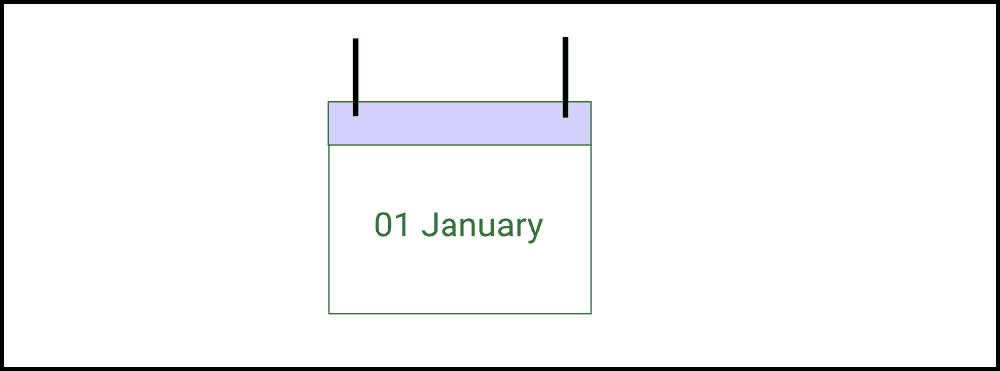

# C# 程序以字符串形式显示日期

> 原文:[https://www . geesforgeks . org/c-sharp-程序到显示-字符串中的日期/](https://www.geeksforgeeks.org/c-sharp-program-to-display-date-in-string/)

C# 语言中的系统命名空间和 mscorlib.dll 程序集提供了多种类和结构。它还提供了日期时间结构，我们可以使用它来初始化数据和时间对象。使用这个结构，我们还可以确定年、月、工作日等。



**1。日期时间构造函数:**日期时间构造函数用于初始化日期时间结构的实例。构造函数方法接受年、月、日、时间作为参数。

**语法:**

> DateTime myDate = new DateTime（YYYY， MM， DD）;

请注意，DateTime 结构总共由 11 个重载构造函数组成，这些构造函数是为不同的目的定义的。本文只关注如何在 C# 中以字符串格式显示日期，因此我们不会讨论所有剩余的构造函数。

**2。DataTime.now()方法:**获取当前日期和时间 DateTime.now()方法使用的是 DateTime 结构。它返回一个 DateTime 结构的对象，该对象可以用 ToString()方法表示为字符串，如下所述。

**语法:**

> DateTime.now(格式)；

**返回类型:**返回包含当前日期和时间的 DateTime 结构的对象

**3。ToString()方法:**每当我们想要以字符串格式打印对象时，这都非常有用。此方法用于将当前日期时间对象值转换为使用指定格式的字符串。

**语法:**

> DateTime.ToString（format）;

**返回类型:**返回表示当前日期和时间的字符串

### 在 C# 中将日期显示为字符串

控制台中有多种显示日期的格式。例如日期/月/年、月/日/年等。C# 提供了许多重载的 DateTime.now()构造函数方法，有助于以各种格式打印日期。下面详细讨论一些常用的方法:

**1。**该方法用于创建包含“月/日/年”格式的当前数据的数据时间结构对象。因为它返回了 DateTime 结构的一个实例，所以我们可以通过使用 ToString()方法将它用作字符串。比如 2021 年 4 月 12 日。

**语法:**

> 日期时间。现在. ToString("MM/dd/yyyy ")

**返回类型:**返回当前日期的字符串格式

**2。**该方法用于创建一个数据时间结构的对象，该对象包含“月日”格式的当前数据。因为它返回了 DateTime 结构的一个实例，所以我们可以使用 ToString()方法将它作为一个字符串使用。比如 04 年 12 月

**语法:**

> 日期时间。现在.托斯特林(“MMMM dd”)

**返回类型:**返回当前日期的字符串格式

**3。**该方法用于创建包含当前格式数据的数据时间结构的对象。因为它返回了 DateTime 结构的一个实例，所以我们可以使用 ToString()方法将它作为一个字符串使用。例如，2021 年 12 月 03 日星期六凌晨 04:10

**语法:**

> DateTime.Now.ToString(“dddd，dd MMMM 年”)

**返回类型:**返回当前日期的字符串格式

**4。**该方法用于创建包含当前格式数据的数据时间结构的对象。因为它返回了 DateTime 结构的一个实例，所以我们可以使用 ToString()方法将它作为一个字符串使用。例如，2021 年 12 月 04 日星期六 06:40:59

**语法:**

> DateTime.Now.ToString(“dddd，dd MMMM yyyy HH:mm:ss”)

**返回类型:**返回当前日期的字符串格式

**5。**该方法用于创建包含当前格式数据的数据时间结构的对象。因为它返回了 DateTime 结构的一个实例，所以我们可以使用 ToString()方法将它作为一个字符串使用。例如，12/04/2021 06:41

**语法:**

> 日期时间。现在. ToString("MM/dd/yyyy HH:mm ")

**返回类型:**返回当前日期的字符串格式

**6。**该方法用于创建包含当前格式数据的数据时间结构的对象。因为它返回了 DateTime 结构的一个实例，所以我们可以使用 ToString()方法将它作为一个字符串使用。例如，2021 年 4 月 12 日上午 06:44

**语法:**

> datetime 日期时间。now . tostring(" mm/DD/yyyy hh:mm TT ")

**返回类型:**返回当前日期的字符串格式

**7。**该方法用于创建包含当前格式数据的数据时间结构的对象。因为它返回了 DateTime 结构的一个实例，所以我们可以使用 ToString()方法将它作为一个字符串使用。例如，2021 年 4 月 12 日 6:44

**语法:**

> 日期时间。现在. ToString("MM/dd/yyyy H:mm ")

**返回类型:**返回当前日期的字符串格式

**8。**该方法用于创建包含当前格式数据的数据时间结构的对象。因为它返回了 DateTime 结构的一个实例，所以我们可以使用 ToString()方法将它作为一个字符串使用。例如，2021 '-' 12 '-' 04 ' T ' 07 ':' 33 ':' 15.9841280+00:00

**语法:**

> datetime 日期时间。now . tostring(" yyyy '-' mm '-' DD ' t hh ':mm ':ss . ffffff fk ")

**返回类型:**返回当前日期的字符串格式

**9。**该方法用于创建包含当前格式数据的数据时间结构的对象。因为它返回了 DateTime 结构的一个实例，所以我们可以使用 ToString()方法将它作为一个字符串使用。例如，Sat，04 2021 年 12 月 07 日:“34”:“42”G12T

**语法:**

> datetime 日期时间。Now.ToString("ddd，DD mmm hh ":" mm ":ss ' GMT ")

**返回类型:**返回当前日期的字符串格式

**10。**该方法用于创建包含当前格式数据的数据时间结构的对象。因为它返回了 DateTime 结构的一个实例，所以我们可以使用 ToString()方法将它作为一个字符串使用。例如，2021'-'12'-'04'T'07':'41':'12

**语法:**

> 日期时间。现在. ToString(" yyyy '-' MM '-' DD ' t ' hh ':' MM ':' ss ")

**返回类型:**返回当前日期的字符串格式

下面是说明这些方法的实现。

**示例:**

## C#

```cs
// C# program to illustrate how we can 
// display date and time in a string format
using System;

class GFG{

static public void Main()
{

    // Getting the string form of the current date in 
    // a format i.e, 12/04/2021   
    string currentDate1 = DateTime.Now.ToString("MM/dd/yyyy");

    // Displaying the current date
    Console.WriteLine("currentDate1 : " + currentDate1);

    // Getting the string form of the current date in
    // a format i.e, Saturday, 04 December 2021
    string currentDate2 = DateTime.Now.ToString("dddd, dd MMMM yyyy");

    // Displaying the current date
       Console.WriteLine("currentDate2 : " + currentDate2);

    // Getting the string form of the current date
    // in a format i.e, December 04                  
    string currentDate3 = DateTime.Now.ToString("MMMM dd");

    // Displaying current date      
    Console.WriteLine("currentDate3 : " + currentDate3);

    // Getting the string form of the current date 
    // in a format, Saturday, i.e, 04 December 2021 19:12:29          
    string currentDate4 = DateTime.Now.ToString(
        "dddd, dd MMMM yyyy HH:mm:ss");

    // Displaying current date      
    Console.WriteLine("currentDate4 : " + currentDate4);

    // Getting the string form of the current date 
    // in a format, i.e, 12/04/2021 19:12          
    string currentDate5 = DateTime.Now.ToString("MM/dd/yyyy HH:mm");

    // Displaying current date      
    Console.WriteLine("currentDate5 : " + currentDate5);

    // Getting the string form of the current date
    // in a format, i.e, 12/04/2021 07:12 PM          
    string currentDate6 = DateTime.Now.ToString("MM/dd/yyyy hh:mm tt");

    // Displaying current date      
    Console.WriteLine("currentDate6 : " + currentDate6);

    // Getting the string form of the current date in 
    // a format,i.e, 12/04/2021 19:12         
    string currentDate7 = DateTime.Now.ToString("MM/dd/yyyy H:mm");

    // Displaying current date      
    Console.WriteLine("currentDate7 : " + currentDate7);

    // Getting the string form of the current date in 
    // a format, 2021’-‘12’-‘04’T’19’:’12’:’29.6715830+00:00          
    string currentDate8 = DateTime.Now.ToString(
        "yyyy’-‘MM’-‘dd’T’HH’:’mm’:’ss.fffffffK");

    // Displaying current date
    Console.WriteLine("currentDate8 : " + currentDate8);

    // Getting the string form of the current date in
    // a format, Sat, 04 Dec 2021 19’:’12’:’29 ‘G12T          
    string currentDate9 = DateTime.Now.ToString(
        "ddd, dd MMM yyy HH’:’mm’:’ss ‘GMT");

    // Displaying current date      
    Console.WriteLine("currentDate9 : " + currentDate9);

    // Getting the string form of the current date in 
    // a format, 2021’-‘12’-‘04’T’19’:’12’:’29          
    string currentDate10 = DateTime.Now.ToString(
        "yyyy’-‘MM’-‘dd’T’HH’:’mm’:’ss");

    // Displaying current date      
    Console.WriteLine("currentDate10 : " + currentDate10);
}
}
```

**输出:**

```cs
currentDate1 : 12/07/2021
currentDate2 : Tuesday, 07 December 2021
currentDate3 : December 07
currentDate4 : Tuesday, 07 December 2021 09:00:37
currentDate5 : 12/07/2021 09:00
currentDate6 : 12/07/2021 09:00 AM
currentDate7 : 12/07/2021 9:00
currentDate8 : 2021’-‘12’-‘07’T’09’:’00’:’37.9475430+05:30
currentDate9 : Tue, 07 Dec 2021 09’:’00’:’37 ‘G12T
currentDate10 : 2021’-‘12’-‘07’T’09’:’00’:’37
```