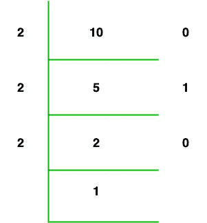

# C#程序使用递归寻找整数的二进制等价形式

> 原文:[https://www . geesforgeks . org/c-sharp-program-to-find-整数的二进制等价使用递归/](https://www.geeksforgeeks.org/c-sharp-program-to-find-binary-equivalent-of-an-integer-using-recursion/)

给定一个整数，现在我们使用递归将给定的整数转换成二进制数。递归是一种函数直接或间接调用自身的方法，这种类型的函数称为递归函数。它非常有效地解决了这个问题，就像我们找到整数的二进制等价物一样。

**示例:**

```cs
Input : 10
Output: 1010

Input : 11
Output: 1011
```

**进场:**

> 要显示整数的二进制等价物，我们使用以下步骤:
> 
> *   If 条件用于检查给定值是否不等于零。
> *   如果给定条件为真，则执行 val 的模 2，然后将模结果加到 10，然后将结果值乘以 decimaltobinary()函数的值。
> *   现在重复步骤 2，直到 val 变量的值大于零。
> *   现在以相反的顺序打印数组。
> *   如果条件为假，那么它将执行 else 部分，即返回 0

下图可以帮助您更好地理解这种方法。



让我们考虑一下整数是 10。现在我们找到了 10 的二进制等效值，

*   10 % 2 + 10 * (10 / 2) % 2 将返回 0
*   5 % 2 + 10 * (5 / 2) % 2 将返回 1
*   2 % 2 + 10 * (2 / 2) % 2 将返回 0
*   1 % 2 + 10 * (1 / 2) % 2 将返回 1

所以最终结果是 1010。

**例 1:**

## C#

```cs
// C# program to display the binary equivalent
// of an integer
using System;

class GFG{

// Driver code
public static void Main(string[] args)
{

    // Input
    int num = 15;

    decimaltobinary(num);
}

// Function to display the binary equivalent 
// of an integer
public static int decimaltobinary(int val)
{
    int binary;

    if (val != 0)
    {
        binary = (val % 2) + 10 * decimaltobinary(val / 2);
        Console.Write(binary);
        return 0;
    }
    else
    {
        return 0;
    }
}
}
```

**Output**

```cs
1111
```

**例 2:**

## C#

```cs
// C# program to display the binary equivalent
// of an integer
using System;

class GFG{

// Function to display the binary equivalent 
// of an integer
public static int decimaltobinary(int val)
{
    int binary;

    if (val != 0)
    {
        binary = (val % 2) + 10 * decimaltobinary(val / 2);
        Console.Write(binary);
        return 0;
    }
    else
    {
        return 0;
    }
}

// Driver code
public static void Main(string[] args)
{
    int num;

    // Reading input from user
    Console.Write("Hi! Enter the number:");
    num = int.Parse(Console.ReadLine());
    decimaltobinary(num);

}
}
```

**输出:**

```cs
Hi! Enter the number:10
1010
```