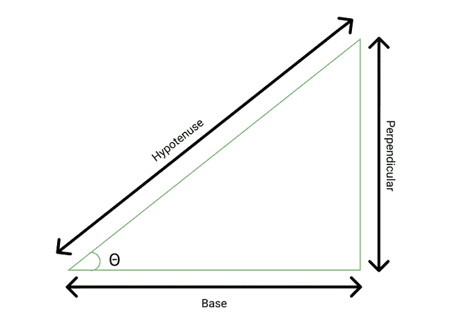

# 求 Sin(x)值的 C#程序

> 原文:[https://www . geesforgeks . org/c-sharp-program-to-find-value-of-sinx/](https://www.geeksforgeeks.org/c-sharp-program-to-find-the-value-of-sinx/)

正弦(x)也称为正弦。它是一个角度的三角函数。在直角三角形中，垂线的长度与斜边的长度之比称为角的正弦。



```
sin θ = perpendicular / hypotenuse
```

下面给出了一些常见角度的正弦值，

1.  sin 0 = 0
2.  罪 30 = 1 / 2
3.  无 45 度= 1 / √2
4.  sin 60 <sup>°</sup> = √3 / 2
5.  罪过 90 = 1

本文主要讨论如何用 C#计算角度的正弦值。

### 方法 1

我们可以使用内置的 [sin()](https://www.geeksforgeeks.org/c-sharp-math-sin-method/#:~:text=Sin()%20is%20an%20inbuilt,value%20argument(specified%20angle).&text=Parameter%3A,of%20this%20parameter%20is%20System.&text=Return%20Value%3A%20Returns%20the%20sine%20of%20num%20of%20type%20System.) 方法来计算角度的正弦。此方法在数学类下定义，是系统命名空间的一部分。数学课非常有用，因为它提供了常数和一些三角函数、对数函数等静态方法。

**语法:**

> 公静双 Sin(双角)；

**参数:**

*   角度:双精度值(弧度角度)

**返回类型:**

*   双重:如果“角度”是双重的
*   NaN:如果“角度”等于 NaN，否定有限性，或者肯定有限性

**例 1:**

## C#

```
// C# program to illustrate how we can 
// calculate the value of sin(x)
// using Sin() method
using System.IO;
using System;

class GFG{

static void Main()
{

    // Angle in degree 
    double angleInDegree1 = 0;

    // Converting angle in radian
    // since Math.sin() method accepts
    // angle in radian
    double angleInRadian1 = (angleInDegree1 * (Math.PI)) / 180;

    // Using Math.Sin() method to calculate value of sine
    Console.WriteLine("The value of sin({0}) = {1} ", 
                      angleInDegree1, Math.Sin(angleInRadian1));

    // Angle in degree 
    double angleInDegree2 = 45;

    // Converting angle in radian
    // since Math.sin() method accepts
    // angle in radian
    double angleInRadian2 = (angleInDegree2 * (Math.PI)) / 180;

    // Using Math.Sin() method to calculate value of sine
    Console.WriteLine("The value of sin({0}) = {1} ", 
                      angleInDegree2, Math.Sin(angleInRadian2));

    // Angle in degree 
    double angleInDegree3 = 90;

    // Converting angle in radian
    // since Math.sin() method accepts
    // angle in radian
    double angleInRadian3 = (angleInDegree3 * (Math.PI)) / 180;

    // Using Math.Sin() method to calculate value of sine
    Console.WriteLine("The value of sin({0}) = {1} ", 
                      angleInDegree3, Math.Sin(angleInRadian3));

    // Angle in degree 
    double angleInDegree4 = 135;

    // Converting angle in radian
    // since Math.sin() method accepts
    // angle in radian
    double angleInRadian4 = (angleInDegree4 * (Math.PI)) / 180;

    // Using Math.Sin() method to calculate value of sine
    Console.WriteLine("The value of sin({0}) = {1} ", 
                      angleInDegree4, Math.Sin(angleInRadian4));
}
}
```

**Output**

```
The value of sin(0) = 0 
The value of sin(45) = 0.707106781186547 
The value of sin(90) = 1 
The value of sin(135) = 0.707106781186548 
```

**例 2:**

## C#

```
// C# program to illustrate how we can 
// calculate the value of sin(x)
// using Sin() method
using System;

class GFG{

static public void Main()
{

    // Angle in radian
    double angle1 = Double.NegativeInfinity;

    // Angle in radian
    double angle2 = Double.PositiveInfinity;

    // Angle in radian
    double angle3 = Double.NaN;

    // Using Math.Sin() method to calculate value of sine
    Console.WriteLine("The value of sin({0}) = {1} ", 
                      angle1, Math.Sin(angle1));

    // Using Math.Sin() method to calculate value of sine
    Console.WriteLine("The value of sin({0}) = {1} ", 
                      angle2, Math.Sin(angle2));

    // Using Math.Sin() method to calculate value of sine
    Console.WriteLine("The value of sin({0}) = {1} ", 
                      angle3, Math.Sin(angle3));
}
}
```

**输出**

```
Sine of angle1: NaN
Sine of angle2: NaN
Sine of angle3: NaN
```

### 方法 2

我们可以用麦克劳林展开法计算一个角度的正弦值。所以辛(x)的麦克劳林级数展开式是:

```
sin(x) = x - x3 / 3! + x5 / 5! - x7 / 7! + ....
```

按照下面给出的步骤找到 sin(x)的值:

1.  初始化存储要计算的角度(以度为单位)的变量**角度等级**。
2.  初始化另一个变量**项**，它存储了我们可以近似 sin(x)值的项数。
3.  声明一个全局函数 **findSinx** 。
4.  声明一个变量**当前。**以弧度存储角度。
5.  初始化一个变量**用**电流**回答**。它会储存我们的最终答案。
6.  用**电流**初始化另一个变量**温度**。
7.  从 **i** = 1 迭代到 **i** = **术语**。在每个步骤中，将 temp 更新为 temp as((-temp)* current * current)/((2 * I)*(2 * I+1))，并将答案更新为答案+ temp。
8.  最终，从 **findSinX** 功能返回答案。
9.  打印答案。

这个公式可以计算出 x 的所有实数值的正弦值。

**示例:**

## C#

```
// C# program to illustrate how we can 
// calculate the value of sin(x)
// using Maclaurin's method
using System;

class GFG{

static double findSinX(int angleInDegree, int terms)
{

    // Converting angle in degree into radian 
    double current = Math.PI * angleInDegree / 180f;

    // Declaring variable to calculate final answer
    double answer = current;
    double temp = current;

    // Loop till number of steps provided by the user
    for(int i = 1; i <= terms; i++)
    {

        // Updating temp and answer accordingly
        temp = ((-temp) * current * current) / 
                    ((2 * i) * (2 * i + 1));
        answer = answer + temp;
    }

    // Return the final answer
    return answer;
}

// Driver code
static public void Main()
{

    // Angle in degree
    int angleInDegree1 = 45;

    // Number of steps 
    int terms1 = 10;

    // Calling function to calculate sine of angle
    double answer1 = findSinX(angleInDegree1, terms1);

    // Print the final answer
    Console.WriteLine("The value of sin({0}) = {1}", 
                      angleInDegree1, answer1);

    // Angle in degree
    int angleInDegree2 = 90;

    // Number of steps
    int terms2 = 20;

    // Calling function to calculate sine of angle      
    double result2 = findSinX(angleInDegree2, terms2);

    // Print the final answer
    Console.WriteLine("The value of sin({0}) = {1}", 
                      angleInDegree2, result2);

    // Angle in degree
    int angleInDegree3 = 135;

    // Number of steps
    int terms3 = 30;

    // Calling function to calculate sine of angle          
    double result3 = findSinX(angleInDegree3, terms3);

    // Print the final answer
    Console.WriteLine("The value of sin({0}) = {1}", 
                      angleInDegree3, result3);

    // Angle in degree
    int angleInDegree4 = 180;

    // Number of steps
    int terms4 = 40;

    // Calling function to calculate sine of angle
    double result4 = findSinX(angleInDegree4, terms4);

    // Print the final answer
    Console.WriteLine("The value of sin({0}) = {1}", 
                      angleInDegree4, result4);
}
}
```

**Output**

```
The value of sin(45) = 0.707106781186547
The value of sin(90) = 1
The value of sin(135) = 0.707106781186548
The value of sin(180) = 2.34898825287367E-16
```