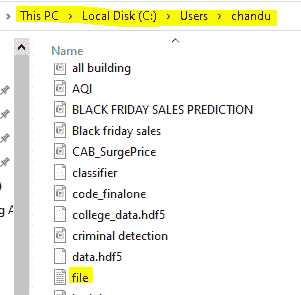

# 使用文件类获取文件时间的 C#程序

> 原文:[https://www . geesforgeks . org/c-sharp-程序获取文件-时间-使用文件-类/](https://www.geeksforgeeks.org/c-sharp-program-to-get-file-time-using-file-class/)

给定一个文件，现在我们的任务是使用 file 类获取文件时间。所以我们使用文件类的 **GetCreationTime()** 方法。此方法用于查找给定文件或目录的创建日期和时间。此方法将只接受一个参数，即文件的路径，如果此路径参数不存在，则它将返回公元 1601 年 1 月 1 日午夜 12:00 协调世界时(UTC)，调整为当地时间。

**语法:**

> 公共静态 DateTime GetCreationTime(字符串 Ipath)

这里 Ipath 表示文件或目录的路径。

**返回类型:**该方法的返回类型为 DateTime。它是一个设置为指定文件的日期和时间的结构。

**异常:**可以有以下异常；

*   **unauthorizeaccess exception:**当调用者没有所需的权限时，就会出现此异常。
*   **ArgumentException:** 当给用户一个无效类型的参数(如零长度字符串，包含一个或多个无效字符)时，会出现此异常。
*   **ArgumentNullException:** 当文件路径为空时，会出现此异常。
*   **PathTooLongException:** 当指定的文件路径、文件名或两者都超过系统定义的最大长度时，就会出现此异常。
*   **notSupportDexception:**当文件路径的格式无效时，将出现此异常。

**示例:**

在本例中，我们将在 C 驱动器中创建一个名为“file.txt”的文件，路径如下图所示:



## C#

```cs
// C# program to get file time
// using File Class
using System;
using System.IO;

class GFG{

static void Main()
{

    // Declaring a time variable that will store 
    // the creation time of the file 
    // Using GetCreationTime() method of File class
    DateTime createdtime = File.GetCreationTime("C://users//file.txt");

    // Display the creation time of the file
    Console.WriteLine("File is created at: {0}", createdtime);
}
}
```

**输出**:

```cs
File is created at: 10/22/2021 1:02:10 PM
```