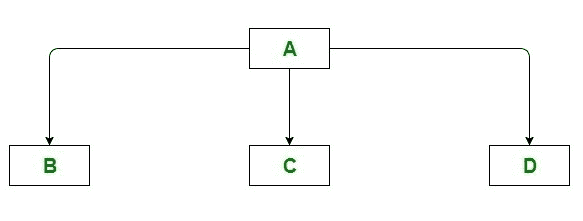

# 用于层次继承的 C# 程序

> 原文:[https://www . geeksforgeeks . org/c-sharp-program-to-design-over-concept/](https://www.geeksforgeeks.org/c-sharp-program-to-illustrate-the-above-concept/)

[继承](https://www.geeksforgeeks.org/c-sharp-inheritance/)是面向对象编程的一个基本方面。超类，也称为基类，是其成员被继承的类，而子类，也称为派生类，是从超类继承的类。它们也分别称为父类和子类。就像孩子继承父母的特质，父母继承前辈的特质一样，编程语言中的继承也是如此。

### 分级继承

就技术术语和面向对象方面而言，这是一种将特性从父类传输到基类、子类或子类的方式。父类或超类是从中获取属性的类，即继承了特性。层次继承描述了一个父类被多个子类继承的情况。从单个父类或基类继承多个类的继承类型称为层次继承。基类与父类共享许多相同的属性，尤其是那些在父类中常见的属性。一个基类产生许多类。这就像有几个孩子，每个孩子都有自己从父母那里获得的一套特征。例如，在下图中，类 A 充当子类 B、C 和 d 的基类(父类)



**例 1:**

以下示例中的基类是父类，派生类是子级第一和子级第二。我们已经从两个派生类中创建了对象，并且正在调用同一个基类函数。

## C#

```cs
// C# program to illustrate the above concept
using System;

// Base Class
public class Father 
{
    public string FatherName() 
    { 
        return "Ravi"; 
    }
}

// Derived Class
public class ChildFirst : Father 
{
    public string ChildDName() 
    { 
        return "Rohan"; 
    }
}

// Derived Class
public class ChildSecond : Father 
{
    public string ChildDName() 
    { 
        return "Nikhil"; 
    }
}

class GFG{

static public void Main()
{
    ChildFirst first = new ChildFirst();

    // Displaying Child Name and Father Name for
    // ChildFirst
    Console.WriteLine("My name is " + first.ChildDName() + 
                      ". My father name is " + 
                      first.FatherName() + ".");
    ChildSecond second = new ChildSecond();

    // Displaying Child Name and Father Name for
    // ChildSecond
    Console.WriteLine("My name is " + second.ChildDName() + 
                      ". My father name is " + 
                      second.FatherName() + ".");
}
}
```

**Output**

```cs
My name is Rohan. My father name is Ravi.
My name is Nikhil. My father name is Ravi.
```

**例 2:**

在下面的代码中，我们创建了三个类:个人、教师和医生。在这个例子中，Person 类被教师类和医生类继承。每个类中的构造函数都用于初始化数据成员。然后我们创建了教师和医生对象，并使用教师详细信息()和医生详细信息()分别为教师和医生生成信息。

## C#

```cs
// C# program to illustrate the above concept
using System;

// Base Class
class Person 
{
    public string name;
    public int aadhar_id;
    public int age;

    public Person(int aadhar_id, int age, string name)
    {
        this.aadhar_id = aadhar_id;
        this.name = name;
        this.age = age;
    }
}

// Derived Class
class Teacher : Person 
{
    public int teacher_salary;

    public Teacher(int aadhar_id, int salary, 
                   string name, int age) : base(aadhar_id, 
                                                age, name)
    {
        teacher_salary = salary;
    }
    public void TeacherDetails()
    {
        Console.WriteLine("teacher ID:      " + aadhar_id);
        Console.WriteLine("teacher Name:    " + name);
        Console.WriteLine("teacher Salary:  " + teacher_salary);
        Console.WriteLine("teacher Age:     " + age);
    }
}

// Derived Class
class Doctor : Person 
{
    public int doctor_fees;

    public Doctor(int aadhar_id, int fees, 
                  string name, int age) : base(aadhar_id, 
                                               age, name)
    {
        doctor_fees = fees;
    }
    public void DoctorDetails()
    {
        Console.WriteLine("Doctor ID:      " + aadhar_id);
        Console.WriteLine("Doctor Name:    " + name);
        Console.WriteLine("Doctor Fees:    " + doctor_fees);
        Console.WriteLine("Doctor Age:     " + age);
    }
}

class GFG{

static public void Main()
{

    // Creating objects
    Teacher t = new Teacher(25054, 50000, "Sanjay", 28);
    Doctor d = new Doctor(25045, 750, "Rohit", 32);

    t.TeacherDetails();
    Console.WriteLine(
        "-----------------------------------");
    d.DoctorDetails();
}
}
```

**Output**

```cs
teacher ID:      25054
teacher Name:    Sanjay
teacher Salary:  50000
teacher Age:     28
-----------------------------------
Doctor ID:      25045
Doctor Name:    Rohit
Doctor Fees:    750
Doctor Age:     32
```