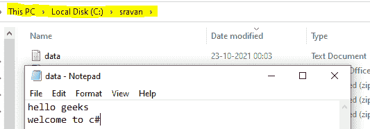

# C#程序查看文件的访问日期和时间

> 原文:[https://www . geesforgeks . org/c-sharp-程序查看文件的访问日期和时间/](https://www.geeksforgeeks.org/c-sharp-program-to-view-the-access-date-and-time-of-a-file/)

给定一个文件，我们的任务是查看访问文件的日期和时间。为此，我们使用文件系统信息类的以下属性:

**1。CreationTime:** 该属性用于获取文件创建的时间。

**语法**:

> 文件。创造时间

其中文件是文件的路径，它将返回日期时间。日期时间结构设置为指定文件的日期和时间。

**2。lastpaccesstime:**该属性用于获取文件最后被使用/访问的时间。

**语法**:

> 文件，文件。压舱物

它将返回一个表示访问当前文件的时间的日期时间。

**3。LastWriteTime:** 此属性用于获取文件或目录最后写入/更新的时间。

**语法**:

> 文件，文件。载荷时间

它将返回一个 DateTime，表示当前文件中最后一次写入的时间。

**接近**

> 1.使用文件路径读取文件，即 C://sravan//data.txt
> 
> 2.使用 CreationTime 属性声明用于访问文件时间详细信息的日期时间变量。
> 
> ```cs
> DateTime createdtime = path.CreationTime
> ```
> 
> 3.使用 last access time 属性获取文件的上次访问时间。
> 
> ```cs
> createdtime = path.LastAccessTime
> ```
> 
> 4.使用 LastWriteTime 属性获取文件最后写入的时间。
> 
> ```cs
> createdtime = path.LastWriteTime
> ```

**示例:**

在本例中，我们将在 C 驱动器中创建一个包含两行数据的文件，文件名为 data.txt，路径如下图所示:



## C#

```cs
// C# Program to display the date 
// and time of access of a file 
using System;
using System.IO;

class GFG{

static void Main()
{

    // Choose the file using file path
    FileInfo path = new FileInfo("C://sravan//data.txt");

    // Declare time variable using DateTime function 
    // This variable holds the time of the file in 
    // which it is created
    DateTime createdtime = path.CreationTime;

    // Get the file created time
    Console.WriteLine("File is created at: {0}", createdtime);

    // Get the file lastly accessed time
    createdtime = path.LastAccessTime;
    Console.WriteLine("File is accessed at lastly: {0}", createdtime);

    // Get the file lastly updated/written time
    createdtime = path.LastWriteTime;
    Console.WriteLine("File is lastly written on: {0} ", createdtime);

}
}
```

**输出:**

```cs
File is created at: 10/23/2021 10:02:10 AM
File is accessed at lastly: 10/23/2021 10:20:00 AM
File is lastly written on: 10/23/2021 10:17:03 AM
```