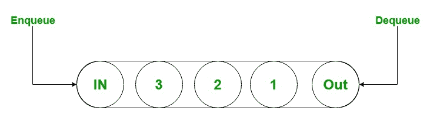

# C# 队列示例

> 原文:[https://www.geeksforgeeks.org/c-sharp-queue-with-examples/](https://www.geeksforgeeks.org/c-sharp-queue-with-examples/)

队列用于表示先进先出的对象集合。当您需要先进先出访问项目时，可以使用它。它是在`System.Collections`命名空间中定义的非泛型集合类型。它用于创建一个动态集合，该集合根据程序的需要而增长。在队列中，您可以存储相同类型和不同类型的元素。通常，当您以与信息存储在集合中的方式相同的方式访问这些信息时，队列是有帮助的，它是存储数据的临时存储。



下图说明了队列类的层次结构:


**要点:**

*   队列类实现了*无限*、*集合*和*无限*接口。
*   当您在列表中添加一个项目时，它被称为 **[入队](https://www.geeksforgeeks.org/queue-enqueue-method-in-c-sharp/)** 。
*   当你移除一个物品时，它被称为 **[出列](https://www.geeksforgeeks.org/queue-dequeue-method-in-c-sharp/)** 。
*   队列接受 null 作为引用类型的有效值。
*   当元素添加到队列中时，容量会根据需要通过重新分配内部阵列来自动增加。
*   在队列中，您可以存储重复的元素。
*   队列的容量是队列可以容纳的元素数量。

#### 如何创建队列？

队列类有*四个构造函数*，用于创建队列，如下所示:

*   **Queue():** 此构造函数用于创建 Queue 类的一个实例，该实例为空，具有默认的初始容量，并使用默认的增长因子。
*   **Queue(icocollection):**此构造函数用于创建 Queue 类的实例，该实例包含从指定集合复制的元素，具有与复制的元素数量相同的初始容量，并使用默认的增长因子。
*   **Queue(Int32):** 此构造函数用于创建 Queue 类的一个实例，该实例为空且具有指定的初始容量，并使用默认的增长因子。
*   **Queue(Int32，Single):** 此构造函数用于创建 Queue 类的一个实例，该实例为空，具有指定的初始容量，并使用指定的增长因子。

让我们看看如何使用 Queue()构造函数创建一个队列:

**第一步:**包含*系统。集合*命名空间在你的程序中借助使用关键字。

**语法:**

```cs
using System.Collections;
```

**步骤 2:** 使用队列类创建一个队列，如下所示:

```cs
Queue queue_name = new Queue();
```

**第三步:**如果想在队列中添加元素，那么使用 *[Enqueue()](https://www.geeksforgeeks.org/queue-enqueue-method-in-c-sharp/)* 方法在队列中添加元素。如下例所示。

**示例:**

```cs
// C# program to illustrate queue
using System;
using System.Collections;

public class GFG {
    static public void Main()
    {

        // Create a queue
        // Using Queue class
        Queue my_queue = new Queue();

        // Adding elements in Queue
        // Using Enqueue() method
        my_queue.Enqueue("GFG");
        my_queue.Enqueue(1);
        my_queue.Enqueue(100);
        my_queue.Enqueue(null);
        my_queue.Enqueue(2.4);
        my_queue.Enqueue("Geeks123");

        // Accessing the elements
        // of my_queue Queue
        // Using foreach loop
        foreach(var ele in my_queue)
        {
            Console.WriteLine(ele);
        }
    }
}
```

**Output:**

```cs
GFG
1
100

2.4
Geeks123

```