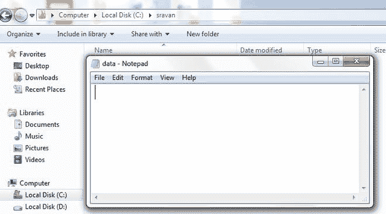
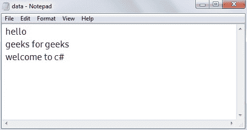

# c#–从文件中读取行，直到到达文件结尾

> 原文:[https://www . geesforgeks . org/c-sharp-reading-line-from-a-file-to-end-file-reach/](https://www.geeksforgeeks.org/c-sharp-reading-lines-from-a-file-until-the-end-of-file-is-reached/)

给定一个文件，现在我们的任务是使用 C#从文件中读取行，直到文件结束。在从文件中读取行之前，我们必须有一些数据，所以首先我们需要在路径中有一个空文件，然后在文件中插入行，然后我们从文件中读取行。因此，为了完成这项任务，我们使用了两个基本操作，即读和写。当我们打开文件进行读写时，文件就变成了一个流，这里的流是指用于通信的字节序列。所以对于我们的任务，我们使用:

**路径:**从任何来源读取文件，我们都需要位置/路径。路径是包含系统中文件路径的字符串。

```
 @"c:\folder\file_name.txt"
```

我们将使用文件检查路径中是否存在该文件。存在(路径)方法

**stream writer:**stream writer 用于将数据流/行写入文件。

```
StreamWriter sw = new StreamWriter(myfilepath)
```

**stream reader:**stream reader 用于从文件中读取数据流/行。

```
StreamReader sr = new StreamReader(myfilepath)
```

**Peek:** 用于从文件中读取数据/行，直到文件结束。

```
StreamReaderObject.Peek()
```

所以所有的都放在 try()块中，以捕获发生的异常。

**示例:**考虑的路径和文件有:



## C#

```
// C# program to read lines from a file 
// until the end of file is reached
using System;
using System.IO;

class GFG{

public static void Main()
{

    // File name is data
    // File path is the following path 
    string myfilepath = @"c:\sravan\data.txt";
    try
    {

        // Check if file exists or not
        if (File.Exists(path))
        {
            File.Delete(path);
        }

        // Write data into file using StreamWriter through the path
        using (StreamWriter sw = new StreamWriter(myfilepath))
        {
            sw.WriteLine("hello");
            sw.WriteLine("geeks for geeks");
            sw.WriteLine("welcome to c#");

        }

        // Read the file present in the path
        using (StreamReader sr = new StreamReader(myfilepath))
        {

            // Iterating the file
            while (sr.Peek() >= 0)
            {

                // Read the data in the file until the peak
                Console.WriteLine(sr.ReadLine());
            }
        }
    }

    // Caught the excpetion
    catch (Exception e)
    {
        Console.WriteLine("The process failed: {0}", e.ToString());
    }
    Console.Read();
}
```

**输出**:

```
hello
geeks for geeks
welcome to c#
```

查看插入的文件数据:

