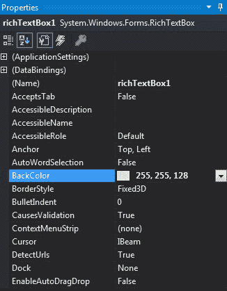
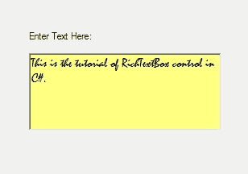
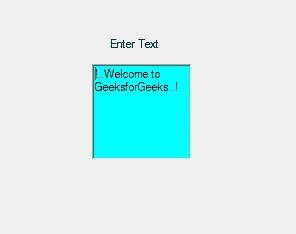

# C# | RichTextBox 类

> 原文:[https://www.geeksforgeeks.org/c-sharp-richtextbox-class/](https://www.geeksforgeeks.org/c-sharp-richtextbox-class/)

在 C# 中，RichTextBox 控件是一个文本框，它为您提供富文本编辑控件和高级格式功能，还包括加载富文本格式(RTF)文件。或者换句话说，RichTextBox 控件允许您显示或编辑流内容，包括段落、图像、表格等。RichTextBox 类用于表示窗口富文本框，还提供不同类型的属性、方法和事件。在**系统下定义。Windows.Forms** 命名空间。
它不像 TextBox 控件那样有 64K 字符的容量限制。它用于提供文本操作和显示功能，类似于微软 word 等文字处理应用程序。在 C# 中，您可以使用两种不同的方法在 windows 窗体中创建一个 RichTextBox:

**1。设计时:**创建 RichTextBox 的最简单方法如下所示:

*   **Step 1:** Create a windows form as shown in the below image:
    **Visual Studio -> File -> New -> Project -> WindowsFormApp**

    

*   **步骤 2:** 接下来，将 RichTextBox 控件从工具箱拖放到表单中。
    T3】
*   **Step 3:** After drag and drop you will go to the properties of the RichTextBox control to modify RichTextBox according to your requirement.

    

    **输出:**

    

**2。运行时:**比上面的方法稍微复杂一点。在此方法中，您可以借助 RichTextBox 类提供的语法以编程方式创建 RichTextBox 控件。以下步骤显示了如何动态设置 create RichTextBox:

*   **步骤 1:** 使用 RichTextBox 类提供的 RichTextBox()构造函数创建一个 RichTextBox 控件。

    ```cs
    // Creating a RichTextBox control
    RichTextBox box = new RichTextBox(); 

    ```

*   **步骤 2:** 创建完 RichTextBox 控件后，设置 RichTextBox 类提供的 RichTextBox 控件的属性。

    ```cs
    // Setting the location 
    // of the RichTextBox
    box.Location = new Point(236, 97); 

    // Setting the background
    // color of the RichTextBox
    box.BackColor = Color.Aqua; 

    // Setting the text 
    // in the RichTextBox
    box.Text = "!..Welcome to GeeksforGeeks..!"; 

    ```

*   **Step 3:** And last add this RichTextBox control to the form using the following statement:

    ```cs
    // Adding this RichTextBox
    // in the form 
    this.Controls.Add(box); 

    ```

    **示例:**

    ```cs
    using System;
    using System.Collections.Generic;
    using System.ComponentModel;
    using System.Data;
    using System.Drawing;
    using System.Linq;
    using System.Text;
    using System.Threading.Tasks;
    using System.Windows.Forms;

    namespace WindowsFormsApp30 {

    public partial class Form1 : Form {

        public Form1()
        {
            InitializeComponent();
        }

        private void Form1_Load(object sender, EventArgs e)
        {
            // Creating and setting the
            // properties of the label
            Label lb = new Label();
            lb.Location = new Point(251, 70);
            lb.Text = "Enter Text";

            // Adding this label in the form
            this.Controls.Add(lb);

            // Creating and setting the
            // properties of the RichTextBox
            RichTextBox box = new RichTextBox();
            box.Location = new Point(236, 97);
            box.BackColor = Color.Aqua;
            box.Text = "!..Welcome to GeeksforGeeks..!";

            // Adding this RichTextBox in the form
            this.Controls.Add(box);
        }
    }
    }
    ```

    **输出:**
    

#### 构造器

| 构造器 | 描述 |
| **法官文本框()** | 该构造函数用于初始化 RichTextBox 类的新实例。 |

#### 性能

| 财产 | 描述 |
| **自动化** | 此属性用于获取或设置一个值，该值指示控件是否根据其内容调整大小。 |
| **背景色** | 此属性用于获取或设置控件的背景色。 |
| 边框样式 | 此属性指示控件的边框样式。 |
| 字体 | 此属性用于获取或设置控件显示的文本的字体。 |
| **前颜色** | 此属性用于获取或设置控件的前景色。 |
| **高度** | 此属性用于获取或设置控件的高度。 |
| **位置** | 此属性用于获取或设置 RichTextBox 控件左上角相对于其窗体左上角的坐标。 |
| **名称** | 此属性用于获取或设置控件的名称。 |
| **tab top** | 此属性用于获取或设置一个值，该值显示用户是否可以按 TAB 键将焦点提供给 NumericUpDown。 |
| **尺寸** | 此属性用于获取或设置控件的高度和宽度。 |
| **文字** | 此属性用于获取或设置要在 RichTextBox 控件中显示的文本。 |
| **可见** | 此属性用于获取或设置一个值，该值指示是否显示控件及其所有子控件。 |
| **宽度** | 此属性用于获取或设置控件的宽度。 |
| **缩放系数** | 此属性用于获取或设置 RichTextBox 的当前缩放级别。 |
| **显示选择标记** | 此属性用于获取或设置一个值，该值指示选择边距是否显示在 RichTextBox 中。 |
| **选择标签** | 此属性用于获取或设置 RichTextBox 控件中的绝对制表位位置。 |
| **精选文字** | 此属性用于获取或设置 RichTextBox 中的选定文本。 |
| **卷轴栏** | 此属性用于获取或设置要在 RichTextBox 控件中显示的滚动条的类型。 |
| **多行** | 此属性用于获取或设置一个值，该值指示这是否是多行 RichTextBox 控件。 |