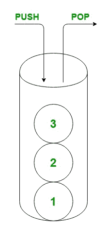
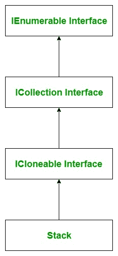

# C#堆栈示例

> 原文:[https://www.geeksforgeeks.org/c-sharp-stack-with-examples/](https://www.geeksforgeeks.org/c-sharp-stack-with-examples/)

一个[栈](https://www.geeksforgeeks.org/stack-data-structure/)代表一个后进先出的对象集合。当您需要后进先出访问项目时，可以使用它。它既是泛型集合，也是非泛型集合。通用堆栈在*系统中定义。集合。通用*命名空间，而非通用堆栈在*系统下定义。集合*命名空间，这里我们将讨论非泛型类型栈。堆栈用于创建动态集合，该集合根据程序的需要而增长。在堆栈中，您可以存储相同类型或不同类型的元素。



下图说明了堆栈类层次结构:



**要点:**

*   堆栈类实现了 *IEnumerable* 、 *ICollection* 和*I lonely*接口。
*   当您在列表中添加一个项目时，它被称为*推动*元素。
*   当你移除它时，它被称为*弹出*元素。
*   堆栈的容量是堆栈可以容纳的元素数量。随着元素添加到堆栈中，容量会根据需要通过重新分配自动增加。
*   在堆栈中，您可以存储重复的元素。
*   堆栈接受空值作为引用类型的有效值。

#### 如何创建堆栈？

堆栈类有*三个*构造函数，用于创建堆栈，如下所示:

*   **Stack():** 此构造函数用于创建 Stack 类的一个实例，该实例为空，具有默认的初始容量。
*   **Stack(ICollection):** 此构造函数用于创建 Stack 类的实例，该实例包含从指定集合中复制的元素，并且具有与复制的元素数量相同的初始容量。
*   **Stack(Int32):** 此构造函数用于创建 Stack 类的一个实例，该实例为空，具有指定的初始容量或默认初始容量，以较大者为准。

让我们看看如何使用 stack()构造函数创建堆栈:
**步骤 1:** 包含*系统。集合*命名空间在你的程序中借助使用关键字。

```cs
using System.Collections;
```

**步骤 2:** 使用如下所示的 stack 类创建堆栈:

```cs
Stack stack_name = new Stack();
```

**第三步:**如果你想在你的栈中添加元素，那么使用 *Push()* 方法在你的栈中添加元素。如下例所示。

**示例:**

## C#

```cs
// C# program to illustrate how to
// create a stack
using System;
using System.Collections;

class GFG {

    // Main Method
    static public void Main()
    {

        // Create a stack
        // Using Stack class
        Stack my_stack = new Stack();

        // Adding elements in the Stack
        // Using Push method
        my_stack.Push("Geeks");
        my_stack.Push("geeksforgeeks");
        my_stack.Push('G');
        my_stack.Push(null);
        my_stack.Push(1234);
        my_stack.Push(490.98);

        // Accessing the elements
        // of my_stack Stack
        // Using foreach loop
        foreach(var elem in my_stack)
        {
            Console.WriteLine(elem);
        }
    }
}
```

**Output:** 

```cs
490.98
1234

G
geeksforgeeks
Geeks
```

#### 如何从堆栈中移除元素？

在堆栈中，您可以从堆栈中移除元素。Stack 类提供了两种不同的方法来移除元素，这两种方法是:

*   [**清除**](https://www.geeksforgeeks.org/stack-clear-method-in-c-sharp/) **:** 此方法用于从堆栈中移除所有对象。
*   [**Pop**](https://www.geeksforgeeks.org/stack-pop-method-in-c-sharp/) **:** 此方法移除堆叠的开始元素。

**示例:**

## C#

```cs
// C# program to illustrate how to
// remove elements from the stack
using System;
using System.Collections;

class GFG {

    // Main Method
    static public void Main()
    {

        // Create a stack
        // Using Stack class
        Stack my_stack = new Stack();

        // Adding elements in the Stack
        // Using Push method
        my_stack.Push("Geeks");
        my_stack.Push("geeksforgeeks");
        my_stack.Push("geeks23");
        my_stack.Push("GeeksforGeeks");

        Console.WriteLine("Total elements present in"+
                    " my_stack: {0}", my_stack.Count);

        my_stack.Pop();

        // After Pop method
        Console.WriteLine("Total elements present in "+
                      "my_stack: {0}", my_stack.Count);

        // Remove all the elements
        // from the stack
        my_stack.Clear();

        // After Pop method
        Console.WriteLine("Total elements present in "+
                      "my_stack: {0}", my_stack.Count);

    }
}
```

**Output:** 

```cs
Total elements present in my_stack: 4
Total elements present in my_stack: 3
Total elements present in my_stack: 0
```

#### 如何获取堆栈的最顶层元素？

在 stack 中，您可以使用 Stack 类提供的以下方法轻松找到堆栈的最顶层元素:

*   [**Pop**](https://www.geeksforgeeks.org/stack-pop-method-in-c-sharp/) **:** 此方法返回堆栈开始处的对象，并进行修改，这意味着此方法移除堆栈的最顶层元素。
*   [**Peek**](https://www.geeksforgeeks.org/stack-peek-method-in-c-sharp/) **:** 此方法返回堆栈开始处的对象，而不移除它。

**示例:**

## C#

```cs
// C# program to illustrate how to
// get topmost elements of the stack
using System;
using System.Collections;

class GFG {

    // Main Method
    static public void Main()
    {

        // Create a stack
        // Using Stack class
        Stack my_stack = new Stack();

        // Adding elements in the Stack
        // Using Push method
        my_stack.Push("Geeks");
        my_stack.Push("geeksforgeeks");
        my_stack.Push("geeks23");
        my_stack.Push("GeeksforGeeks");

        Console.WriteLine("Total elements present in"+
                     " my_stack: {0}",my_stack.Count);

        // Obtain the topmost element
        // of my_stack Using Pop method
        Console.WriteLine("Topmost element of my_stack"
                          + " is: {0}",my_stack.Pop());

        Console.WriteLine("Total elements present in"+
                    " my_stack: {0}", my_stack.Count);

        // Obtain the topmost element
        // of my_stack Using Peek method
        Console.WriteLine("Topmost element of my_stack "+
                              "is: {0}",my_stack.Peek());

        Console.WriteLine("Total elements present "+
                 "in my_stack: {0}",my_stack.Count);

    }
}
```

**Output:** 

```cs
Total elements present in my_stack: 4
Topmost element of my_stack is: GeeksforGeeks
Total elements present in my_stack: 3
Topmost element of my_stack is: geeks23
Total elements present in my_stack: 3
```

#### 如何检查堆栈中元素的可用性？

在堆栈中，可以使用 [Contains()](https://www.geeksforgeeks.org/stack-contains-method-in-c-sharp/) 方法检查给定元素是否存在。或者换句话说，如果您想在给定的堆栈中搜索一个元素，请使用 Contains()方法。如果堆栈中存在元素，此方法返回 true。否则，返回 false。

注意:Contains()方法需要 O(n)个时间来检查元素是否存在于堆栈中。使用这种方法时应该考虑到这一点。

**示例:**

## C#

```cs
// C# program to illustrate how
// to check element present in
// the stack or not
using System;
using System.Collections;

class GFG {

    // Main  Method
    static public void Main()
    {

        // Create a stack
        // Using Stack class
        Stack my_stack = new Stack();

        // Adding elements in the Stack
        // Using Push method
        my_stack.Push("Geeks");
        my_stack.Push("geeksforgeeks");
        my_stack.Push("geeks23");
        my_stack.Push("GeeksforGeeks");

        // Checking if the element is
        // present in the Stack or not
        if (my_stack.Contains("GeeksforGeeks") == true)
        {
            Console.WriteLine("Element is found...!!");
        }

        else
        {
            Console.WriteLine("Element is not found...!!");
        }
    }
}
```

**Output:** 

```cs
Element is found...!!
```

#### 通用堆栈与非通用堆栈

<figure class="table">

| 

通用堆栈

 | 

非通用堆栈

 |
| --- | --- |
| 通用堆栈在系统下定义。集合。通用命名空间。 | 非通用堆栈在系统下定义。集合命名空间。 |
| 泛型堆栈只能存储相同类型的元素。 | 非泛型堆栈可以存储相同类型或不同类型的元素。 |
| 需要定义堆栈中元素的类型。 | 不需要定义堆栈中元素的类型。 |
| 它是类型安全的。 | 它不是类型安全的。 |

</figure>