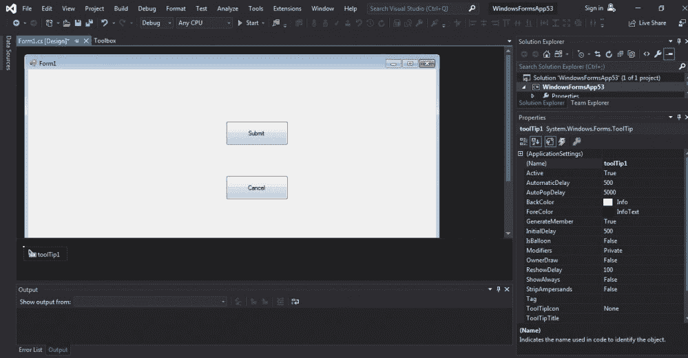

# C# |工具提示类

> 原文:[https://www.geeksforgeeks.org/c-sharp-tooltip-class/](https://www.geeksforgeeks.org/c-sharp-tooltip-class/)

在 windows 窗体中，工具提示代表一个微小的弹出框，当您将指针或光标放在控件上时，该框会出现，该控件的目的是提供有关 Windows 窗体中控件的简要说明。工具提示类用于创建工具提示控件，还提供不同类型的属性、方法和事件，并提供控件的运行时状态。
你可以在任何容器或控件中使用工具提示类。借助单个工具提示组件，您可以为多个控件创建多个工具提示。在**系统下定义的工具提示类。窗体**命名空间。在 C# 中，您可以使用两种不同的方法在 windows 窗体中创建工具提示:

**1。设计时:**创建工具提示的最简单方法如下所示:

*   **第一步:**创建如下图所示的窗口表单:
    **Visual Studio->File->New->Project->windows formpp**
    
*   **第 2 步:**从工具箱中拖动工具提示并将其放到表单上。当您将此工具提示拖放到窗体上时，它将自动添加到当前窗口中出现的每个控件的属性(在工具提示 1 中命名为工具提示)中。
    T3】
*   **Step 3:** After drag and drop you will go to the properties of the ToolTip control to modify ToolTip according to your requirement.
    

    **输出:**
    

**2。运行时:**比上面的方法稍微复杂一点。在此方法中，您可以借助工具提示类提供的语法，以编程方式创建工具提示控件。以下步骤显示了如何动态设置创建工具提示:

*   **步骤 1:** 使用工具提示类提供的*工具提示()*构造函数创建工具提示控件。

    ```cs
    // Creating a ToolTip control
    ToolTip t_Tip = new ToolTip(); 

    ```

*   **Step 2:** After creating ToolTip control, set the property of the ToolTip control provided by the ToolTip class.

    ```cs
    // Seting the properties of ToolTip
    t_Tip.Active = true; 
    t_Tip.AutoPopDelay = 4000; 
    t_Tip.InitialDelay = 600; 
    t_Tip.IsBalloon = true; 
    t_Tip.ToolTipIcon = ToolTipIcon.Info; 
    t_Tip.SetToolTip(box1, "Name should start with Capital letter"); 
    t_Tip.SetToolTip(box2, "Password should be greater than 8 words"); 

    ```

    **示例:**

    ```cs
    using System;
    using System.Collections.Generic;
    using System.ComponentModel;
    using System.Data;
    using System.Drawing;
    using System.Linq;
    using System.Text;
    using System.Threading.Tasks;
    using System.Windows.Forms;

    namespace WindowsFormsApp34 {

    public partial class Form1 : Form {

        public Form1()
        {
            InitializeComponent();
        }

        private void Form1_Load(object sender, EventArgs e)
        {
            // Creating and setting the
            // properties of the Label
            Label l1 = new Label();
            l1.Location = new Point(140, 122);
            l1.Text = "Name";

            // Adding this Label
            // control to the form
            this.Controls.Add(l1);

            // Creating and setting the
            // properties of the TextBox
            TextBox box1 = new TextBox();
            box1.Location = new Point(248, 119);
            box1.BorderStyle = BorderStyle.FixedSingle;

            // Adding this TextBox
            // control to the form
            this.Controls.Add(box1);

            // Creating and setting the
            // properties of Label
            Label l2 = new Label();
            l2.Location = new Point(140, 152);
            l2.Text = "Password";

            // Adding this Label
            // control to the form
            this.Controls.Add(l2);

            // Creating and setting the
            // properties of the TextBox
            TextBox box2 = new TextBox();
            box2.Location = new Point(248, 145);
            box2.BorderStyle = BorderStyle.FixedSingle;

            // Adding this TextBox
            // control to the form
            this.Controls.Add(box2);

            // Creating and setting the
            // properties of the ToolTip
            ToolTip t_Tip = new ToolTip();
            t_Tip.Active = true;
            t_Tip.AutoPopDelay = 4000;
            t_Tip.InitialDelay = 600;
            t_Tip.IsBalloon = true;
            t_Tip.ToolTipIcon = ToolTipIcon.Info;
            t_Tip.SetToolTip(box1, "Name should start with Capital letter");
            t_Tip.SetToolTip(box2, "Password should be greater than 8 words");
        }
    }
    }
    ```

    **输出:**

    

#### 构造器

| 构造器 | 描述 |
| **工具提示 （T1】** | 此构造函数用于在没有指定容器的情况下初始化工具提示的新实例。 |
| 工具提示(图标持有人) | 此构造函数用于用指定的容器初始化工具提示类的新实例。 |

#### 性能

| 财产 | 描述 |
| **激活** | 此属性用于获取或设置一个值，该值指示工具提示当前是否处于活动状态。 |
| 自动延迟 | 此属性用于获取或设置工具提示的自动延迟。 |
| **自动分配器** | 此属性用于获取或设置当指针停留在具有指定工具提示文本的控件上时，工具提示保持可见的时间段。 |
| **背景色** | 此属性用于获取或设置控件的背景色。 |
| **前颜色** | 此属性用于获取或设置控件的前景色。 |
| 初始延时 | 此属性用于获取或设置工具提示出现之前经过的时间。 |
| **是一个全球通** | 此属性用于获取或设置一个值，该值指示工具提示是否应使用气球窗口。 |
| **resshowdelay** | 此属性用于获取或设置指针从一个控件移动到另一个控件时，在后续工具提示窗口出现之前必须经过的时间长度。 |
| 工具提示图标 | 此属性用于获取或设置一个值，该值定义要与工具提示文本一起显示的图标类型。 |
| **工具提示标题** | 此属性用于获取或设置工具提示窗口的标题。 |