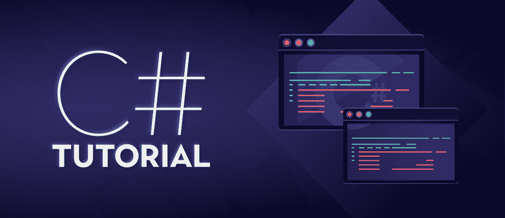

# C# 教程

> 原文:[https://www.geeksforgeeks.org/c-sharp-tutorial/](https://www.geeksforgeeks.org/c-sharp-tutorial/)

C# 是一种面向对象的现代编程语言，由微软创建。它运行在。NET 框架。C# 非常接近 [C](https://www.geeksforgeeks.org/c-programming-language/) / [C++](https://www.geeksforgeeks.org/c-plus-plus/) 和 [Java](https://www.geeksforgeeks.org/java/) 编程语言。它是由安德斯·海尔斯伯格和他的团队在。NET 倡议，由欧洲计算机制造商协会(ECMA)和国际标准组织(国际标准化组织)批准。C# 第一版发布于 2002 年，最新版本为 2019 年 9 月发布的 **8.0** 。在我们开始之前，我们必须了解。NET 框架和 Visual Studio。

**话题:**

*   [。NET 框架&及其组件](# dot-net framework)
*   [Visual Studio](# visual studio)
*   [为什么是 C#？](# why C#)
*   [应用程序](# applications)
*   [下载并安装 C# ](# downloading and installing C#)
*   [基本面](# hello world program)
    *   [你好世界！程序](# hello world program)
    *   [标识符](# identifiers)
    *   [关键词](# keywords)
    *   [变量](# variables)
    *   [文字](# literals)
    *   [数据类型](# data types)
    *   [操作员](# operators)
    *   [枚举](# enumeration)
*   [决策声明](# decision making)
*   [切换语句](# switch statement)
*   [循环](# loops)
    *   [同时循环](# while loop)
    *   [边做边循环](# do while loop)
    *   回路的
    *   [前循环](# for each loop)
*   [跳转语句](# jump)
    *   [断开](# break)
    *   [继续](# continue)
    *   [转到](# goto)
    *   [返回](# return)

*   [阵列](# arrays)
*   [弦](# string)
*   [访问修饰符](# access modifiers)
*   [OOPS 概念](# oops concepts)
    *   [类和对象](# class and object)
    *   [施工人员](# constructors)
    *   [析构器](# destructors)
    *   [继承](# inheritance)
    *   [封装](# encapsulation)
    *   [多态性](# polymorphism)
*   [方法](# methods)
    *   [方法过载](# method overloading)
    *   [方法覆盖](# method overriding)
    *   [方法隐藏](# method hiding)
*   [收藏](# collections)
    *   [阵列列表](# arraylist)
    *   [哈希表](# hashtable)
    *   [堆叠](# stack)
    *   队列
*   [属性](# properties)
*   [索引器](# indexers)
*   [界面](# interface)
*   [多线程](# multithreading)
*   [正则表达式](# regular expression)
*   [异常处理](# exception handling)