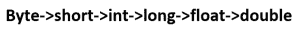

# C# |型铸造

> 原文:[https://www.geeksforgeeks.org/c-sharp-type-casting/](https://www.geeksforgeeks.org/c-sharp-type-casting/)

### 先决条件: [C#数据类型](https://www.geeksforgeeks.org/c-data-types-2/)

当我们将一种数据类型的值赋给另一种数据类型时，就会发生类型转换。如果数据类型兼容，则 [C#](https://www.geeksforgeeks.org/introduction-to-c-sharp/) 进行**自动类型转换**。如果不可比，则需要显式转换，称为**显式类型转换**。例如，给长变量赋值。

### 

**隐式类型铸造/自动类型转换**

它发生在:

*   这两种数据类型是兼容的。
*   当我们将较小数据类型的值赋给较大数据类型时。

例如，在 C#中，数字数据类型相互兼容，但不支持从数字类型到 char 或 boolean 的自动转换。此外，char 和 boolean 彼此不兼容。在转换之前，编译器首先根据下图检查兼容性，然后决定它是正常的还是有错误。



**下表显示了 C#支持的隐式转换类型:**

| 从数据类型转换 | 转换为数据类型 |
| 字节 | 短，整数，长，浮点，双精度 |
| 短的 | int、long、float、double |
| （同 Internationalorganizations）国际组织 | 长，浮动，双 |
| 长的 | 双浮子 |
| 漂浮物 | 两倍 |

**示例:**

```cs
// C# program to demonstrate the
// Implicit Type Conversion
using System;
namespace Casting{

class GFG {

        // Main Method
        public static void Main(String []args)
        {
            int i = 57; 

            // automatic type conversion
            long l = i; 

            // automatic type conversion
            float f = l;

            // Display Result
            Console.WriteLine("Int value "  +i);
            Console.WriteLine("Long value "  +l);
            Console.WriteLine("Float value "  +f);
        }
}
}
```

**Output:**

```cs
Int value 57
Long value 57
Float value 57

```

### 

**显式铸造**

当类型彼此不兼容时，可能会出现编译错误。例如，将双精度值赋给 int 数据类型:

```cs
// C# program to illustrate incompatible data 
// type for explicit type conversion
using System;
namespace Casting{

class GFG {

        // Main Method
        public static void Main(String []args)
        {
            double d = 765.12;

            // Incompatible Data Type
            int i = d;

            // Display Result    
            Console.WriteLine("Value of i is ", +i);
        }
}
}
```

**错误:**

```cs
prog.cs(14,21): error CS0266: Cannot implicitly convert type `double' to `int'.
An explicit conversion exists (are you missing a cast?)

```

因此，如果我们想将较大数据类型的值赋给较小的数据类型，我们就要执行显式类型转换。

*   这对于无法自动转换的不兼容数据类型非常有用。
*   在这里，target-type 指定要将指定值转换为的所需类型。
*   有时，可能会导致**有损转换。**

**示例:**

```cs
// C# program to demonstrate the
// Explicit Type Conversion
using System;
namespace Casting{

class GFG {

        // Main Method
        public static void Main(String []args)
        {
            double d = 765.12;

            // Explicit Type Casting
            int i = (int)d;

            // Display Result
            Console.WriteLine("Value of i is " +i);
        }
}
}
```

**Output:**

```cs
Value of i is 765

```

**说明:**
这里由于有损转换，I 的值变成了 765，损失了 0.12 的值。

#### C#为类型转换提供了如下内置方法:

| 方法 | 描述 |
| ToBoolean | 它会将类型转换为布尔值 |
| 充电 | 它会将类型转换为字符值 |
| 托字节 | 它会将一个值转换为字节值 |
| 到特定日期 | 它会将一个值转换为小数点值 |
| ToDouble | 它会将类型转换为双数据类型 |
| ToInt16 | 它会将类型转换为 16 位整数 |
| ToInt32 | 它会将类型转换为 32 位整数 |
| ToInt64 | 它会将类型转换为 64 位整数 |
| ToString | 它会将给定类型转换为字符串 |
| 图 16 | 它会将类型转换为无符号 16 位整数 |
| ToUInt32 | 它会将类型转换为无符号 32 位整数 |
| ToUInt64 | 它会将类型转换为无符号 64 位整数 |

**示例:**

```cs
// C# program to demonstrate the
// Built- In Type Conversion Methods
using System;
namespace Casting{

class GFG {

        // Main Method
        public static void Main(String []args)
        {
            int i = 12;
            double d = 765.12;
            float f = 56.123F;

            // Using Built- In Type Conversion
            // Methods & Displaying Result
            Console.WriteLine(Convert.ToString(f));
            Console.WriteLine(Convert.ToInt32(d));
            Console.WriteLine(Convert.ToUInt32(f));
            Console.WriteLine(Convert.ToDouble(i));
            Console.WriteLine("GeeksforGeeks");
        }
}
}
```

**Output:**

```cs
56.123
765
56
12
GeeksforGeeks

```