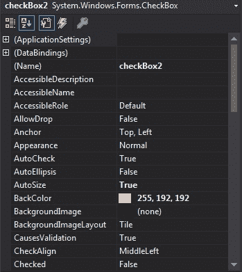
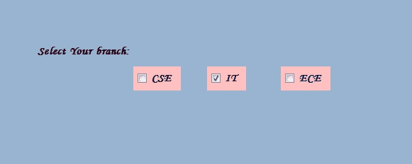
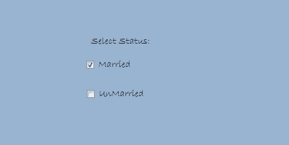

# C#中的

# 复选框

> 原文:[https://www.geeksforgeeks.org/checkbox-in-c-sharp/](https://www.geeksforgeeks.org/checkbox-in-c-sharp/)

CheckBox 控件是 windows 窗体的一部分，用于接受用户的输入。或者换句话说，CheckBox 控件允许我们从给定的列表中选择单个或多个元素，或者它可以为我们提供选项，如是或否、真或假等。它可以显示为图像或文本，或者两者都显示。复选框是一个类，在*系统下定义。Windows.Forms* 命名空间。在 Windows 窗体中，您可以通过两种不同的方式创建 CheckBox:

**1。设计时:**使用以下步骤创建复选框是最简单的方法:

*   **第一步:**创建如下图所示的窗口表单:
    T3】Visual Studio->File->New->Project->windows formapp


*   **步骤 2:** 从工具箱中拖动 CheckBox 控件，并将其放到窗口窗体上。您可以根据需要将 CheckBox 放在 windows 窗体上的任何位置。


*   **第三步:**拖放后，您将进入 CheckBox 控件的属性，根据您的要求修改 CheckBox 设计。



**输出:**



**2。运行时:**比上面的方法稍微复杂一点。在这种方法中，您可以使用 checkbox 类以编程方式创建自己的 CheckBox。

*   **步骤 1:** 使用 checkbox 类提供的 CheckBox()构造函数创建一个 CheckBox。

```
// Creating checkbox
CheckBox Mycheckbox = new CheckBox();
```

*   **步骤 2:** 创建 CheckBox 后，设置 CheckBox 类提供的 CheckBox 的属性。

```
// Set height of the checkbox
 Mycheckbox.Height = 50;

// Set width of the checkbox
Mycheckbox.Width = 100;

// Set location of the checkbox
Mycheckbox.Location = new Point(229, 136);

// Set text in the checkbox
Mycheckbox.Text = "Married";

// Set font of the checkbox
Mycheckbox.Font = new Font("Bradley Hand ITC", 12);
```

*   **第 3 步:**最后使用 add()方法将该复选框控件添加到表单中。

```
// Add this checkbox to form
this.Controls.Add(Mycheckbox);
```

**示例:**

## C#

```
using System;
using System.Collections.Generic;
using System.ComponentModel;
using System.Data;
using System.Drawing;
using System.Linq;
using System.Text;
using System.Threading.Tasks;
using System.Windows.Forms;

namespace WindowsFormsApp5 {

public partial class Form1 : Form {

    public Form1()
    {
        InitializeComponent();
    }

    private void Form1_Load(object sender, EventArgs e)
    {
        // Creating and setting the properties of label
        Label l = new Label();
        l.Text = "Select Status:";
        l.AutoSize = true;
        l.Location = new Point(233, 111);
        l.Font = new Font("Bradley Hand ITC", 12);
        // Adding label to form
        this.Controls.Add(l);

        // Creating and setting the properties of CheckBox
        CheckBox Mycheckbox = new CheckBox();
        Mycheckbox.Height = 50;
        Mycheckbox.Width = 100;
        Mycheckbox.Location = new Point(229, 136);
        Mycheckbox.Text = "Married";
        Mycheckbox.Font = new Font("Bradley Hand ITC", 12);

        // Adding checkbox to form
        this.Controls.Add(Mycheckbox);

        // Creating and setting the properties of CheckBox
        CheckBox Mycheckbox1 = new CheckBox();
        Mycheckbox1.Location = new Point(230, 198);
        Mycheckbox1.Text = "UnMarried";
        Mycheckbox1.AutoSize = true;
        Mycheckbox1.Font = new Font("Bradley Hand ITC", 12);

        // Adding checkbox to form
        this.Controls.Add(Mycheckbox1);
    }
}
}
```

**输出:**



#### 复选框的重要属性

<figure class="table">

| 财产 | 描述 |
| --- | --- |
| **外观** | 此属性用于获取或设置指示 CheckBox 控件外观的值。 |
| **汽车尾翼** | 此属性用于设置一个值，该值显示当您单击复选框时，“已选中”或“检查状态”值以及复选框的外观是否会自动更改。 |
| **自体发光** | 此属性用于获取或设置一个值，该值确定省略号(…)是否出现在控件的右边缘，表示控件文本超出了控件的指定长度。 |
| **自动化** | 此属性用于获取或设置一个值，该值确定控件是否根据其内容调整大小。 |
| **背景色** | 此属性用于获取或设置控件的背景色。 |
| **背景影像** | 此属性用于获取或设置控件中显示的背景图像。 |
| **检查状态** | 该属性用于获取或设置复选框的状态。 |
| **检查校准** | 此属性用于获取或设置 CheckBox 控件上复选标记的水平和垂直对齐方式。 |
| **选中** | 此属性用于获取或设置一个值，该值决定复选框是否处于选中状态。
 |
| **事件** | 此属性用于获取附加到此组件的事件处理程序列表。 |
| 字体 | 此属性用于获取或设置控件显示的文本的字体。 |
| **前颜色** | 此属性用于获取或设置控件的前景色。 |
| **图像** | 此属性用于获取或设置复选框控件上显示的图像。 |
| **位置** | 此属性用于获取或设置 CheckBox 控件左上角相对于其窗体左上角的坐标。 |
| **保证金** | 此属性用于获取或设置控件之间的间距。 |
| **名称** | 此属性用于获取或设置控件的名称。 |
| **填充** | 此属性用于获取或设置控件内的填充。 |
| **文字** | 此属性用于获取或设置与此控件关联的文本。 |
| **文字配体** | 此属性用于获取或设置 CheckBox 控件上文本的对齐方式。
 |
| **可见** | 此属性用于获取或设置一个值，该值决定是否显示控件及其所有子控件。 |

</figure>

#### 复选框上的重要事件

<figure class="table">

| 事件 | 描述 |
| --- | --- |
| **检查已更改的** | 当“已检查”属性的值更改时，会发生此事件。 |
| **检查状态已更改** | 当 CheckState 属性值更改时，会发生此事件。 |
| **点击** | 单击控件时会发生此事件。 |
| **双击** | 当用户双击 CheckBox 控件时，会发生此事件。 |
| **离开** | 当输入焦点离开控件时，会发生此事件。 |
| **慕容克** | 当鼠标单击控件时，会发生此事件。 |
| **鼠标点击** | 当用户双击 CheckBox 控件时，会发生此事件。 |
| **鼠标悬停** | 当鼠标指针停留在控件上时，会发生此事件。 |

</figure>