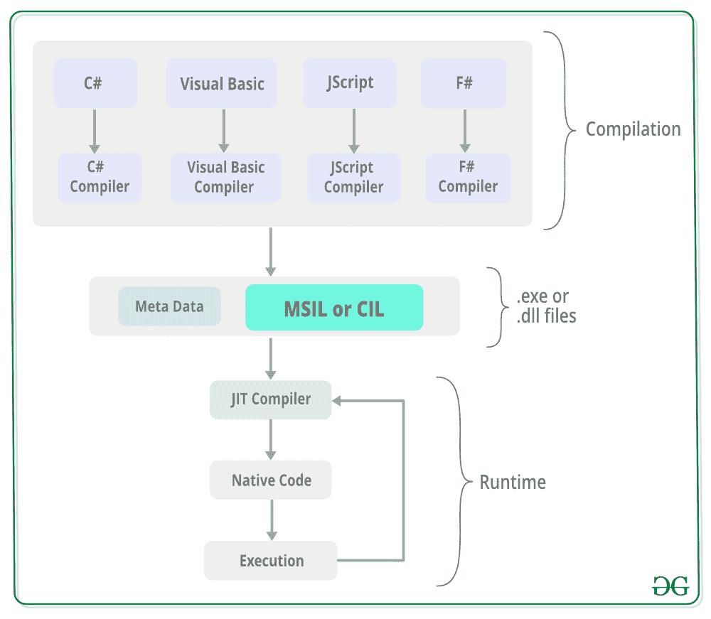

# CIL 或 MSIL |微软中间语言或通用中间语言

> 原文:[https://www . geesforgeks . org/cil-or-msil-Microsoft-中间语言或-common-中间语言/](https://www.geeksforgeeks.org/cil-or-msil-microsoft-intermediate-language-or-common-intermediate-language/)

微软中间语言(MSIL)，也称为通用中间语言(CIL)，是一组独立于平台的指令，由特定语言的编译器根据源代码生成。MSIL 是独立于平台的，因此，它可以在任何公共语言基础设施支持的环境中执行，如窗口*。NET* 运行时。
MSIL 被 [JIT 编译器](https://www.geeksforgeeks.org/what-is-just-in-time-jit-compiler-in-dot-net/)转换成特定计算机环境特定的机器代码。这是在 MSIL 被处决之前完成的。此外，MSIL 在需求的基础上被转换成机器代码，即 JIT 编译器根据需求编译 MSIL，而不是全部编译。

**公共语言运行时(CLR)中的执行过程:**由 JIT 编译器创建 MSIL 和将 MSIL 转换为机器代码的执行过程如下:

[](https://media.geeksforgeeks.org/wp-content/uploads/20190423170518/MSIL.png)

*   源代码在 CLR 编译时由特定语言的编译器转换成 MSIL。此外，随着 MSIL，元数据也在汇编中产生。元数据包含诸如代码中类型的定义和签名、运行时信息等信息。
*   公共语言基础结构(CLI)程序集是通过组装 MSIL 创建的。这个程序集基本上是一个编译好的代码库，用于安全性、部署、版本控制等。并且它有两种类型，即进程程序集(EXE)和库程序集(DLL)。
*   然后，JIT 编译器将微软中间语言(MSIL)转换成特定于 JIT 编译器运行的计算机环境的机器代码。MSIL 在需求的基础上被转换成机器代码，即 JIT 编译器根据需求编译 MSIL，而不是全部编译。
*   然后，使用 JIT 编译器获得的机器代码由计算机的处理器执行。

**示例:**MSIL 是由特定于语言的编译器根据下面给出的源代码生成的。为了详细了解 MSIL，打印“ *GeeksforGeeks* 的类 Demo 的简单 C#源代码如下:

```cs
using System;

public class Demo {
    public static void Main()
    {
        Console.WriteLine("GeeksforGeeks");
    }
}
```

C#编译器为上面提供的代码创建的 MSIL 如下所示:

```cs
// =============== CLASS MEMBERS DECLARATION ===================

.class public auto ansi beforefieldinit Demo
       extends [mscorlib]System.Object
{
  .method public hidebysig static void  Main() cil managed
  {
    // 
    .maxstack  8
    IL_0000:  nop
    IL_0001:  ldstr      "GeeksforGeeks"
    IL_0006:  call       void [mscorlib]System.Console::WriteLine(string)
    IL_000b:  nop
    IL_000c:  ret
  } // end of method Demo::Main

  .method public hidebysig specialname rtspecialname 
          instance void  .ctor() cil managed
  {
    // 
    .maxstack  8
    IL_0000:  ldarg.0
    IL_0001:  call       instance void [mscorlib]System.Object::.ctor()
    IL_0006:  ret
  } // end of method Demo::.ctor

} // end of class Demo

// =============================================================

```

在上面的 MSIL 中，有一个或两个字节长的操作码。继承所有其他类的基类声明包含在*mscorlib.dll*中。在 Main()方法中，指令 *ldstr* 将字符串“ *GeeksforGeeks* ”加载到堆栈上。然后是静态*系统。调用 Writeline* 函数，从堆栈中弹出字符串。最后，ret 指令发出结束函数调用的信号。
然后是*。ctor(* )语句暗示了一个默认的构造函数，没有类 Demo 的参数。该构造函数由编译器为非静态类 Demo 自动创建。调用指令传递基对象构造函数，ret 指令发出函数调用结束的信号。