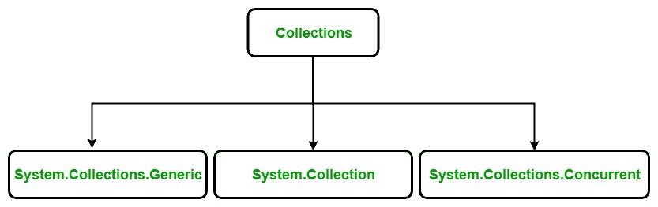

# c#中的集合

> 原文:[https://www.geeksforgeeks.org/collections-in-c-sharp/](https://www.geeksforgeeks.org/collections-in-c-sharp/)

集合标准化了程序处理对象的方式。换句话说，它包含一组类，以通用的方式包含元素。在集合的帮助下，用户可以对对象进行存储、更新、删除、检索、搜索、排序等操作。

C#将集合分成几个类，一些常见的类如下所示:



#### 系统。集合。泛型类

C#中的泛型集合是在`System.Collection.Generic`命名空间中定义的。它提供了标准数据结构的一般实现，如链表、栈、队列和字典。这些集合是类型安全的，因为它们是泛型，这意味着只有那些与集合类型兼容的项才能存储在泛型集合中，这消除了意外的类型不匹配。泛型集合由接口和类的集合定义。下表包含了`System.Collections.Generic`命名空间的常用类:

| 类别名 | 描述 |
| 词典< TKey，TValue > | 它存储键/值对，并提供类似于非泛型哈希表类中的功能。 |
| **[列表<T>](https://www.geeksforgeeks.org/c-list-class/)T3】** | 它是一个动态数组，提供类似于非泛型数组列表类中的功能。 |
| 队列<t>t1] | 先进先出列表，提供与非通用队列类类似的功能。 |
| **排好队<【tkey，tvalue】>** | 它是一个键/值对的排序列表，提供了类似于非泛型 sorted list 类中的功能。 |
| **叠加<T>T1】** | 它是一个先进先出的列表，提供了与非泛型 Stack 类类似的功能。 |
| **T1<T>T2** | 它是独特元素的无序集合。它防止在集合中插入重复项。 |
| **T1】链接列表<T>T2** | 它允许快速插入和移除元素。它实现了一个经典的链表。 |

**示例:**

```
// C# program to illustrate the concept 
// of generic collection using List<T>
using System;
using System.Collections.Generic;

class Geeks {

    // Main Method
    public static void Main(String[] args)
    {

        // Creating a List of integers
        List<int> mylist = new List<int>();

        // adding items in mylist
        for (int j = 5; j < 10; j++) {
            mylist.Add(j * 3);
        }

        // Displaying items of mylist
        // by using foreach loop
        foreach(int items in mylist)
        {
            Console.WriteLine(items);
        }
    }
}
```

**Output:**

```
15
18
21
24
27

```

#### 系统。集合类

C#中的非泛型集合是在`System.Collections`命名空间中定义的。它是一种通用的数据结构，对对象引用起作用，因此它可以处理任何类型的对象，但不是以安全类型的方式。非泛型集合由接口和类的集合定义。下表包含了`System.Collections`命名空间的常用类:

| 类别名 | 描述 |
| **[阵列列表](https://www.geeksforgeeks.org/c-arraylist-class/)** | 它是一个动态数组，意味着数组的大小不是固定的，它可以在运行时增加和减少。 |
| **[哈希表](https://www.geeksforgeeks.org/c-hashtable-class/)** | 它表示基于键的哈希代码组织的键和值对的集合。 |
| 队列 | 它表示先进先出的对象集合。当您需要先进先出访问项目时，可以使用它。 |
| **堆叠** | 它是一种线性数据结构。输入/输出遵循后进先出模式。 |

**示例:**

```
// C# to illustrate the concept
// of non-generic collection using Queue
using System;
using System.Collections;

class GFG {

    // Driver code
    public static void Main()
    {

        // Creating a Queue
        Queue myQueue = new Queue();

        // Inserting the elements into the Queue
        myQueue.Enqueue("C#");
        myQueue.Enqueue("PHP");
        myQueue.Enqueue("Perl");
        myQueue.Enqueue("Java");
        myQueue.Enqueue("C");

        // Displaying the count of elements
        // contained in the Queue
        Console.Write("Total number of elements present in the Queue are: ");

        Console.WriteLine(myQueue.Count);

        // Displaying the beginning element of Queue
        Console.WriteLine("Beginning Item is: " + myQueue.Peek());
    }
}
```

**Output:**

```
Total number of elements present in the Queue are: 5
Beginning Item is: C#

```

**注意:** C#还提供了一些专门的集合，这些集合经过优化，可以处理特定类型的数据类型，这些专门的集合可以在`System.Collections.Specialized`命名空间中找到。

#### 系统。集合。并发

它出现在`.NET Framework Version 4`之后。它提供了各种线程安全的集合类，当多个线程同时访问集合时，这些类用于代替`System.Collections`和`System.Collections.Generic`名称空间中的相应类型。该集合中的类有:

| 类别名 | 描述 |
| **封锁集合** | 它为实现
iprocureconsumerccollection 的线程安全集合提供了阻塞和绑定功能。 |
| 竞争 | 它代表一个线程安全的、无序的对象集合。 |
| **同意词典** | 它表示一个线程安全的键/值对集合，可以由多个线程同时访问。 |
| 并发队列 | 它表示线程安全的先进先出(FIFO)集合。 |
| **并发包** | 它表示线程安全的后进先出(LIFO)集合。 |
| **可排序分区** | 它代表了一种将可排序数据源分成多个分区的特殊方式。 |
| **分区** | 它为数组、列表和枚举提供了通用的分区策略。 |
| **分区** | 它代表了将数据源拆分成多个分区的一种特殊方式。 |