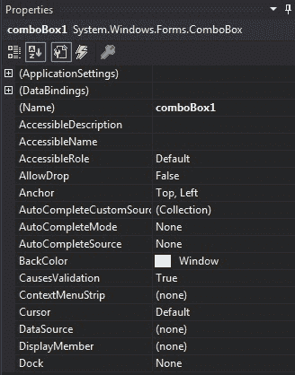
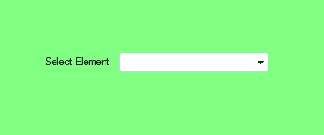
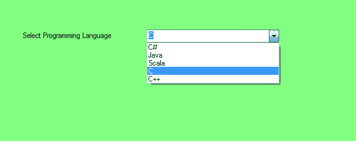

# c#中的组合框

> 原文:[https://www.geeksforgeeks.org/combobox-in-c-sharp/](https://www.geeksforgeeks.org/combobox-in-c-sharp/)

在 Windows 窗体中，组合框在单个控件中提供了两种不同的功能，这意味着组合框同时作为[文本框](https://www.geeksforgeeks.org/c-sharp-textbox-controls/)和列表框工作。在组合框中，一次只显示一个项目，其余项目出现在下拉菜单中。组合框是 C#中的一个类，在*系统下定义。Windows.Forms* 命名空间。您可以使用两种不同的方式创建组合框:

**1。设计时:**使用以下步骤创建组合框控件是最简单的方法:

*   **第一步:**创建如下图所示的窗口表单:
    **Visual Studio->File->New->Project->windows formpp**
    
*   **第 2 步:**从工具箱中拖动组合框控件，并将其放到窗口窗体上。根据您的需要，您可以将组合框控件放在窗口窗体的任何位置。
    T3】
*   **Step 3:** After drag and drop you will go to the properties of the ComboBox control to set the properties of the ComboBox according to your need.
    

    **输出:**
    

**运行时间:**比上面的方法稍微复杂一点。在此方法中，您可以使用组合框类设置创建自己的组合框控件。创建动态组合框的步骤:

*   **步骤 1:** 使用组合框类提供的组合框()构造函数创建组合框。

    ```
    // Creating combobox using ComboBox class
    ComboBox mybox = new ComboBox();

    ```

*   **步骤 2:** 创建组合框后，设置组合框类提供的组合框属性。

    ```
    // Set the location of the ComboBox 
    mybox.Location = new Point(327, 77);

    // Set the size of the ComboBox
    mybox.Size = new Size(216, 26);

    // Add items in the ComboBox
    mybox.Items.Add("C#");
    mybox.Items.Add("Java");
    mybox.Items.Add("Scala");
    mybox.Items.Add("C");
    mybox.Items.Add("C++");

    ```

*   **Step 3:** And last add this ComboBox control to form using Add() method.

    ```
    // Add this ComboBox to the form
    this.Controls.Add(mybox);

    ```

    **示例:**

    ```
    using System;
    using System.Collections.Generic;
    using System.ComponentModel;
    using System.Data;
    using System.Drawing;
    using System.Linq;
    using System.Text;
    using System.Threading.Tasks;
    using System.Windows.Forms;

    namespace WindowsFormsApp18 {

    public partial class Form1 : Form {

        public Form1()
        {
            InitializeComponent();
        }

        private void Form1_Load(object sender, EventArgs e)
        {
            // Creating and setting the properties of label
            Label l = new Label();
            l.Location = new Point(122, 80);
            l.AutoSize = true;
            l.Text = "Select Programming Language";

            // Adding this label to the form
            this.Controls.Add(l);

            // Creating and setting the properties of comboBox
            ComboBox mybox = new ComboBox();
            mybox.Location = new Point(327, 77);
            mybox.Size = new Size(216, 26);
            mybox.Items.Add("C#");
            mybox.Items.Add("Java");
            mybox.Items.Add("Scala");
            mybox.Items.Add("C");
            mybox.Items.Add("C++");

            // Adding this ComboBox to the form
            this.Controls.Add(mybox);
        }
    }
    }
    ```

    **输出:**

    

#### 组合框的重要属性

| 财产 | 描述 |
| **背景色** | 此属性用于设置组合框控件的背景颜色。 |
| 下拉式高度 | 此属性用于设置组合框控件下拉部分的高度(以像素为单位)。 |
| **DropDownStyle** | 此属性用于设置指定组合框控件样式的值。 |
| **下降宽度** | 此属性用于设置组合框控件下拉部分的宽度。 |
| 字体 | 此属性用于设置组合框控件显示的文本的字体。 |
| **前颜色** | 此属性用于设置组合框控件的前景色。 |
| **高度** | 此属性用于设置组合框控件的高度。 |
| **项** | 此属性用于获取一个对象，该对象表示此组合框控件中包含的项的集合。 |
| **MaxDropDownItems** | 此属性用于设置在组合框控件的下拉部分显示的最大项数。 |
| **最大长度** | 此属性用于设置用户可以在组合框控件中键入的字符数。 |
| **名称** | 此属性用于设置组合框控件的名称。 |
| **选择集** | 此属性用于设置组合框中当前选定的项目。 |
| **尺寸** | 此属性用于设置组合框控件的高度和宽度。 |
| **已排序** | 此属性用于设置一个值，该值指示组合框中的项目是否已排序。 |
| **文字** | 此属性用于设置与此组合框控件关联的文本。 |
| **可见** | 此属性用于设置一个值，该值指示是否显示控件及其所有子控件。 |

#### 重要事件

| 事件 | 描述 |
| **点击** | 单击组合框控件时会发生此事件。 |
| 疏浚 | 当拖放操作完成时，会发生此事件。 |
| **下拉菜单** | 当显示组合框的下拉部分时，会发生此事件。 |
| **下降关闭** | 当组合框的下拉部分不再可见时，会发生此事件。 |
| **dropdowstyle changed** | DropDownStyle 属性更改时会发生此事件。 |
| **离开** | 当输入焦点离开组合框控件时，会发生此事件。 |
| **慕容克** | 当鼠标单击组合框控件时，会发生此事件。 |
| **鼠标点击** | 当鼠标双击组合框控件时，会发生此事件。 |
| 慕斯敦 | 当鼠标指针位于组合框控件上并按下鼠标按钮时，会发生此事件。 |
| **鼠标输入** | 当鼠标指针进入组合框控件时，会发生此事件。 |
| **鼠标悬停** | 当鼠标指针停留在组合框控件上时，会发生此事件。 |
| **选择索引已更改** | 当 SelectedIndex 属性更改时，会发生此事件。 |