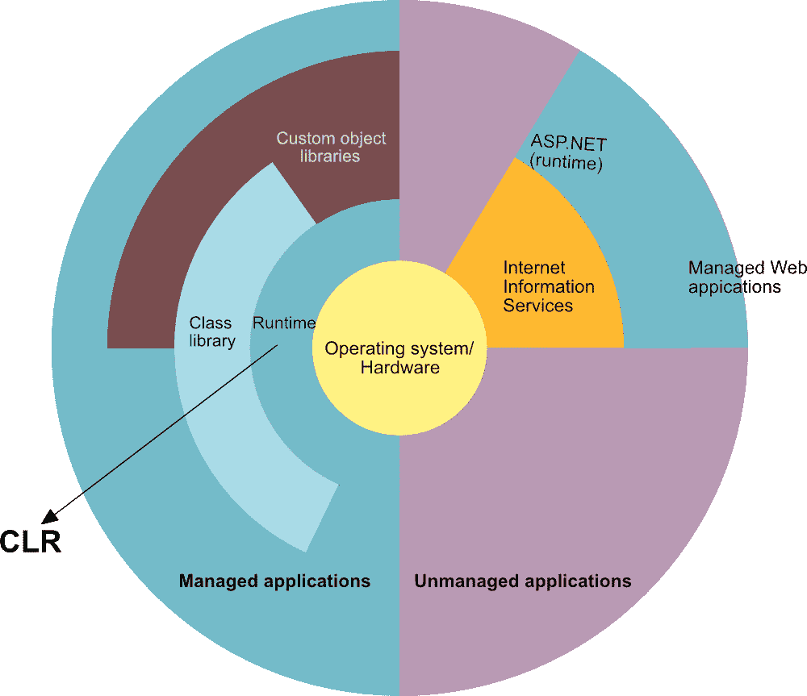
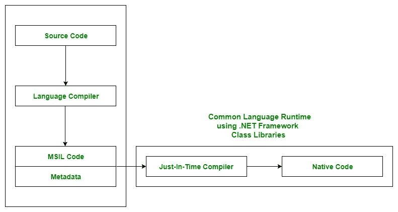

# c#中的公共语言运行时(CLR)

> 原文:[https://www . geesforgeks . org/common-language-runtime-clr-in-c-sharp/](https://www.geeksforgeeks.org/common-language-runtime-clr-in-c-sharp/)

CLR 是 [**的基本和虚拟机组件。NET 框架**](https://www.geeksforgeeks.org/c-net-framework-basic-architecture-component-stack/) 。这是中的**运行时环境。NET 框架**，它运行代码，并通过提供各种服务来帮助简化开发过程。基本上负责管理*的执行。NET 程序*不管任何*。NET* 编程语言。在内部，CLR 实现了 *VES(虚拟执行系统)*，这是在微软实现 *CLI(公共语言基础设施)中定义的。*
在公共语言运行库下运行的代码称为托管代码。换句话说，可以说 CLR 为*提供了一个托管的执行环境。NET* 程序通过提高安全性，包括跨语言集成和一套丰富的类库等。CLR 存在于每一个。. NET 框架版本。下表说明了中的 CLR 版本。NET 框架。

<figure class="table">

| CLR 版本 | 。NET 框架版本 |
| --- | --- |
| **1.0** | **1.0** |
| **1.1** | **1.1** |
| **2.0** | **2.0** |
| **2.0** | **3.0** |
| **2.0** | **3.5** |
| **4** | **4** |
| **4** | **4.5(也是 4.5.1 & 4.5.2)** |
| **4** | **4.6(也是 4.6.1 & 4.6.2)** |
| **4** | **4.7(也是 4.7.1 & 4.7.2)** |

</figure>

下图说明了 CLR 如何与操作系统/硬件以及类库相关联。这里，运行时实际上是 CLR。

#### CLR 在 C#程序执行中的作用

*   假设您已经编写了一个 C#程序，并将其保存在一个名为“源代码”的文件中。
*   语言特定编译器将源代码编译成***【MSIL】(微软中间语言)*** ，也称为***【CIL】(通用中间语言)*** 或 ***IL(中间语言)*** 及其元数据。*元数据*包括程序的所有类型、每个功能的实际实现。MSIL 是独立于机器的代码。
*   现在 CLR 出现了。CLR 为 MSIL 代码提供服务和运行时环境。内部 CLR 包括 JIT(即时)编译器，它将 MSIL 代码转换成机器代码，由中央处理器进一步执行。CLR 还使用。NET 框架类库。元数据向 CLR 提供关于编程语言、环境、版本和类库的信息，CLR 通过这些信息处理 MSIL 代码。由于 CLR 很常见，所以它允许用不同语言编写的类的实例调用用另一种语言编写的类的方法。

**CLR 的主要部件**

正如单词 specify 所表示的，Common 意味着 CLR 提供了一个公共的运行时或执行环境，因为有 60 多个。NET 编程语言。

CLR 的主要组件:

**通用语言规范(CLS):**
它负责转换不同的。NET 编程语言的语法规则和条例转换成 CLR 可理解的格式。基本上，它提供了语言互操作性。语言互操作性意味着也在中为其他编程语言提供执行支持。NET 框架。

**语言互操作可以通过两种方式实现:**

1.  **托管代码:**由 CLR 管理的 MSIL 代码称为托管代码。对于托管代码，CLR 提供了**三个**。网络设施:
2.  **非托管代码:**之前。NET 开发，编程语言 like.COM 组件& Win32 API 不生成 MSIL 代码。所以这些不是由 CLR 管理，而是由操作系统管理。

**通用类型系统(CTS):**
每种编程语言都有自己的数据类型系统，所以 CTS 负责理解的所有数据类型系统。NET 编程语言，并将其转换为 CLR 可理解的格式，这将是一种常见的格式。

*有两种类型的 CTS。NET 编程语言有:*

1.  **值类型:**值类型将值直接存储到内存位置。这些类型仅适用于堆栈机制。CLR 在编译时允许这些内存。
2.  **引用类型:**引用类型将包含值的内存地址，因为引用类型不会将变量值直接存储在内存中。这些类型使用堆机制。CLR 在运行时为它们分配内存。

**垃圾收集器:**
用于提供*自动内存管理*功能。如果没有垃圾收集器，程序员将不得不编写内存管理代码，这对程序员来说是一种开销。

**JIT(适时编译器):**
它负责使用公共语言运行时环境将 CIL(公共中间语言)转换为机器代码或本机代码。

**CLR 的优势:**

*   它通过在运行时提供程序之间丰富的交互来提高性能。
*   通过消除在任何支持它的操作系统上重新编译程序的需要来增强可移植性。
*   当它分析 MSIL 指令是否安全时，安全性也会增加。此外，使用委托代替函数指针增强了类型的安全性。
*   在垃圾收集器的帮助下支持自动内存管理。
*   提供跨语言集成，因为 CLR 内部的 CTS 提供了一个通用标准，可以激活不同的语言来扩展和共享彼此的库。
*   为使用在其他中开发的组件提供支持。NET 编程语言。
*   提供语言、平台和架构独立性。
*   它允许轻松创建可扩展的多线程应用程序，因为开发人员不需要考虑内存管理和安全问题。