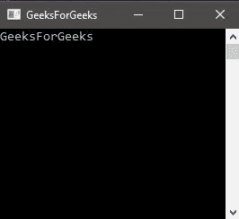
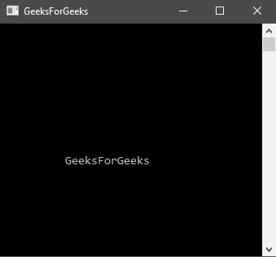

# 控制台。C#中的 MoveBufferArea 方法

> 原文:[https://www . geesforgeks . org/console-movebuferarea-method-in-c-sharp/](https://www.geeksforgeeks.org/console-movebufferarea-method-in-c-sharp/)

**控制台。移动缓冲区方法**用于将指定的屏幕区域移动到目标区域。

> **语法:**公共静态视线移动缓冲区(int sourceLeft、int sourceTop、int sourceWidth、int sourceHeight、int targetLeft、int target top)；
> 
> **参数:**
> **源左**:源区最左边一列。
> **sourceTop** :源区域最上面一行。
> **源宽度**:源区域的列数。
> **源高度**:源区域的行数。
> **目标左侧**:目的区域最左边一列。
> **targetTop** :目的区域最上面一行。

**异常:**

*   **argumenterofrange exception:**
    *   一个或多个参数小于零。
    *   如果 sourceLeft 或 targetLeft 大于或等于 BufferWidth。
    *   如果 sourceTop 或 targetTop 大于或等于 BufferHeight。
    *   如果 sourceTop + sourceHeight 大于或等于 BufferHeight。
    *   如果 sourceLeft + sourceWidth 大于或等于 BufferWidth。
*   **io 异常**:如果出现输入/输出错误。

**例 1:**

```
// C# program to print GeeksForGeeks
using System;

namespace GFG {

class Program {

    static void Main(string[] args)
    {
        Console.WriteLine("GeeksForGeeks");
    }
}
}
```

**输出:**



**例 2:**

```
// C# program to change area
// of GeeksForGeeks
using System;

namespace GFG {

class Program {

    static void Main(string[] args)
    {
        Console.WriteLine("GeeksForGeeks");

        // using the method
        Console.MoveBufferArea(0, 0, Console.BufferWidth,
                           Console.BufferHeight, 10, 10);
    }
}
}
```

**输出:**



**注:**

*   查看输出图像中文本位置的差异。
*   如果目标和源参数指定了位于当前屏幕缓冲区边界之外的位置，则仅复制源区域中适合目标区域的部分。也就是说，源区域被裁剪以适合当前屏幕缓冲区。
*   MoveBufferArea 方法将源区域复制到目标区域。如果目标区域与源区域不相交，则源区域将使用当前的前景色和背景色填充空白。否则，不会填充源区域的相交部分。

**参考:**

*   [https://docs . Microsoft . com/en-us/dotnet/API/system . console . movebuferarea？视图=netframework-4.7.2](https://docs.microsoft.com/en-us/dotnet/api/system.console.movebufferarea?view=netframework-4.7.2)