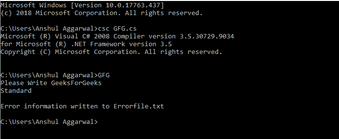
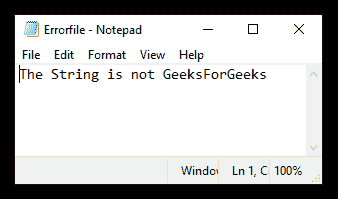

# 控制台。C# 中的 OpenStandardError 方法

> 原文:[https://www . geesforgeks . org/console-open standard error-method-in-c-sharp/](https://www.geeksforgeeks.org/console-openstandarderror-method-in-c-sharp/)

该方法用于获取标准误差流。此方法可用于在标准错误流被 SetError 方法更改后重新获取标准错误流。

**语法:**

```cs
public static System.IO.Stream OpenStandardError ();
```

**返回:**该方法返回标准误差流。

**示例:**下面的代码首先检查字符串是否为 GeeksForGeeks，如果不是，则程序调用 *SetError* 方法将错误信息重定向到文件，在重新获取标准错误流的过程中调用*openstandardserror*方法，并指示错误信息已写入文件。*串流编译器。在重新获取错误流之前，自动刷新*属性被设置为真。这确保了输出将立即发送到控制台，而不是缓冲。

```cs
// C# program to illustrate the 
// OpenStandardError() Method
using System;
using System.IO;

namespace GeeksforGeeks {

class GFG {

    // Main Method
    static void Main(string[] args)
    {
        Console.WriteLine("Please Write GeeksForGeeks");
        string a;
        a = Console.ReadLine();

        // checks for a string to be GeeksforGeeks
        if (!a.Equals("GeeksForGeeks")) { 

            // Write error information to a file.
            Console.SetError(new StreamWriter(@".\Errorfile.txt"));

            Console.Error.WriteLine("The String is not GeeksForGeeks");
            Console.Error.Close();

            // Reacquire the standard error stream.
            var standardError = new StreamWriter(Console.OpenStandardError());
            standardError.AutoFlush = true;

            Console.SetError(standardError);

            Console.Error.WriteLine("\nError information written"+
                                             " to Errorfile.txt");
        }
    }
}
}
```

**在 Cmd 上执行:**

[](https://media.geeksforgeeks.org/wp-content/uploads/20190503123804/openstandarderror-method.png)

**输出文件:**

[](https://media.geeksforgeeks.org/wp-content/uploads/20190503123802/errorfile.png)

**参考:**

*   [https://docs . Microsoft . com/en-us/dotnet/API/system . console . open standard error？视图=网络框架-4.8 # 系统 _ 控制台 _ 开放标准错误](https://docs.microsoft.com/en-us/dotnet/api/system.console.openstandarderror?view=netframework-4.8# System_Console_OpenStandardError)