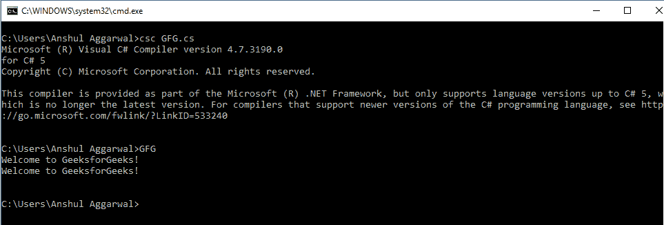

# 控制台。C#中的 OpenStandardInput 方法

> 原文:[https://www . geesforgeks . org/console-openstandard input-method-in-c-sharp/](https://www.geeksforgeeks.org/console-openstandardinput-method-in-c-sharp/)

控制台。OpenStandardInput 方法用于获取标准输入流。C#中有两种可用的 OpenStandardInput 方法重载，如下所示:

*   **OpenStandardInput()方法***   **OpenStandardInput(int32) Method

    #### OpenStandardInput()方法

    它用于获取标准输入流。制作**流**类的对象，通过使用该方法，用户可以给出该对象的输入引用。它创建了一个用于接受用户输入的缓冲区。该方法也可用于*在标准输入流被**设置**方法更改后重新获取*。

    **语法:**

    ```cs
    public static System.IO.Stream OpenStandardInput ();
    ```

    **示例:**

    ```cs
    // C# program to illustrate the 
    // OpenStandardInput() Method
    using System;
    using System.Text;
    using System.IO;

    class GFG {

        public static void Main()
        {

            // Stream Object declared and 
            // OpenStandardInput method is used
            Stream inputStream = Console.OpenStandardInput(); 
            byte[] bytes = new byte[50];
            int outputLength = inputStream.Read(bytes, 0, 50);
            char[] chars = Encoding.UTF7.GetChars(bytes, 0, outputLength); 
            Console.WriteLine(new string(chars));
        }
    }
    ```

    **输出:**

    [](https://media.geeksforgeeks.org/wp-content/uploads/20190301134913/open-11.png)

    #### OpenStandardInput(Int32)方法

    它还用于获取设置为指定缓冲区大小的标准输入流。此方法中传递的值决定了缓冲区的大小。该方法也可用于在标准输入流被**设置**方法更改后*重新获取*。

    > **语法:**公共静态系统。流开放标准输入；
    > 
    > **参数:**
    > **缓冲区大小:**是内部流缓冲区大小。
    > 
    > **返回值:**返回标准输入流。
    > 
    > **异常:**如果*缓冲区*小于等于零，此方法将给出**argumentout of range Exception**。

    ```cs
    // C# program to illustrate the 
    // OpenStandardInput(Int32) Method
    using System;
    using System.Text;
    using System.IO;

    class GFG {

        // Main Method
        public static void Main()
        {

            // Using the Method
            Stream inputStream = Console.OpenStandardInput(100);
            byte[] bytes = new byte[100];
            int outputLength = inputStream.Read(bytes, 0, 100);
            char[] chars = Encoding.UTF7.GetChars(bytes, 0, outputLength);
            Console.WriteLine(new string(chars));
        }
    }
    ```

    **输出:**

    [](https://media.geeksforgeeks.org/wp-content/uploads/20190301134914/Open-2.png)

    **参考:**

    *   [https://docs . Microsoft . com/en-us/dotnet/API/system . console . openstandard input？视图=netframework-4.7.2](https://docs.microsoft.com/en-us/dotnet/api/system.console.openstandardinput?view=netframework-4.7.2)**