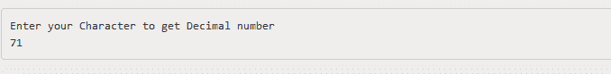
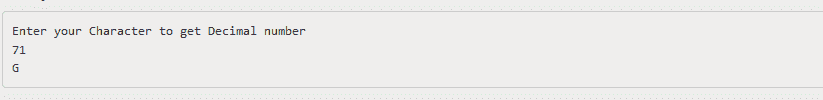

# 控制台。C#中的 Read()方法

> 原文:[https://www . geesforgeks . org/console-read-method-in-c-sharp/](https://www.geeksforgeeks.org/console-read-method-in-c-sharp/)

**控制台。Read()方法**用于从标准输入流中读取下一个字符。当用户键入一些输入字符时，该方法基本上阻止其返回。一旦用户按下回车键，它就终止。

> **语法:**公共静态 int Read()；
> 
> **返回值:**返回输入流中的下一个字符，如果当前没有要读取的字符，则返回负数(-1)。
> 
> **异常:**如果出现输入输出错误，该方法将给出*异常*。

以下程序说明了上述方法的使用:

**例 1:**

```cs
// C# program to illustrate the use
// of Console.Read Method
using System;

namespace GFG {

class Program {

    static void Main(string[] args)
    {

        int x;
        Console.WriteLine("Enter your Character to get Decimal number");

        // using the method
        x = Console.Read();
        Console.WriteLine(x);
    }
}
}
```

**输出:**



**例 2:**

```cs
// C# program to illustrate the use
// of Console.Read Method
using System;

namespace GFG {

class Program {

    static void Main(string[] args)
    {
        // Write to console window.

        int x;
        Console.WriteLine("Enter your Character to get Decimal number");
        x = Console.Read();
        Console.WriteLine(x);

        // Converting the decimal into character.
        Console.WriteLine(Convert.ToChar(x));
    }
}
}
```

**输出:**


**参考:**

*   [https://docs . Microsoft . com/en-us/dotnet/API/system . console . read？视图=netframework-4.7.2](https://docs.microsoft.com/en-us/dotnet/api/system.console.read?view=netframework-4.7.2)