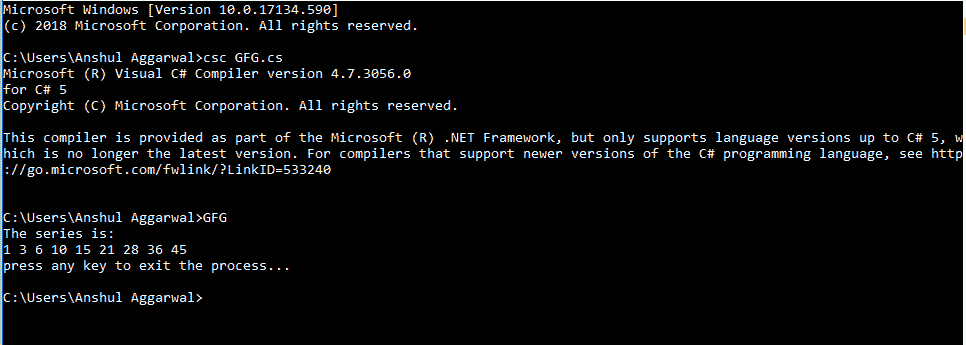
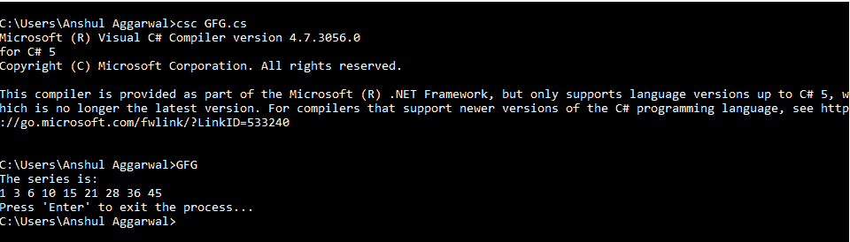
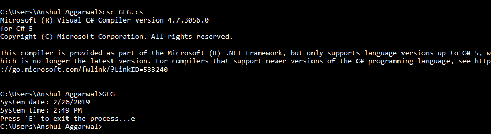
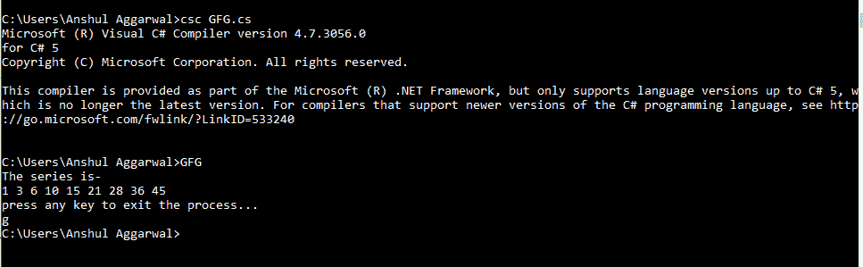
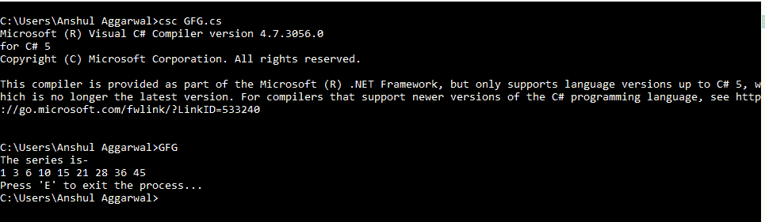
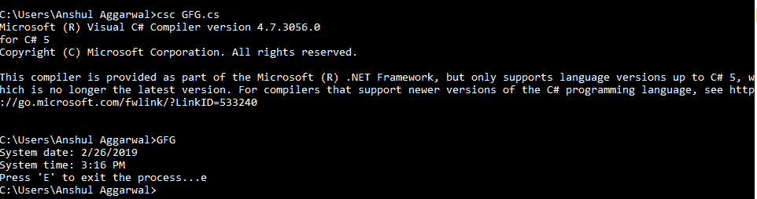

# 控制台。C#中的 ReadKey()方法

> 原文:[https://www . geesforgeks . org/console-read key-method-in-c-sharp/](https://www.geeksforgeeks.org/console-readkey-method-in-c-sharp/)

**控制台。ReadKey()方法**使程序等待按键，并且它阻止屏幕直到按键被按下。简而言之，它获得下一个字符或用户按下的任何键。按下的键显示在控制台窗口中(如果将发生任何输入过程)。此方法的重载列表中有两种方法，如下所示:

*   **ReadKey()方法***   **ReadKey(Boolean) Method

    #### ReadKey()方法

    此方法用于获取用户按下的下一个字符或功能键。按下的键显示在控制台窗口中。

    > **语法:**公共静态 ConsoleKeyInfo ReadKey()；
    > 
    > **返回值:**这个方法返回一个描述 **ConsoleKey** 常量和 Unicode 字符(如果有的话)的对象，它对应于被按下的键。
    > 
    > **异常:**如果中的*属性属于控制台以外的某个流，此方法将给出无效操作异常。**“In”**属性用于获取标准输入流。*

    以下程序说明了上述方法的使用:

    **例 1:**

    ```
    // C# program to illustrate the
    // Console.ReadKey Method
    using System;

    class GFG {

        // Main Method
        public static void Main()
        {
            int c = 0;
            Console.WriteLine("The series is:");

            for (int i = 1; i < 10; i++) 
            {
                c = c + i;
                Console.Write(c + " ");
            }

            Console.WriteLine("\npress any key to exit the process...");

            // basic use of "Console.ReadKey()" method
            Console.ReadKey();

        }
    }
    ```

    **输出:**

    [](https://media.geeksforgeeks.org/wp-content/uploads/20190226152120/Example-11.png)

    **例 2:**

    ```
    // C# program to illustrate the
    // Console.ReadKey Method
    using System;

    class GFG {

        // Main Method
        public static void Main()
        {
            int c = 0;
            Console.WriteLine("The series is:");
            for (int i = 1; i < 10; i++) 
            {
                c = c + i;
                Console.Write(c + " ");
            }

            Console.Write("\nPress 'Enter' to exit the process...");

            // another use of "Console.ReadKey()" method
            // here it asks to press the enter key to exit
            while (Console.ReadKey().Key != ConsoleKey.Enter) {
            }

        }
    }
    ```

    **输出:**

    [](https://media.geeksforgeeks.org/wp-content/uploads/20190226152122/Example-21.png)

    **例 3:**

    ```
    // C# program to illustrate the
    // Console.ReadKey Method
    using System;

    class GFG {

        // Main Method
        public static void Main()
        {

            // "DateTime" is a inbuilt class 
            // for date and time
            DateTime d = DateTime.Now;

            // print the system date and time
            Console.WriteLine("System date: {0:d}\n"+
                            "System time: {0:t}", d);

            Console.Write("Press 'E' to exit the process...");

            // here it ask to press "E" to exit
            while (Console.ReadKey().Key != ConsoleKey.E) {
            }

        }
    }
    ```

    **输出:**

    [](https://media.geeksforgeeks.org/wp-content/uploads/20190226152124/Example-31.png)

    #### 读取键(布尔)方法

    这种方法与前面的方法更相似，也就是说，它还获得用户按下的下一个字符或任意键。唯一的区别是，按下的键可选地显示在控制台窗口中。

    > **语法:**公共静态 ConsoleKeyInfo ReadKey(bool key)；
    > 这里，**“键”**用来决定是否在控制台窗口显示按下的键。如果为“真”，则按下的键不会显示在输出窗口中。如果为“假”，则按下的键将显示在输出窗口中。
    > 
    > **返回值:**这个方法返回一个描述 **ConsoleKey** 常量和 Unicode 字符(如果有的话)的对象，它对应于被按下的键。
    > 
    > **异常:**当中的*属性属于控制台以外的某个流时，此方法将给出**无效操作异常**。**“In”**属性用于获取标准输入流。*

    以下程序说明了上述方法的使用:

    **例 1:**

    ```
    // C# program to illustrate the 
    // ReadKey(Boolean) Method
    using System;

    class GFG {

        // Main Method
        public static void Main()
        {
            int c = 0;
            Console.WriteLine("The series is-");
            for (int i = 1; i < 10; i++) 
            {
                c = c + i;
                Console.Write(c + " ");
            }

            Console.WriteLine("\npress any key to exit the process...");

            // here we use "false" in the argument list
            // when we press any key, the key will 
            // displays in the console output window
            Console.ReadKey(false);

        }
    }
    ```

    **输出:**

    [](https://media.geeksforgeeks.org/wp-content/uploads/20190226152126/Example-41.png)

    **实施例 2:**

    ```
    // C# program to illustrate the 
    // ReadKey(Boolean) Method
    using System;

    class GFG {

        // Main Method
        public static void Main()
        {
            int c = 0;
            Console.WriteLine("The series is-");
            for (int i = 1; i < 10; i++) 
            {
                c = c + i;
                Console.Write(c + " ");
            }
            Console.Write("\nPress 'E' to exit the process...");

            // here it asks to press "E" to exit
            // and the key "E" is not shown in
            // the console output window
            while (Console.ReadKey(true).Key != ConsoleKey.E) {
            }

        }
    }
    ```

    **输出:**

    [](https://media.geeksforgeeks.org/wp-content/uploads/20190226152128/Example-51.png)

    **实施例 3:**

    ```
    // C# program to illustrate the 
    // ReadKey(Boolean) Method
    using System;

    class GFG {

        public static void Main()
        {
            // "DateTime" is a inbuilt class
            // for date and time
            DateTime d = DateTime.Now;

            // print the system date and time
            Console.WriteLine("System date: {0:d}\n"+
                            "System time: {0:t}", d);

            Console.Write("Press 'E' to exit the process...");

            // here it asks to press "E" to exit
            // The key "E" is shown in the console 
            // output window because of "false"
            while (Console.ReadKey(false).Key != ConsoleKey.E) {
            }

        }
    }
    ```

    **输出:**

    [](https://media.geeksforgeeks.org/wp-content/uploads/20190226152130/Example-61.png)**