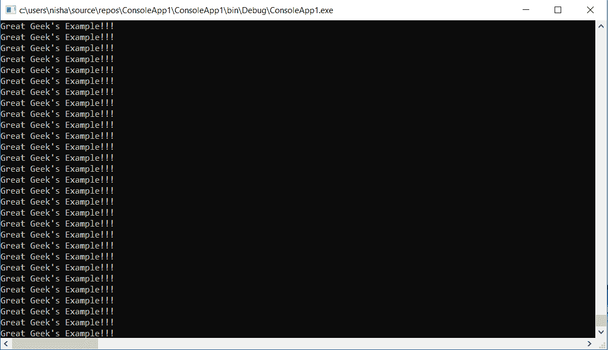
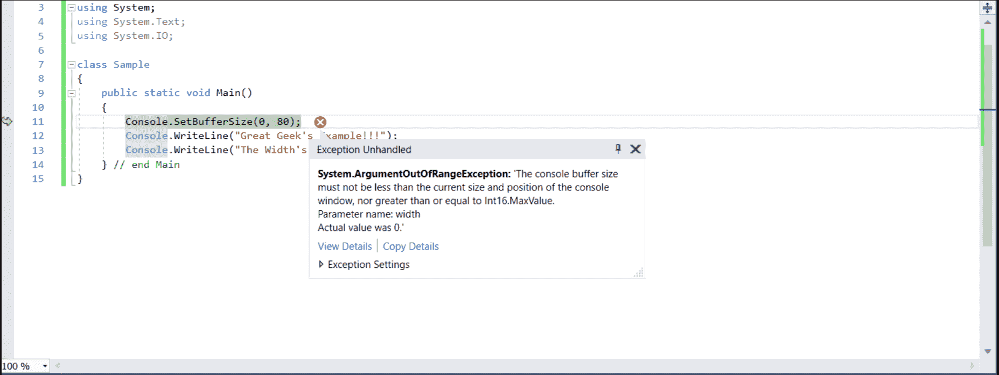
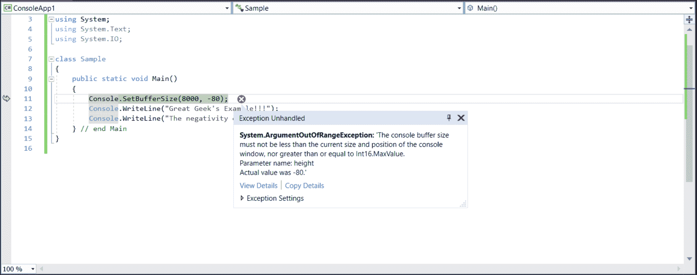

# 控制台。C# 中的 SetBufferSize()方法

> 原文:[https://www . geesforgeks . org/console-setbuffersize-method-in-c-sharp/](https://www.geeksforgeeks.org/console-setbuffersize-method-in-c-sharp/)

**控制台。SetBufferSize(Int32，Int32)方法**用于将屏幕缓冲区的高度和宽度设置为指定值。

> **语法:**public static void SetBufferSize(int width，int height)；
> 
> **参数:**
> **宽度**:设置以列的形式测量的缓冲区宽度。
> **高度**:设置缓冲区以行的形式测量的高度。
> 
> **返回值:**缓冲屏的新大小。

**异常:**

*   **argumentout of range 异常**:如果*高度*或*宽度*小于或等于零*或*高度*或宽度大于或等于*最大值*。同样，如果*宽度*小于`WindowLeft + WindowWidth`或者高度小于`WindowTop + WindowHeight`，那么我们会得到同样的例外。*
*   **io 异常**:如果出现输入输出错误。

**注意:**正如你将在下面的例子中通过水平和垂直滚动条看到的，当我们给出不同的维度时，我们得到不同大小的窗口。

**例 1:**

```cs
// C# program to demonstrate
// the  SetBufferSize Method
using System;
using System.Text;
using System.IO;

class GFG {

    // Main Method
    public static void Main()
    {

        // using the method
        Console.SetBufferSize(800, 800);
        Console.WriteLine("Start");
        while (true) 
        {
            Console.WriteLine("Great Geek's Example!!!");
        }
    } // end Main
}
```

**输出:**



**例 2:**

```cs
// C# program to demonstrate
// the SetBufferSize Method
using System;
using System.Text;
using System.IO;

class GFG {

    // Main Method
    public static void Main()
    {
        Console.SetBufferSize(0, 80);
        Console.WriteLine("Great Geek's Example!!!");
        Console.WriteLine("The Width's value is too less!");
    } // end Main
}
```



**例 3:**

```cs
// C# program to demonstrate
// the SetBufferSize Method
using System;
using System.Text;
using System.IO;

class GFG {

    // Main Method
    public static void Main()
    {
        Console.SetBufferSize(8000, -80);
        Console.WriteLine("Great Geek's Example!!!");
        Console.WriteLine("The negativity of this height is unbearable!");
    } // end Main
}
```



**参考:**

*   [https://docs . Microsoft . com/en-us/dotnet/API/system . console . setbuffersize？视图=netframework-4.7.2](https://docs.microsoft.com/en-us/dotnet/api/system.console.setbuffersize?view=netframework-4.7.2)