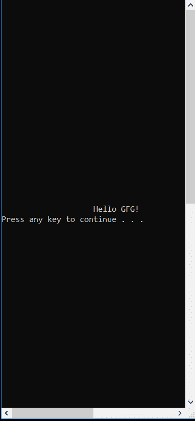
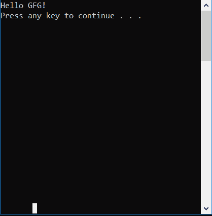

# 控制台。C#中的 SetCursorPosition()方法

> 原文:[https://www . geesforgeks . org/console-setcursorposition-method-in-c-sharp/](https://www.geeksforgeeks.org/console-setcursorposition-method-in-c-sharp/)

**控制台。设置光标位置(Int32，Int32)方法**用于设置光标的位置。基本上，它指定了控制台窗口中下一个写操作的开始位置。如果指定的光标位置在控制台窗口中当前可见的区域之外，窗口原点会自动更改以使光标可见。

> **语法:**公共静态 void SetCursorposition(int left，int top)；
> 
> **参数:**
> **左侧:**是光标所在的列位置。列从 0 开始从左到右编号。
> **顶部:**是光标所在的行位置。行从 0 开始从上到下编号。

**异常:**

*   **argumentout of range exception:**如果*左侧*或*顶部*小于 0 或*左侧*T14】=*buffer width*或*顶部*T15】=*buffer h8*。
*   **安全性异常:**如果用户没有执行此操作的权限。

**示例:**

```cs
// C# Program to illustrate 
// Console.CursorPosition() method
using System;

class GFG {

    // Main Method
    public static void Main()
    {

        // setting the window size
        Console.SetWindowSize(40, 40);

        // setting buffer size of console
        Console.SetBufferSize(80, 80);

        // using the method
        Console.SetCursorPosition(20, 20);
        Console.WriteLine("Hello GFG!");
        Console.Write("Press any key to continue . . . ");

        Console.ReadKey(true);
    } 
} 
```

**输出:**



当**控制台。未使用 SetCursorPosition()** 方法:



**参考:**

*   [https://docs . Microsoft . com/en-us/dotnet/API/system . console . setcursorposition？视图=netframework-4.7.2](https://docs.microsoft.com/en-us/dotnet/api/system.console.setcursorposition?view=netframework-4.7.2)