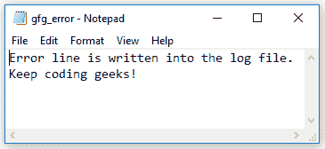

# 控制台。C# 中的 SetError()方法

> 原文:[https://www . geesforgeks . org/console-set error-method-in-c-sharp/](https://www.geeksforgeeks.org/console-seterror-method-in-c-sharp/)

**控制台。SetError(TextWriter)方法**设置指定 StreamWriter 的 Error 属性，即它将标准错误流重定向到一个文件。由于控制台是用这个 StreamWriter 对象设置的，因此可以调用 WriteLine()方法将错误写入文件。

> **语法:**公共静态 void SetError(系统。IO . stream writer new error)；
> 
> **参数:**
> **新误差:**这是一个流，是新的标准误差输出。

**异常:**如果传递的参数为空，该方法将抛出 *ArgumentNullException* 。此外，因为它使用 StreamWriter 对象，所以也应该注意它的异常。

**示例:**在本例中， *SetError()方法*用于将 StreamWriter 对象设置到控制台，错误消息将从控制台写入日志文件。

```cs
// C# program to demonstrate 
// the SetError() method
using System;
using System.IO;

class GFG {

    // Main Method
    static void Main()
    {
        // Define file to receive error stream.
        string fn = "F:\\gfg_error.log";

        // Define the new error StreamWriter object
        StreamWriter errStream = new StreamWriter(fn);

        // Redirect standard error stream to file.
        Console.SetError(errStream);

        // Write the error message into the Log file
        Console.Error.WriteLine("Error line is written into the log file.");
        Console.Error.WriteLine("Keep coding geeks!");

        // Close redirected error stream.
        Console.Error.Close();
    }
}
```

**输出:**gfg _ error . log 文件现在将包含错误消息。



**参考:**

*   [https://docs . Microsoft . com/en-us/dotnet/API/system . console . set error？view = net framework-4 . 7 . 2 # System _ Console _ SetError _ System _ IO _ TextWriter _](https://docs.microsoft.com/en-us/dotnet/api/system.console.seterror?view=netframework-4.7.2# System_Console_SetError_System_IO_TextWriter_)