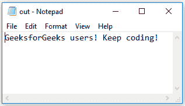
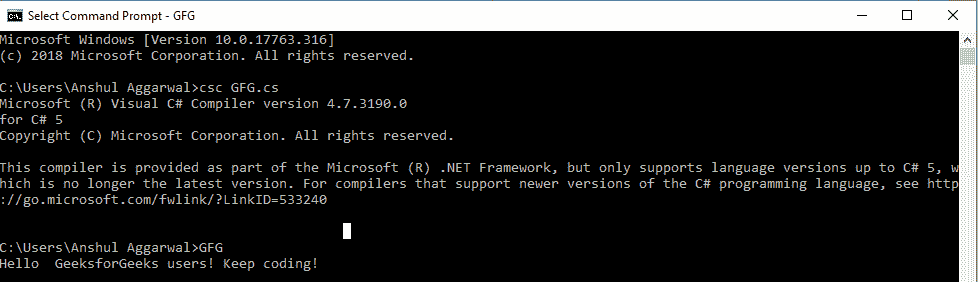

# 控制台。C# 中的 SetIn()方法

> 原文:[https://www . geesforgeks . org/console-setin-method-in-c-sharp/](https://www.geeksforgeeks.org/console-setin-method-in-c-sharp/)

**控制台。SetIn()方法**用于设置指定 StreamReader 对象的 *In* 属性，即将标准输入从控制台重定向到输入文件。由于控制台设置了这个 StreamReader 对象，因此可以调用 *ReadLine()方法*来逐行读取文件的内容。

> **语法:**公共静态 void SetIn (System。IO . stream reader new in)；
> 
> **参数:**
> **新 In** :是一个流，是新的标准输入。

**异常:**

*   **参数空异常:**如果*纽因*为空。
*   **安全性异常:**如果调用方没有所需的权限。

**示例:**在本例中，使用 SetIn()方法将 StreamReader 对象设置到控制台，文件的内容将被读取、存储和打印。

**使用的文本文件:**



```cs
// C# program to demonstrate SetIn() method
using System;
using System.IO;

class GFG {

    // Main Method
    static void Main()
    {

        // Create a string to get 
        // data from the file
        string geeks = " ";

        // creating the StreamReader object
        // and set it to the desired 
        // text file
        using(StreamReader gfg = new StreamReader("D:\\out.txt"))
        {

            // setting the StreamReader 
            // object to the Console
            Console.SetIn(gfg);

            string l;

            // Reading the contents of the file into l
            while ((l = Console.ReadLine()) != null) 
            {
                geeks = geeks + l;
            }

            // Printing the file contents
            // appended to "Hello "
            Console.WriteLine("Hello " + geeks);

            // Waiting for user input
            // to exit the program
            Console.ReadKey();
        }
    }
}
```

**输出:**

[](https://media.geeksforgeeks.org/wp-content/uploads/20190308125221/setln-1.png)

**参考:**

*   [https://docs . Microsoft . com/en-us/dotnet/API/system . console . setin？view = net framework-4 . 7 . 2 # System _ Console _ SetIn _ System _ IO _ TextReader _](https://docs.microsoft.com/en-us/dotnet/api/system.console.setin?view=netframework-4.7.2# System_Console_SetIn_System_IO_TextReader_)