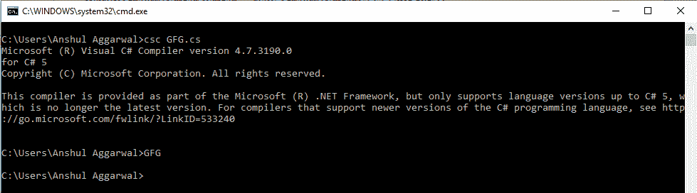
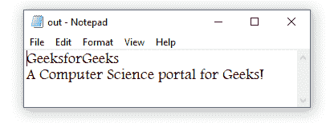
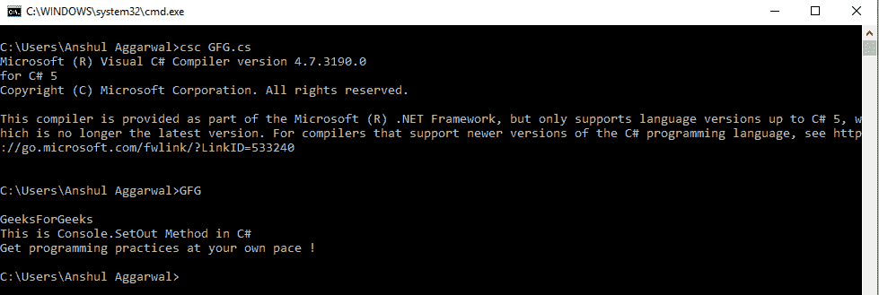
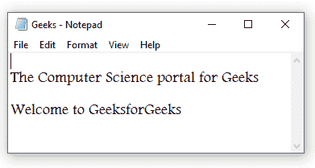

# 控制台。C#中的 SetOut()方法

> 原文:[https://www . geesforgeks . org/console-setout-method-in-c-sharp/](https://www.geeksforgeeks.org/console-setout-method-in-c-sharp/)

***控制台。C#中的 SetOut(TextWriter)*** 方法用于重定向标准输出流。在这个方法的帮助下，用户可以指定一个 StreamWriter 作为输出对象。*控制台。SetOut* 方法将接收一个 TextWriter 类型的对象。流写入器可以传递到*控制台。设置*并隐式转换为文本编写器类型。它只是将标准输出流属性设置为它获取的指定 TextWriter 对象。

**语法:**

```cs
public static System.IO.TextWriter Out { get; }
                or
public static void SetOut (System.IO.TextWriter newOut);
                or
public static void SetOut(TextWriter newOut)

```

**返回值:**将流写入器返回给指定的文本写入器对象。

**异常:**

*   当 newOut 为空时**抛出 ArgumentNullException** ，它不接受它作为有效的参数。
*   当出现输入/输出错误时**将引发 IOException** 。

**例 1:**

```cs
// C# code to demonstrate the use 
// of Console.SetOut method
using System;
using System.IO;

class GFG {

    // Main Method
    static void Main()
    {

        // Creating a text file named "out" in D Drive
        using(StreamWriter writer = new StreamWriter("D:\\out.txt"))
        {
            Console.SetOut(writer);
            Result();
        }
    }

    // Method Result
    static void Result()
    {

        // Writing to the file
        Console.WriteLine("GeeksforGeeks");
        Console.WriteLine("A Computer Science portal for Geeks!");
    }
}
```

**编译和执行:**

[](https://media.geeksforgeeks.org/wp-content/uploads/20190307122521/setout-1.png)

**输出:**

[](https://media.geeksforgeeks.org/wp-content/uploads/20190307122522/setout-2.png)

**例 2:**

```cs
// C# code to demonstrate the use 
// of Console.SetOut method
using System;
using System.IO;

class GFG {

    // Main Method
    static void Main()
    {

        // will display on console
        Console.WriteLine("\nGeeksForGeeks");

        // Creating a text file named "Geeks" 
        // at the location of your program
        FileStream geeks1 = new FileStream("Geeks.txt", FileMode.Create);

        // Standard Output stream is 
        // being saved to a Textwriter
        TextWriter geeksave = Console.Out;

        StreamWriter portal1 = new StreamWriter(geeks1);
        Console.SetOut(portal1);

        Console.WriteLine("\nThe Computer Science portal for Geeks");

        Console.WriteLine("\nWelcome to GeeksforGeeks");
        Console.SetOut(geeksave);

        // will display on console
        Console.WriteLine("This is Console.SetOut Method in C#");
        Console.WriteLine("Get programming practices at your own pace !");
        portal1.Close();
    }
}
```

**编译和执行:**

[](https://media.geeksforgeeks.org/wp-content/uploads/20190307122524/setout-3.png)

[](https://media.geeksforgeeks.org/wp-content/uploads/20190307122526/setout-4.png)

**参考:**

*   [https://docs . Microsoft . com/en-us/dotnet/API/system . console . setout？视图=netframework-4.7.2](https://docs.microsoft.com/en-us/dotnet/api/system.console.setout?view=netframework-4.7.2)