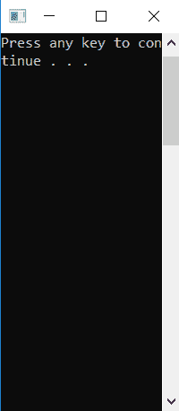
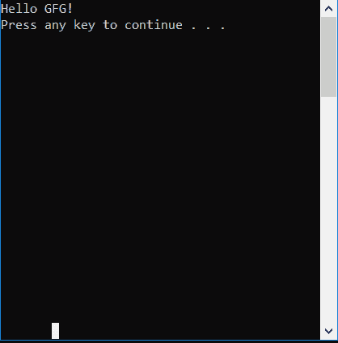

# 控制台。C#中的 SetWindowPosition()方法

> 原文:[https://www . geesforgeks . org/console-setwindowposition-method-in-c-sharp/](https://www.geeksforgeeks.org/console-setwindowposition-method-in-c-sharp/)

**控制台。C#中的 SetWindowPosition(Int32，Int32)方法**用于设置控制台窗口相对于屏幕缓冲区的位置。

> **语法:**公共静态 void SetWindowposition(int left，int top)；
> 
> **参数:**
> **左侧:**是控制台窗口左上角的列位置。
> **顶部:**是控制台窗口左上角的行位置。

**异常:**

*   **ArgumentOutOfRangeException:**当*左*或*顶*小于 0 或*左+窗宽***>**T10】buffer width 或*顶+窗高***>**T16】buffer what。
*   **安全性异常:**如果用户没有执行此操作的权限。

**示例:**

```
// C# Program to illustrate the use of 
// Console.WindowPosition() method
using System;
using System.Text;
using System.IO;

class GFG {

    // Main Method
    public static void Main(string[] args)
    {
        Console.SetWindowSize(20, 20);

        // setting buffer size 
        Console.SetBufferSize(80, 80);

        // using the method
        Console.SetWindowPosition(0, 0);
        Console.WriteLine("Hello GFG!");

        Console.Write("Press any key to continue . . . ");
        Console.ReadKey(true);
    }
}
```

**输出:**



当**控制台。不使用 WindowPosition()** 方法:



**参考:**

*   [https://docs . Microsoft . com/en-us/dotnet/API/system . console . setwindowposition？视图=netframework-4.7.2](https://docs.microsoft.com/en-us/dotnet/api/system.console.setwindowposition?view=netframework-4.7.2)