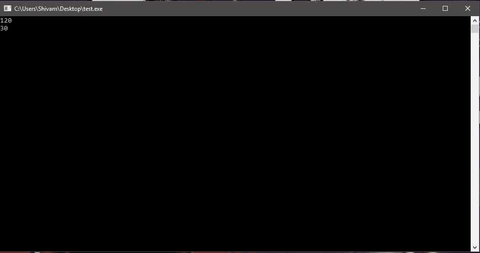
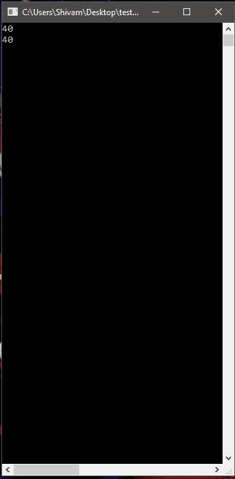

# 控制台。C# 中的 SetWindowSize()方法

> 原文:[https://www . geesforgeks . org/console-setwindowsize-method-in-c-sharp/](https://www.geeksforgeeks.org/console-setwindowsize-method-in-c-sharp/)

**控制台。SetWindowSize(Int32，Int32)方法**用于将控制台窗口的高度和宽度更改为指定值。

> **语法:**公共静态 void SetWindowSize (int width，int height)；
> 
> **参数:**
> **宽度**:控制台窗口的宽度以列为单位测量。
> **高度**:控制台窗口的高度，以行为单位测量。

**异常:**

*   **argumenterofrange exception:**
    *   如果宽度或高度小于或等于零
    *   宽度加窗口左侧或高度加窗口顶部大于或等于最大值
    *   宽度或高度大于当前屏幕分辨率和控制台字体的最大可能窗口宽度或高度。
*   **io 异常**:如果出现输入/输出错误。

**示例 1:** 获取窗口的当前尺寸。

```cs
// C# program to get the current
// window width and Height
using System;

namespace GFG {

class Program {

    static void Main(string[] args)
    {
        Console.WriteLine(Console.WindowWidth);
        Console.WriteLine(Console.WindowHeight);
    }
}
}
```

**输出:**



**示例 2:** 设置设置窗口大小的值

```cs
// C# program to illustrate the
// Console.SetWindowSize Property
using System;

namespace GFG {

class Program {

    static void Main(string[] args)
    {
        // Passed 40, 40 to SetWindowSize to 
        // change window size to 40 by 40
        Console.SetWindowSize(40, 40);.

        // Printing the current dimensions
        Console.WriteLine(Console.WindowWidth);
        Console.WriteLine(Console.WindowHeight);
    }
}
}
```

**输出:**



**注意:**在两幅图像中都可以看到窗口底部的水平滚动条。

**参考:**

*   [https://docs . Microsoft . com/en-us/dotnet/API/system . console . setwindowsize？视图=netframework-4.7.2](https://docs.microsoft.com/en-us/dotnet/api/system.console.setwindowsize?view=netframework-4.7.2)