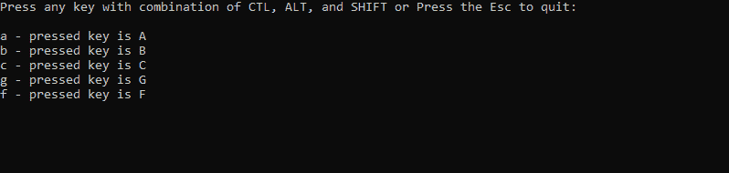
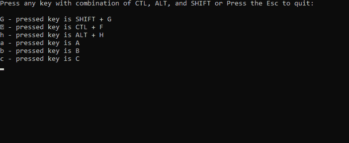

# 控制台。C#中的 TreatControlCAsInput 属性，带示例

> 原文:[https://www . geeksforgeeks . org/console-treatcontrolcasinput-property-in-c-sharp-with-examples/](https://www.geeksforgeeks.org/console-treatcontrolcasinput-property-in-c-sharp-with-examples/)

**控制台。TreatControlCAsInput 属性**用于获取或设置一个值，该值指示控制修饰键和 C 控制台键 **(Ctrl+C)** 的组合是被视为普通输入还是被视为由操作系统处理的中断。

**语法:**

```
public static bool TreatControlCAsInput { get; set; }
```

**属性值:**如果 **Ctrl+C** 被视为普通输入，则该属性返回真。否则为假，表示如果输入是 **Ctrl+C** ，则程序终止。

**异常:**如果程序无法获取或设置控制台输入缓冲区的输入模式，该属性将给出 **IOException** 。

以下程序说明了上述属性的使用:

**例 1:**

```
// C# program to illustrate the use of
// Console.TreatControlCAsInput Property
using System;

class GFG {

    // Main Method
    public static void Main()
    {
        ConsoleKeyInfo c;

        // Prevent program from terminating 
        // if CTL+C is pressed.
        Console.TreatControlCAsInput = true;

        Console.WriteLine("Press any key with combination of CTL, "+
                    "ALT, and SHIFT or Press the Esc to quit: \n");

        do {

            c = Console.ReadKey();
            Console.Write(" - pressed key is ");

            // only prints the pressed keys
            Console.WriteLine(c.Key.ToString());

          // condition for Exit
        } while (c.Key != ConsoleKey.Escape);

    }
}
```

**输出:**



**例 2:**

```
// C# program to illustrate the use of
// Console.TreatControlCAsInput Property
using System;

class GFG {

    // Main Method
    public static void Main()
    {
        ConsoleKeyInfo c;

        // Prevent program from terminating 
        // if CTL+C is pressed.
        Console.TreatControlCAsInput = true;

        Console.WriteLine("Press any key with combination of CTL, "+
                     "ALT, and SHIFT or Press the Esc to quit: \n");

        do {

            c = Console.ReadKey();
            Console.Write("pressed key is ");

            // conditions-
            if ((c.Modifiers & ConsoleModifiers.Shift) != 0)
                Console.Write("SHIFT + ");

            if ((c.Modifiers & ConsoleModifiers.Control) != 0)
                Console.Write("CTL + ");

            if ((c.Modifiers & ConsoleModifiers.Alt) != 0)
                Console.Write("ALT + ");

            // prints the pressed keys
            Console.WriteLine(c.Key.ToString());

          // condition for Exit
        } while (c.Key != ConsoleKey.Escape);

    }
}
```

**输出:**



当**为假时**

```
using System;

class GFG {

    // Main Method
    public static void Main()
    {
        ConsoleKeyInfo c;

        // Prevent program from terminating 
        // if CTL+C is pressed.
        Console.TreatControlCAsInput = false;

        Console.WriteLine("Press any key with combination of CTL,"+
                  " ALT, and SHIFT or Press the Esc to quit: \n");

        do {
            c = Console.ReadKey();
            Console.Write(" - pressed key is ");

            // only prints the pressed keys
            Console.WriteLine(c.Key.ToString());

          // condition for Exit
        } while (c.Key != ConsoleKey.Escape);

    }
}
```

**输出:**

```
Press any key with combination of CTL, ALT, and SHIFT or Press the Esc to quit:

a - pressed key is A
b - pressed key is B
g - pressed key is G

// Here after these input we press Ctrl+C, 
// then the program is terminated.

```

**参考:**

*   [https://docs . Microsoft . com/en-us/dotnet/API/system . console . treatcontrolcasinput？视图=netframework-4.7.2](https://docs.microsoft.com/en-us/dotnet/api/system.console.treatcontrolcasinput?view=netframework-4.7.2)