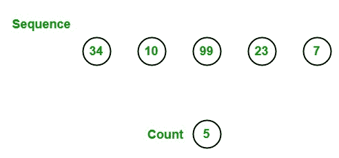

# 统计 LINQ 序列中存在的元素数量？

> 原文:[https://www . geeksforgeeks . org/count-in-linq 序列中出现的元素数量/](https://www.geeksforgeeks.org/count-the-number-of-element-present-in-the-sequence-in-linq/)

在 LINQ，您可以使用**计数方法**来计数给定序列中存在的元素总数。此方法返回给定序列中存在的元素总数。



该方法可以通过两种不同的方式重载:

1.  **Count<TSource>():** This method returns the total number of elements present in the given specified sequence. The return type of this method is *System.Int32*. This method gives *ArgumentNullException* if the source is null and OverflowException if the value of the source is large. It does not support query syntax in C#, but you can wrap the query into brackets() and use aggregation functions as shown in Example 1\. It supports query syntax in VB.NET.

    **语法:**

    ```cs
    int Count<TSource>();
    ```

2.  **Count<TSource>(Func<TSource, bool> predicate):** This method is used to return the number of items which satisfy the given condition. The return type of this method is *System.Int32*. This method gives *ArgumentNullException* if the source or predicate is null and *OverflowException* if the value of the source is large.

    **语法:**

    ```cs
    int Count<TSource>(Func<TSource, bool> predicate);
    ```

    **注意:**VB.NET 不支持这种带谓词参数的方法。

**例 1:**

```cs
// C# program to find total number of
// elements present in the given array
using System;
using System.Linq;

class GFG {

    // Main Method
    static public void Main()
    {

        // Data source
        int[] sequence = {6, 455, 50, 56, 102,
                          89, 9, 100, 67, 29};

        // Display the sequence
        Console.WriteLine("The sequence is: ");

        foreach(int s in sequence)
        {
            Console.WriteLine(s);
        }

        // Finding the total number of elements
        // present in the given sequence
        // Using Count function
        int result = sequence.Count();
        Console.WriteLine("Total number of Elements: {0}", result);
    }
}
```

**Output:**

```cs
The sequence is: 
6
455
50
56
102
89
9
100
67
29
Total number of Elements: 10

```

**例 2:**

```cs
// C# program to count the total
// number of the employees
using System;
using System.Linq;
using System.Collections.Generic;

// Employee details
public class Employee {

    public int emp_id
    {
        get;
        set;
    }

    public string emp_name
    {
        get;
        set;
    }

    public string emp_gender
    {
        get;
        set;
    }

    public string emp_hire_date
    {
        get;
        set;
    }

    public int emp_salary
    {
        get;
        set;
    }
}

class GFG {

    // Main method
    static public void Main()
    {
        List<Employee> emp = new List<Employee>() {
            new Employee() { emp_id = 209, emp_name = "Anjita", emp_gender = "Female", emp_hire_date = "12/3/2017", emp_salary = 20000 },
                new Employee() { emp_id = 210, emp_name = "Soniya", emp_gender = "Female", emp_hire_date = "22/4/2018", emp_salary = 30000 },
                new Employee() { emp_id = 211, emp_name = "Rohit", emp_gender = "Male", emp_hire_date = "3/5/2016", emp_salary = 40000 },
                new Employee() { emp_id = 212, emp_name = "Supriya", emp_gender = "Female", emp_hire_date = "4/8/2017", emp_salary = 40000 },
                new Employee() { emp_id = 213, emp_name = "Anil", emp_gender = "Male", emp_hire_date = "12/1/2016", emp_salary = 40000 },
                new Employee() { emp_id = 214, emp_name = "Anju", emp_gender = "Female", emp_hire_date = "17/6/2015", emp_salary = 50000 },
        };

        // Count the total number of employees
        // Using Count () method
        var res = (from e in emp
                       select e.emp_id)
                      .Count();

        Console.WriteLine("Total number of Employees: {0}", res);
    }
}
```

**Output:**

```cs
Total number of Employees: 6

```